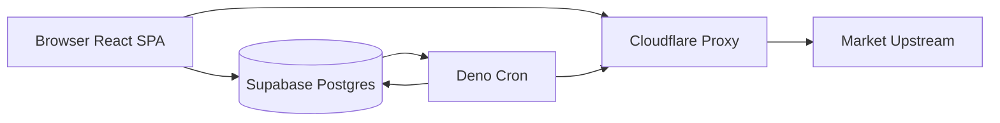

# TSD 00 — Arsitektur / Architecture

> Status: Kanonis
> Terverifikasi: 2026-09-16
> Tanggal: 2026-09-16
> Cakupan: Runtime, layering, engine single-source, jalur data market

[Bahasa Indonesia](#bagian-id) · [English](#english-part)

## Bagian ID

### Ringkasan
- Produk merupakan frontend murni plus serverless tanpa server backend khusus.
- Kode berjalan di 4 runtime: Browser, Edge Function, Postgres, Cloudflare.
- Keamanan premium dan admin ditegakkan di server melalui RLS dan RPC.
- Engine sinyal single-source dipakai bersama oleh browser dan cron. Alur sat-set.

### Empat Runtime
- Browser: React SPA untuk UI, chart, dialog, screener, engine live.
- Edge Function: cron Deno untuk auto-journal, summary, discovery.
- Postgres: database, RLS, RPC, jadwal cron, auth.
- Cloudflare: hosting Pages plus proxy market data.



### Layering Pure-IO
- Fungsi keputusan bersifat pure tanpa DOM, fetch, atau clock langsung.
- Timestamp disuntik sebagai parameter agar pengujian deterministik.
- Cron Deno hanya menangani fetch plus DB di sekitar fungsi pure.
- Facade tersedia di `edge-engine.ts › facade` untuk impor cron.

```
edge-engine.ts facade
  core-automation core
    core-engine signals plus indicators plus regime
      core-trade model plus journal-mapper
        core-market candles plus adapters
          services-supabase types plus features-model
```

### Engine Single-Source Dua Rumah
- Browser memakai engine untuk analisis market terkini dan proyeksi setup.
- Cron memakai bundle `_engine.mjs` hasil `npm run build:edge`.
- Sumber tunggal berada di `src/core/engine/` plus automation core.
- Bundle dibuat dari `src/core/edge-engine.ts` ke 3 `_engine.mjs`.

### Jalur Data Market
- Browser memakai proxy `/api/yahoo` untuk Yahoo dan direct untuk global plus derivatives.
- Cron memakai proxy Cloudflare agar cache tetap warm dan traffic rendah.
- Engine proxy berada di `proxy.ts › proxyJsonGet` dengan 3 route.
- Route mencakup yahoo, binance, coingecko di `functions/api/`.

### Keamanan Server
- Premium dan admin diperiksa via `is_premium`, `is_admin`, `is_owner` di Postgres.
- Redeem kode berjalan via RPC `SECURITY DEFINER` tanpa ekspos rahasia.
- Tulis jurnal hanya via service-role pada cron, browser read-only.
- UI hanya menyembunyikan tombol, RLS mengunci akses data.

### Fakta Kanonis
| Aspek | Nilai |
|---|---|
| Tabel | 16 tabel kanonis termasuk journal_signal_states |
| RPC | 28 RPC kanonis |
| Migrasi | 38 berkas migrasi |
| Pengujian | 45 file dan 422 case |

### Terkait
- Tech stack di `01-tech-stack.md`.
- Alur data di `02-data-flow.md`.
- Metodologi di `../05-explainers/00-trading-methodology.md`.

---
## English Part

### Overview
- Product is pure frontend plus serverless without dedicated backend server.
- Code runs in 4 runtimes: Browser, Edge Function, Postgres, Cloudflare.
- Premium and admin security is enforced on server via RLS and RPC.
- Single-source signal engine is shared by browser and cron. Flow deep-dive.

### Four Runtimes
- Browser: React SPA for UI, charts, dialogs, screener, live engine.
- Edge Function: Deno cron for auto-journal, summary, discovery.
- Postgres: database, RLS, RPC, cron schedule, auth.
- Cloudflare: Pages hosting plus market data proxy.


### Pure-IO Layering
- Decision functions stay pure without DOM, fetch, or direct clock.
- Timestamps are injected as parameters for deterministic testing.
- Deno cron only handles fetch plus DB around pure functions.
- Facade is available in `edge-engine.ts › facade` for cron imports.

```
edge-engine.ts facade
  core-automation core
    core-engine signals plus indicators plus regime
      core-trade model plus journal-mapper
        core-market candles plus adapters
          services-supabase types plus features-model
```

### Single-Source Engine
- Browser uses engine for current market analysis and setup projection.
- Cron uses `_engine.mjs` bundle from `npm run build:edge`.
- Single source lives in `src/core/engine/` plus automation core.
- Bundle is built from `src/core/edge-engine.ts` into 3 `_engine.mjs`.

### Market Data Path
- Browser uses `/api/yahoo` proxy for Yahoo and direct for global plus derivatives.
- Cron uses Cloudflare proxy to keep cache warm with low traffic.
- Proxy engine lives in `proxy.ts › proxyJsonGet` with 3 routes.
- Routes cover yahoo, binance, coingecko under `functions/api/`.

### Server Enforcement
- Premium and admin are checked via `is_premium`, `is_admin`, `is_owner` in Postgres.
- Code redemption runs via `SECURITY DEFINER` RPC without secret exposure.
- Journal writes use service-role on cron, browser stays read-only.
- UI only hides buttons, RLS locks data access.

### Canonical Facts
| Aspect | Value |
|---|---|
| Tables | 16 canonical tables including journal_signal_states |
| RPCs | 28 canonical RPCs |
| Migrations | 38 migration files |
| Tests | 45 files and 422 cases |

### Related
- Tech stack in `01-tech-stack.md`.
- Data flow in `02-data-flow.md`.
- Methodology in `../05-explainers/00-trading-methodology.md`.
