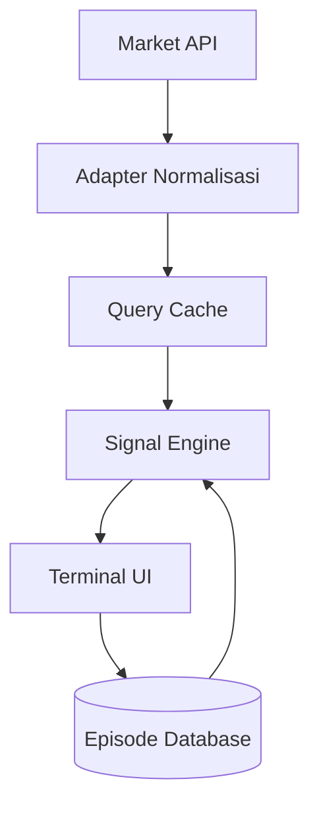
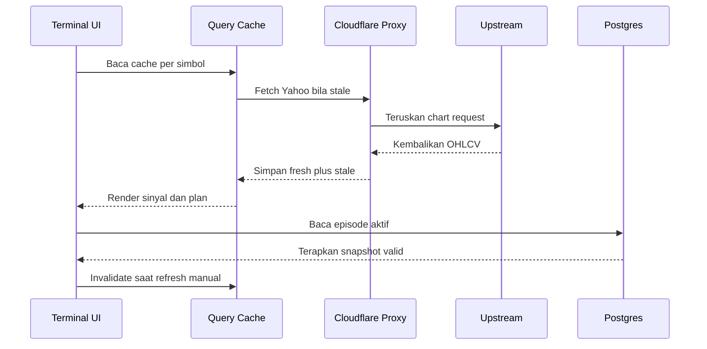
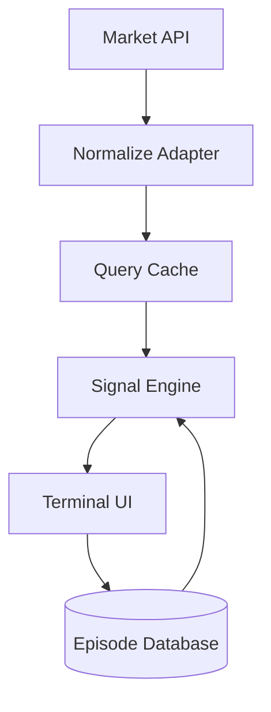
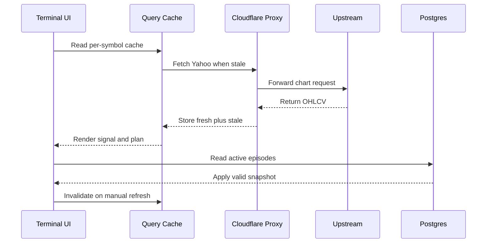

# TSD 02 — Alur Data / Data Flow

> Status: Kanonis
> Terverifikasi: 2026-09-16
> Tanggal: 2026-09-16
> Cakupan: Market flow, adapter, react-query, state, refresh

[Bahasa Indonesia](#bagian-id) · [English](#english-part)

## Bagian ID

### Ringkasan
- Alur market bergerak dari API ke adapter ke cache ke engine ke UI.
- Cache dibagi via shared key agar fetch tambahan hampir nol. Pola sat-set.
- Episode server menentukan publikasi LONG dan SHORT yang valid.

### Alur Market

- API menyediakan chart Yahoo, dominance, derivatives, dan episode server.
- Adapter menormalkan candle, quote, dominance, dan positioning.
- Cache menyimpan hasil per simbol dengan interval 5 menit default.
- Engine menghitung sinyal lalu UI menampilkan tabel dan dialog.

### Klien API
| Klien | Endpoint | Jalur |
|---|---|---|
| `client › fetcher` | HTTP shared plus timeout | Direct fetch |
| `coingecko › dominance` | Global plus markets | Direct visitor |
| `binance › derivatives` | Premium, OI, long-short | Direct visitor |

- Yahoo chart, search, dan fundamentals melewati proxy `/api/yahoo`.
- CoinGecko dan Binance dari browser memakai IP visitor langsung.
- Cron memakai proxy agar cache warm dan traffic rendah.

### Adapter Dan Hooks
| Adapter | Fungsi | Output |
|---|---|---|
| `yahoo-adapter › adapt` | Normalisasi chart | Aset unified |
| `candles › normalize` | Resample dan tren | Candle bersih |
| `fundamentals › adapt` | Konteks display-only | FundamentalStocks |

| Hook | Key | Cache Dan Dedupe |
|---|---|---|
| `useMarketData › query` | asset-data per simbol | 30 menit, shared key |
| `useDominance › query` | dominance global | 30 menit, memo konteks |
| `useSmartMoney › query` | smart-money per simbol | 30 menit, maks 40 simbol |

- Default global adalah stale 5 menit, retry 1, tanpa refetch fokus window.
- Episode memakai polling 60 detik dengan refetch saat mount dan fokus.
- Backtest memakai worker modul dan abort saat observer dilepas.

### Refresh Sequence

### State Management
- Redux menyimpan UI loading, filter aset, dan sesi auth saja.
- Server state penuh berada di react-query, bukan di Redux.
- Theme bertahan via localStorage dengan mode gelap dan terang.
- i18n memakai dua locale dengan parity dan deteksi browser.

### Terkait
- Arsitektur di `00-architecture.md`.
- Screener di `../01-functional-specs/01-terminal-screener.md`.
- Proxy di `04-cloudflare-proxy.md`.

---
## English Part

### Overview
- Market flow moves from API to adapter to cache to engine to UI.
- Cache is shared via shared keys for near-zero extra fetch. Pattern deep-dive.
- Server episodes determine valid LONG and SHORT publication.

### Market Flow

- APIs supply Yahoo charts, dominance, derivatives, and server episodes.
- Adapters normalize candles, quotes, dominance, and positioning.
- Cache stores per-symbol results with 5-minute default interval.
- Engine computes signals then UI renders tables and dialogs.

### API Clients
| Client | Endpoint | Path |
|---|---|---|
| `client › fetcher` | Shared HTTP plus timeout | Direct fetch |
| `coingecko › dominance` | Global plus markets | Direct visitor |
| `binance › derivatives` | Premium, OI, long-short | Direct visitor |

- Yahoo charts, search, and fundamentals pass `/api/yahoo` proxy.
- Browser CoinGecko and Binance use direct visitor IP.
- Cron uses proxy for warm cache with low traffic.

### Adapters And Hooks
| Adapter | Function | Output |
|---|---|---|
| `yahoo-adapter › adapt` | Chart normalization | Unified asset |
| `candles › normalize` | Resample and trend | Clean candles |
| `fundamentals › adapt` | Display-only context | Stock fundamentals |

| Hook | Key | Cache And Dedupe |
|---|---|---|
| `useMarketData › query` | asset-data per symbol | 30 min, shared key |
| `useDominance › query` | global dominance | 30 min, memo context |
| `useSmartMoney › query` | smart-money per symbol | 30 min, max 40 symbols |

- Global default is 5-minute stale, retry 1, no window-focus refetch.
- Episodes use 60-second polling with mount and focus refetch.
- Backtest uses module worker with abort on observer release.

### Refresh Sequence

### State Management
- Redux stores UI loading, asset filters, and auth session only.
- Full server state lives in react-query, not in Redux.
- Theme persists via localStorage with dark and light modes.
- i18n uses two locales with parity and browser detection.

### Related
- Architecture in `00-architecture.md`.
- Screener in `../01-functional-specs/01-terminal-screener.md`.
- Proxy in `04-cloudflare-proxy.md`.
