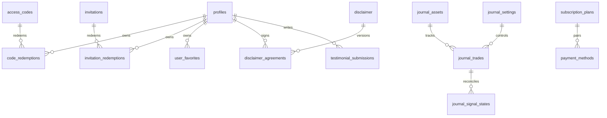

# TSD 03 — Skema Database / Database Schema

> Status: Kanonis
> Terverifikasi: 2026-09-16
> Tanggal: 2026-09-16
> Cakupan: Tabel 16, RPC 28, RLS, migrasi 38

[Bahasa Indonesia](#bagian-id) · [English](#english-part)

## Bagian ID

### Ringkasan
- Skema memakai Postgres dengan 16 tabel, 28 RPC, dan RLS penuh. Struktur sat-set.
- Migrasi berjumlah 38 berkas idempotent dengan urutan timestamp.
- Tipe frontend ditulis manual dan aman untuk bundle edge.

### Tabel Kanonis 16
| Tabel | Kunci Dan Kolom | Kebijakan |
|---|---|---|
| `access_codes` | Kode plus kind dan limit | Terkunci, RPC only |
| `code_redemptions` | Kode plus user | Baris milik sendiri |
| `disclaimer` | Singleton versi plus klausa | Baca publik |
| `disclaimer_agreements` | User plus versi | Tulis milik sendiri |
| `featured_testimonials` | Slot 1-6 plus snapshot | Baca publik |
| `invitation_redemptions` | Kode plus user | Baris milik sendiri |
| `invitations` | Kode plus kind dan expiry | Terkunci, RPC only |
| `journal_assets` | Simbol plus tipe dan source | Premium atau admin |
| `journal_settings` | Singleton konfigurasi cron | Admin only |
| `journal_signal_states` | Simbol plus timeframe plus state | Premium atau admin |
| `journal_trades` | ID plus simbol dan status | Premium read |
| `payment_methods` | UUID plus kategori | Baca publik |
| `profiles` | User plus tier dan flag | Baris milik sendiri |
| `subscription_plans` | Slug plus JSON bilingual | Baca publik |
| `testimonial_submissions` | ID plus status moderasi | Pemilik atau admin |
| `user_favorites` | User plus simbol | Baris milik sendiri |

### Relasi Inti

### RPC Kanonis 28
| RPC | Guard | Peran |
|---|---|---|
| `verify_access_code` | Terbuka | Cek kind tanpa bocor |
| `redeem_access_code` | Row-lock | Grant premium atau trial |
| `is_premium` | Terbuka | Cek premium atau trial aktif |
| `is_admin` | Terbuka | Cek admin atau owner |
| `is_owner` | Terbuka | Cek owner |
| `handle_new_user` | Trigger | Buat profil free |
| `set_updated_at` | Trigger | Cap waktu update |
| `get_public_journal_success_rates` | Agregat aman | Win rate per simbol |
| `touch_last_active` | Baris sendiri | Cap aktivitas |
| `get_journal_period_config` | Premium | Baca periode aktif |
| `admin_start_new_journal_period` | Admin | Reset periode atomik |
| `claim_auto_journal_slot` | Service-role | Klaim slot cron |
| `admin_list_users` | Admin | List user plus profil |
| `admin_list_access_codes` | Admin | List kode akses |
| `admin_list_invitations` | Admin | List undangan |
| `admin_create_user` | Admin | Buat user plus profil |
| `admin_create_access_code` | Admin | Terbitkan kode akses |
| `admin_create_invitation` | Admin | Terbitkan undangan |
| `admin_delete_user` | Admin | Hapus user |
| `admin_delete_access_code` | Admin | Hapus kode akses |
| `admin_delete_invitation` | Admin | Hapus undangan |
| `admin_revoke_invitation` | Admin | Cabut undangan |
| `admin_toggle_block_user` | Admin | Blokir atau buka blokir |
| `admin_update_user` | Admin | Update tier dan flag |
| `admin_set_featured_testimonial` | Admin | Isi slot 1-6 |
| `admin_unfeature_testimonial` | Admin | Kosongkan slot |
| `peek_invitation` | Aman anonim | Pratinjau validitas |
| `redeem_invitation` | Row-lock | Grant via undangan |

### RLS Dan Migrasi
- Data user memakai select baris milik sendiri.
- Data publik memakai read publik dengan snapshot aman.
- Data locked tanpa policy dan hanya via RPC.
- Data premium memakai `is_premium` atau admin.

| Rentang Migrasi | Jumlah | Cakupan |
|---|---|---|
| Inti jurnal dan auth | 12 | Trades, codes, profiles, RLS |
| Aset dan settings | 8 | Universe, settings, premium read |
| Admin dan subscription | 8 | Admin RPC, plans, disclaimer |
| Cron dan discovery | 6 | Summary, discovery, period |
| Hardening dan sinyal | 4 | Signal states, exit reason |

- Total migrasi adalah 38 berkas timestamp-order.
- Wiring cron via `schedule-auto-journal`, `schedule-daily-summary`, `schedule-asset-discovery`.
- Mapper `journal-mapper › rowToFollowedTrade` dipakai app dan cron.
- Trial diatur via `VITE_TRIAL_DURATION` pada profil trial.

### Terkait
- Cron di `05-edge-functions.md`.
- Auth di `../01-functional-specs/06-auth-entitlement.md`.
- Runbook di `../04-operations/00-runbook.md`.

---
## English Part

### Overview
- Schema uses Postgres with 16 tables, 28 RPCs, and full RLS. Structure deep-dive.
- Migrations total 38 idempotent files in timestamp order.
- Frontend types stay handwritten and safe for edge bundle.

### Canonical 16 Tables
| Table | Keys And Columns | Policy |
|---|---|---|
| `access_codes` | Code plus kind and limit | Locked, RPC only |
| `code_redemptions` | Code plus user | Own-row only |
| `disclaimer` | Singleton version plus clauses | Public read |
| `disclaimer_agreements` | User plus version | Own write |
| `featured_testimonials` | Slots 1-6 plus snapshot | Public read |
| `invitation_redemptions` | Code plus user | Own-row only |
| `invitations` | Code plus kind and expiry | Locked, RPC only |
| `journal_assets` | Symbol plus type and source | Premium or admin |
| `journal_settings` | Singleton cron config | Admin only |
| `journal_signal_states` | Symbol plus timeframe plus state | Premium or admin |
| `journal_trades` | ID plus symbol and status | Premium read |
| `payment_methods` | UUID plus category | Public read |
| `profiles` | User plus tier and flags | Own-row only |
| `subscription_plans` | Slug plus bilingual JSON | Public read |
| `testimonial_submissions` | ID plus moderation status | Owner or admin |
| `user_favorites` | User plus symbol | Own-row only |

### Core Relations

### Canonical 28 RPCs
| RPC | Guard | Role |
|---|---|---|
| `verify_access_code` | Open | Check kind without leak |
| `redeem_access_code` | Row-lock | Grant premium or trial |
| `is_premium` | Open | Check active premium or trial |
| `is_admin` | Open | Check admin or owner |
| `is_owner` | Open | Check owner |
| `handle_new_user` | Trigger | Create free profile |
| `set_updated_at` | Trigger | Stamp update time |
| `get_public_journal_success_rates` | Safe aggregate | Win rate per symbol |
| `touch_last_active` | Own-row | Stamp activity |
| `get_journal_period_config` | Premium | Read active period |
| `admin_start_new_journal_period` | Admin | Atomic period reset |
| `claim_auto_journal_slot` | Service-role | Claim cron slot |
| `admin_list_users` | Admin | List users plus profiles |
| `admin_list_access_codes` | Admin | List access codes |
| `admin_list_invitations` | Admin | List invitations |
| `admin_create_user` | Admin | Create user plus profile |
| `admin_create_access_code` | Admin | Mint access code |
| `admin_create_invitation` | Admin | Mint invitation |
| `admin_delete_user` | Admin | Delete user |
| `admin_delete_access_code` | Admin | Delete access code |
| `admin_delete_invitation` | Admin | Delete invitation |
| `admin_revoke_invitation` | Admin | Revoke invitation |
| `admin_toggle_block_user` | Admin | Block or unblock |
| `admin_update_user` | Admin | Update tier and flags |
| `admin_set_featured_testimonial` | Admin | Fill slots 1-6 |
| `admin_unfeature_testimonial` | Admin | Clear slot |
| `peek_invitation` | Anon-safe | Preview validity |
| `redeem_invitation` | Row-lock | Grant via invitation |

### RLS And Migrations
- User data uses own-row select.
- Public data uses public read with safe snapshot.
- Locked data has no policy and stays RPC-only.
- Premium data uses `is_premium` or admin.

| Migration Range | Count | Scope |
|---|---|---|
| Journal and auth core | 12 | Trades, codes, profiles, RLS |
| Assets and settings | 8 | Universe, settings, premium read |
| Admin and subscription | 8 | Admin RPC, plans, disclaimer |
| Cron and discovery | 6 | Summary, discovery, period |
| Hardening and signals | 4 | Signal states, exit reason |

- Total migrations are 38 timestamp-ordered files.
- Cron wiring via `schedule-auto-journal`, `schedule-daily-summary`, `schedule-asset-discovery`.
- Mapper `journal-mapper › rowToFollowedTrade` is used by app and cron.
- Trial is set via `VITE_TRIAL_DURATION` on trial profiles.

### Related
- Cron in `05-edge-functions.md`.
- Auth in `../01-functional-specs/06-auth-entitlement.md`.
- Runbook in `../04-operations/00-runbook.md`.
