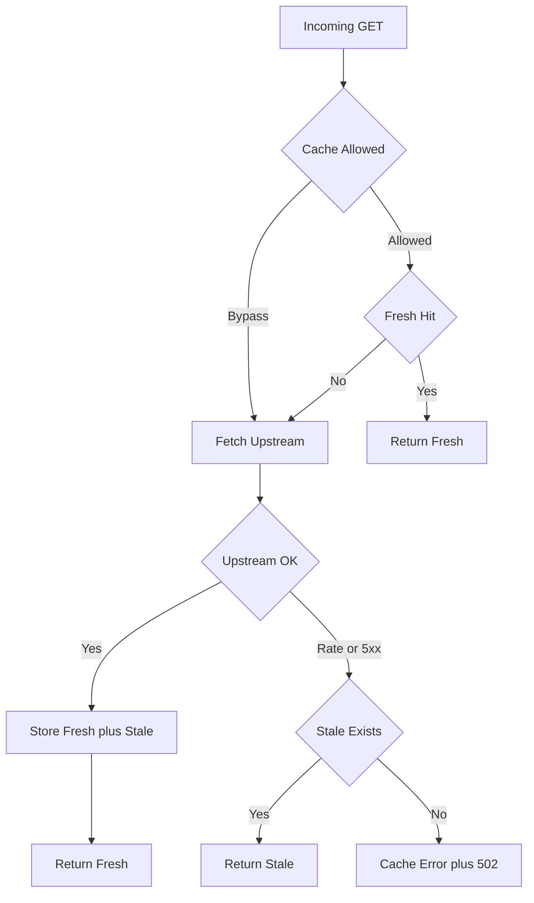
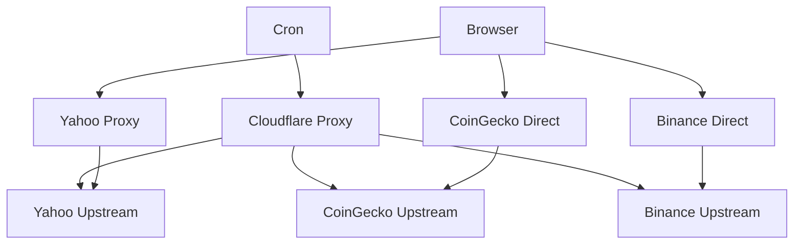

# TSD 04 — Cloudflare Proxy / Cloudflare Proxy

> Status: Kanonis
> Terverifikasi: 2026-09-16
> Tanggal: 2026-09-16
> Cakupan: Engine cache, 3 route, split browser dan cron

[Bahasa Indonesia](#bagian-id) · [English](#english-part)

## Bagian ID

### Ringkasan
- Proxy merupakan tier JSON caching di Pages Functions. Desain sat-set.
- Satu engine plus 3 route melayani Yahoo, Binance, CoinGecko.
- Browser direct untuk global dan derivatives, cron via proxy.

### Engine Cache

- Engine berada di `proxy.ts › proxyJsonGet` dengan coalescing internal.
- Policy mencakup fresh TTL, stale TTL, error TTL, dan bypass params.
- Header diagnostik mencakup proxy, cache, upstream, stale reason.
- Timeout default 8000ms dengan CORS terbuka dan UA kanonis.

### Tiga Route
| Route | Upstream Dan Cache | Catatan |
|---|---|---|
| `coingecko › proxy` | Host demo plus fresh 1800s | Dipakai cron trending |
| `binance › proxy` | Futures plus fresh 300-1800s | Dipakai cron ticker |
| `yahoo › proxy` | Chart plus quote plus search | Crumb untuk quoteSummary |

- Yahoo memakai auth crumb dan cookie dengan refresh saat 401.
- CoinGecko menyuntik demo key dari server tanpa ekspos browser.
- Binance memakai UA browser asli dengan timeout 5000ms.
- Hanya JSON sehat yang di-cache, error di-cache singkat.

### Split Browser Vs Cron

- Browser memakai proxy Yahoo karena gating crumb.
- Browser direct ke CoinGecko dan Binance via IP visitor.
- Cron memakai proxy untuk semua upstream agar cache warm.
- Split menghindari rate-limit IP shared Cloudflare.

### Terkait
- Arsitektur di `00-architecture.md`.
- Cron di `05-edge-functions.md`.
- Server vs browser di `../05-explainers/03-server-vs-browser.md`.

---
## English Part

### Overview
- Proxy is a JSON caching tier on Pages Functions. Design deep-dive.
- One engine plus 3 routes serves Yahoo, Binance, CoinGecko.
- Browser stays direct for global and derivatives, cron via proxy.

### Cache Engine

- Engine lives in `proxy.ts › proxyJsonGet` with internal coalescing.
- Policy covers fresh TTL, stale TTL, error TTL, and bypass params.
- Diagnostic headers cover proxy, cache, upstream, stale reason.
- Default timeout is 8000ms with open CORS and canonical UA.

### Three Routes
| Route | Upstream And Cache | Notes |
|---|---|---|
| `coingecko › proxy` | Demo host plus fresh 1800s | Used by trending cron |
| `binance › proxy` | Futures plus fresh 300-1800s | Used by ticker cron |
| `yahoo › proxy` | Chart plus quote plus search | Crumb for quoteSummary |

- Yahoo uses crumb and cookie auth with refresh on 401.
- CoinGecko injects server demo key without browser exposure.
- Binance uses real browser UA with 5000ms timeout.
- Only healthy JSON is cached, errors cache briefly.

### Browser Vs Cron Split

- Browser uses Yahoo proxy because of crumb gating.
- Browser calls CoinGecko and Binance direct via visitor IP.
- Cron uses proxy for all upstreams for warm cache.
- Split avoids shared Cloudflare IP rate limits.

### Related
- Architecture in `00-architecture.md`.
- Cron in `05-edge-functions.md`.
- Server vs browser in `../05-explainers/03-server-vs-browser.md`.
