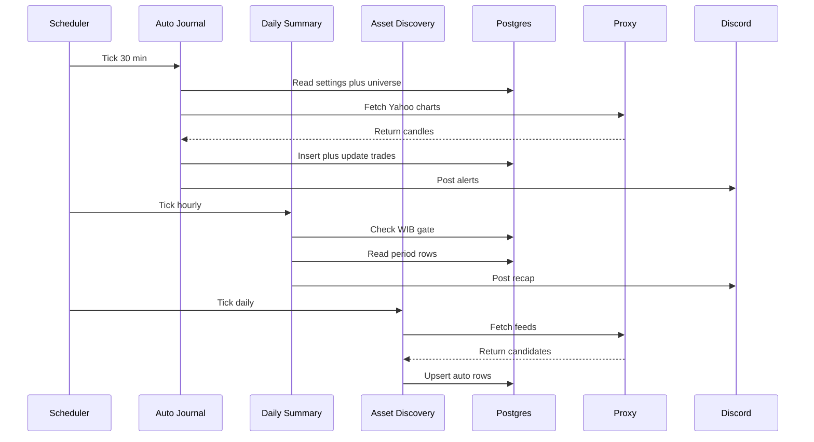

# TSD 05 — Edge Functions / Edge Functions

> Status: Kanonis
> Terverifikasi: 2026-09-16
> Tanggal: 2026-09-16
> Cakupan: 3 cron, gating, Discord, bundle edge

[Bahasa Indonesia](#bagian-id) · [English](#english-part)

## Bagian ID

### Ringkasan
- Tiga fungsi cron berjalan di Deno: auto-journal, summary, discovery. Orkestrasi sat-set.
- Tiap handler impor pure core dari `_engine.mjs` hasil build edge.
- Tulis memakai service-role dengan dukungan force manual via admin.

### Auto-Journal 30 Menit
| Aspek | Nilai |
|---|---|
| Path | `auto-journal › handler` |
| Pemicu | Cron 30 menit plus force admin |
| Output | Universe, fetch, emit, close, alerts |

- Gate memakai enabled, interval selaras WIB, dan klaim slot atomik.
- Universe dibaca dari `journal_assets` plus konstanta komoditas dan forex.
- Candle Yahoo diambil via proxy dengan pool terbatas 8.
- Discord memakai batch utuh maksimal 1900 karakter.

### Daily-Summary Hourly Dan Discovery Daily
| Aspek | Nilai |
|---|---|
| Summary path | `daily-summary › handler` |
| Summary picu | Hourly dengan self-gate WIB |
| Discovery path | `asset-discovery › handler` |

- Summary hanya kirim pada jam WIB terkonfigurasi dan hari kirim valid.
- Klaim send-once atomik per kind mencegah double-send.
- Discovery berjalan daily dengan klaim once-per-day WIB.
- Bar validasi mencakup 120 candle, cap 60 auto aktif, divergensi 0.3.

### Alur Tiga Cron

### Wiring Dan Konfig
| Berkas Jadwal | Job Dan Secret |
|---|---|
| `schedule-auto-journal › job` | 30m plus cron secret |
| `schedule-daily-summary › job` | Hourly plus cron secret |
| `schedule-asset-discovery › job` | Daily plus cron secret |

- Bundle dibuat via `npm run build:edge` dari `src/core/edge-engine.ts`.
- Output bundle adalah 3 `_engine.mjs` untuk tiap fungsi.
- Secret cron disimpan di Vault dan diverifikasi via header.
- JWT diverifikasi nonaktif karena handler membedakan cron dan admin.

### Terkait
- Fungsional di `../01-functional-specs/03-auto-journal.md`.
- Engine di `06-engine-internals.md`.
- Skema di `03-database-schema.md`.

---
## English Part

### Overview
- Three cron functions run on Deno: auto-journal, summary, discovery. Flow deep-dive.
- Each handler imports pure core from `_engine.mjs` edge build.
- Writes use service-role with manual force support via admin.

### Auto-Journal Every 30 Minutes
| Aspect | Value |
|---|---|
| Path | `auto-journal › handler` |
| Trigger | 30-minute cron plus admin force |
| Output | Universe, fetch, emit, close, alerts |

- Gates use enabled flag, WIB-aligned interval, and atomic slot claim.
- Universe is read from `journal_assets` plus commodity and forex constants.
- Yahoo candles are fetched via proxy with bounded pool of 8.
- Discord uses complete batches with 1900-character maximum.

### Hourly Daily-Summary And Daily Discovery
| Aspect | Value |
|---|---|
| Summary path | `daily-summary › handler` |
| Summary trigger | Hourly with WIB self-gate |
| Discovery path | `asset-discovery › handler` |

- Summary only sends on configured WIB hour and valid send day.
- Atomic send-once claim per kind prevents double-send.
- Discovery runs daily with once-per-day WIB claim.
- Validation bars cover 120 candles, 60 auto-active cap, 0.3 divergence.

### Three-Cron Flow

### Wiring And Config
| Schedule File | Job And Secret |
|---|---|
| `schedule-auto-journal › job` | 30m plus cron secret |
| `schedule-daily-summary › job` | Hourly plus cron secret |
| `schedule-asset-discovery › job` | Daily plus cron secret |

- Bundle is built via `npm run build:edge` from `src/core/edge-engine.ts`.
- Bundle output is 3 `_engine.mjs` files for each function.
- Cron secrets are stored in Vault and verified via header.
- JWT verification stays off because handler separates cron and admin.

### Related
- Functional in `../01-functional-specs/03-auto-journal.md`.
- Engine in `06-engine-internals.md`.
- Schema in `03-database-schema.md`.
