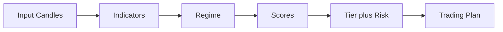

# TSD 06 — Engine Internals / Engine Internals

> Status: Kanonis
> Terverifikasi: 2026-09-16
> Tanggal: 2026-09-16
> Cakupan: Sinyal, indikator, konteks, plan, automation core

[Bahasa Indonesia](#bagian-id) · [English](#english-part)

## Bagian ID

### Ringkasan
- Engine bersifat pure dan single-source di `src/core/engine/` plus automation. Fondasi sat-set.
- Formula dan threshold terdokumentasi agar hasil browser dan cron identik.
- Kalibrasi memakai `MIN_CALIBRATION_SAMPLE=30` sebagai batas sampel.

### Pipeline Mini

- Input candle dinormalisasi sebelum indikator dihitung.
- Regime menentukan bobot kategori sinyal.
- Skor arah diskala ke strength 0-100.
- Tier dan risk dipetakan lalu plan dihitung.

### Sinyal Dan Regime
- Volume gate menandai unreliable bila rasio nol tinggi dalam window 50.
- Regime memakai squeeze prioritas, lalu trending, volatilitas, ranging.
- Skor kategori dinormalisasi per max lalu dibobot via regime multiplier.
- Tier A mulai 80, B mulai 60, C di bawah 60; risk low 75, medium 50.

### Peta Modul
| Berkas | Ekspor | Peran |
|---|---|---|
| `signals › computeSignal` | Outlook plus tier | Skor 4 kategori |
| `indicators › suite` | 19 fungsi O(n) | RSI hingga pivot |
| `regime › classify` | Regime pasar | Squeeze prioritas |

- Bobot trend 0.4, momentum 0.3, volatilitas 0.2, volume 0.1.
- Threshold RSI 30 dan 70, spike 1.5x, ADX 25 dan 20, Bollinger 20 dan 2.
- HTF konfirmasi boost bila selaras dan downgrade bila konflik.
- Counter-trend guard memaksa netral kecuali override 0.6.

### Konteks Dan Enrichment
- Tiga konteks melakukan de-rate top-down tanpa flip atau hide.
- Faktor de-rate 0.6 diskala ke score dan strength plus warning.
- `enrichAsset` menjalankan konteks lalu evidence display-only.
- Fundamentals hanya browser-only dan tidak mengubah plan cron.

### Indikator Dan Overlay
| Fungsi | Formula |
|---|---|
| `calculateRSI › wilder` | Rata-rata up-down 14 |
| `calculateEMA › smoothing` | Faktor 2 per period+1 |
| `calculateMACD › lines` | Fast 12 slow 26 signal 9 |

- Smart-money membaca OI, funding 0.0005, dan rasio 2.0.
- Akumulasi memakai 15 candle daily dengan gate volume 30 persen.
- Relative strength memakai band 1.0 persen dan skala 5.0 persen.
- Fundamentals memakai blackout 5 hari dan derate 0.85.

### Backtest Dan Kalibrasi
- Backtest single posisi, entry open bar berikut, tanpa lookahead.
- Mode default progresif dengan TP1 ke entry dan TP2 ke TP1.
- Biaya crypto 0.0004 plus slippage 0.0006 per sisi.
- Kalibrasi memakai `MIN_CALIBRATION_SAMPLE=30`; di bawah itu null.

### Plan Dan Automation Core
- Stop memakai 1.5x ATR plus fallback struktural swing dan pivot.
- R:R adaptif clamp 1-4 dengan 3 level TP dan clamp risk per tipe.
- `runAutoJournal` emit insert plus sync closure via replay candle.
- `recapWindow` memakai math kalender WIB dengan refMs injeksi.

### Terkait
- Fungsional di `../01-functional-specs/02-trading-engine.md`.
- Cron di `05-edge-functions.md`.
- Uji di `../03-testing/01-coverage-inventory.md`.

---
## English Part

### Overview
- Engine stays pure and single-sourced in `src/core/engine/` plus automation. Base deep-dive.
- Formulas and thresholds are documented for identical browser and cron results.
- Calibration uses `MIN_CALIBRATION_SAMPLE=30` as sample floor.

### Mini Pipeline

- Input candles are normalized before indicators are computed.
- Regime determines signal category weights.
- Direction scores scale into 0-100 strength.
- Tier and risk map first, then plan is computed.

### Signals And Regime
- Volume gate marks unreliable on high zero ratio in 50 window.
- Regime uses priority squeeze, then trending, volatility, ranging.
- Category scores normalize per max then weight via regime multipliers.
- Tier A from 80, B from 60, C below 60; risk low 75, medium 50.

### Module Map
| File | Exports | Role |
|---|---|---|
| `signals › computeSignal` | Outlook plus tier | 4-category score |
| `indicators › suite` | 19 O(n) functions | RSI through pivot |
| `regime › classify` | Market regime | Priority squeeze |

- Weights are trend 0.4, momentum 0.3, volatility 0.2, volume 0.1.
- Thresholds are RSI 30 and 70, spike 1.5x, ADX 25 and 20, Bollinger 20 and 2.
- HTF confirmation boosts on align and downgrades on conflict.
- Counter-trend guard forces neutral except 0.6 override.

### Contexts And Enrichment
- Three contexts apply top-down de-rate without flip or hide.
- De-rate factor 0.6 scales score and strength plus warning.
- `enrichAsset` runs contexts then display-only evidence.
- Fundamentals stay browser-only without changing cron plan.

### Indicators And Overlays
| Function | Formula |
|---|---|
| `calculateRSI › wilder` | 14-period up-down average |
| `calculateEMA › smoothing` | Factor 2 per period+1 |
| `calculateMACD › lines` | Fast 12 slow 26 signal 9 |

- Smart money reads OI, 0.0005 funding, and 2.0 ratio.
- Accumulation uses 15 daily candles with 30-percent volume gate.
- Relative strength uses 1.0-percent band and 5.0-percent scale.
- Fundamentals use 5-day blackout and 0.85 derate.

### Backtest And Calibration
- Backtest uses single position, next-bar open entry, no lookahead.
- Default progressive mode moves TP1 to entry and TP2 to TP1.
- Crypto cost is 0.0004 plus 0.0006 slippage per side.
- Calibration uses `MIN_CALIBRATION_SAMPLE=30`; below that returns null.

### Plan And Automation Core
- Stops use 1.5x ATR plus structural swing and pivot fallback.
- Adaptive R:R clamps 1-4 with 3 TP levels and per-type risk clamp.
- `runAutoJournal` emits inserts plus synced closures via candle replay.
- `recapWindow` uses WIB calendar math with injected refMs.

### Related
- Functional in `../01-functional-specs/02-trading-engine.md`.
- Cron in `05-edge-functions.md`.
- Tests in `../03-testing/01-coverage-inventory.md`.
