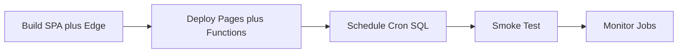

# TSD 07 — Deployment / Deployment

> Status: Kanonis
> Terverifikasi: 2026-09-16
> Tanggal: 2026-09-16
> Cakupan: Build, deploy edge, schedule cron, env, smoke

[Bahasa Indonesia](#bagian-id) · [English](#english-part)

## Bagian ID

### Ringkasan
- Deploy memakai 3 jalur: SPA, edge functions, wiring cron. Alur sat-set.
- Build SPA tidak memperbarui cron tanpa bundle edge terpisah.
- Smoke test manual memvalidasi Pages, cron, Discord, dan universe.

### Alur Deploy

- Build SPA via `npm run build` ke `dist/` untuk Pages.
- Bundle edge via `npm run build:edge` dari engine ke 3 file.
- Deploy Pages via dashboard atau integrasi Git.
- Deploy fungsi via Supabase CLI per cron.

### Build Dan Deploy Edge
- `npm run build` menjalankan typecheck plus Vite build.
- `npm run build:edge` memakai esbuild ESM neutral dengan alias `@`.
- Output adalah 3 `_engine.mjs` untuk auto-journal, summary, discovery.
- Deploy memakai `deploy:auto-journal`, `deploy:daily-summary`, `deploy:asset-discovery`.

### Schedule Cron
| Jadwal | Job | Pola |
|---|---|---|
| Auto-journal | 30 menit | Interval WIB selaras |
| Summary | Hourly | Self-gate WIB |
| Discovery | Daily | Once per day WIB |

- SQL dijalankan sekali setelah fungsi terdeploy.
- Secret vault dipakai untuk header cron privat.
- Nilai `CRON_SECRET` disamakan dengan secret vault.
- Retune interval dimungkinkan via alter job tanpa redeploy.

### Env Dan Smoke
| Var | Peran |
|---|---|
| `VITE_SUPABASE_URL` | Klien browser |
| `VITE_SUPABASE_PUBLISHABLE_KEY` | Klien browser RLS |

- `.env.example` hanya berisi URL plus publishable key.
- Vault menyimpan URL fungsi plus cron secret.
- Runtime edge memakai service-role plus webhook Discord.
- Proxy memakai demo key CoinGecko opsional via dashboard.

### Update Flow
| Ubah | Langkah |
|---|---|
| UI | Build lalu deploy Pages |
| Engine | Bundle edge lalu deploy fungsi |
| Schedule | Alter job via SQL editor |
| Konfig cron | Admin UI tanpa redeploy |

### Terkait
- Stack di `01-tech-stack.md`.
- Cron di `05-edge-functions.md`.
- Runbook di `../04-operations/00-runbook.md`.

---
## English Part

### Overview
- Deployment uses 3 tracks: SPA, edge functions, cron wiring. Flow deep-dive.
- SPA build never updates cron without separate edge bundle.
- Manual smoke tests validate Pages, cron, Discord, and universe.

### Deploy Flow

- SPA build via `npm run build` into `dist/` for Pages.
- Edge bundle via `npm run build:edge` from engine into 3 files.
- Pages deploy via dashboard or Git integration.
- Function deploy via Supabase CLI per cron.

### Edge Build And Deploy
- `npm run build` runs typecheck plus Vite build.
- `npm run build:edge` uses neutral ESM esbuild with `@` alias.
- Output is 3 `_engine.mjs` files for auto-journal, summary, discovery.
- Deploy uses `deploy:auto-journal`, `deploy:daily-summary`, `deploy:asset-discovery`.

### Cron Schedule
| Schedule | Job | Pattern |
|---|---|---|
| Auto-journal | 30 minutes | WIB-aligned interval |
| Summary | Hourly | WIB self-gate |
| Discovery | Daily | Once per day WIB |

- SQL runs once after functions are deployed.
- Vault secrets supply private cron headers.
- `CRON_SECRET` value matches vault secret.
- Interval retune is possible via alter job without redeploy.

### Env And Smoke
| Var | Role |
|---|---|
| `VITE_SUPABASE_URL` | Browser client |
| `VITE_SUPABASE_PUBLISHABLE_KEY` | Browser RLS client |

- `.env.example` only contains URL plus publishable key.
- Vault stores function URLs plus cron secret.
- Edge runtime uses service-role plus Discord webhook.
- Proxy uses optional CoinGecko demo key via dashboard.

### Update Flow
| Change | Steps |
|---|---|
| UI | Build then deploy Pages |
| Engine | Bundle edge then deploy functions |
| Schedule | Alter job via SQL editor |
| Cron config | Admin UI without redeploy |

### Related
- Stack in `01-tech-stack.md`.
- Cron in `05-edge-functions.md`.
- Runbook in `../04-operations/00-runbook.md`.
