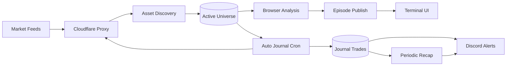
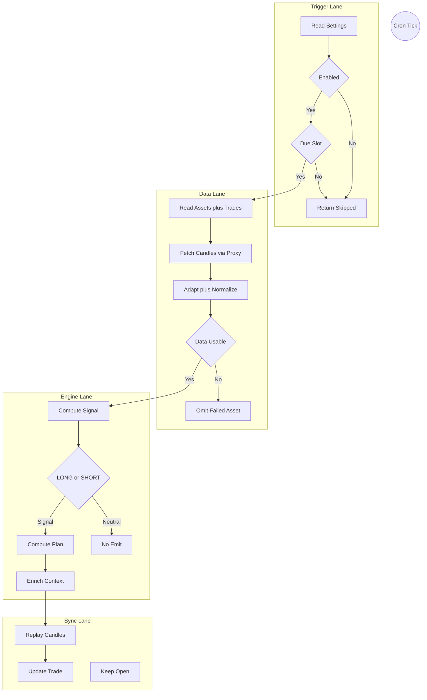
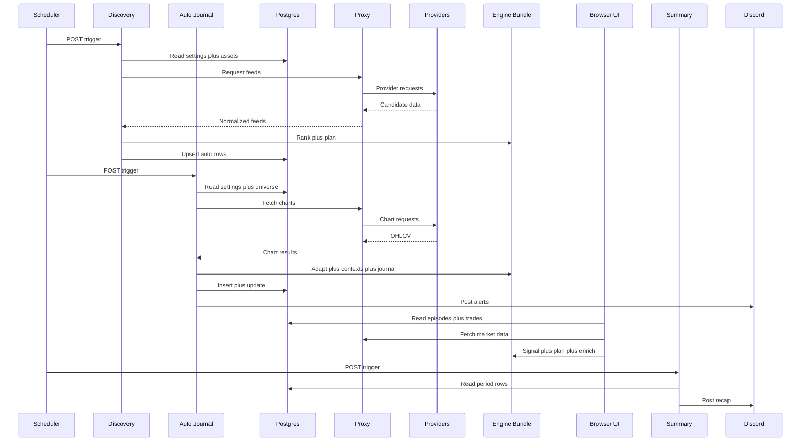

# TSD 08 — Diagram Alur Sinyal / Signal Flow Diagrams

> Status: Kanonis
> Terverifikasi: 2026-09-16
> Tanggal: 2026-09-16
> Cakupan: End-to-end, activity swimlanes, sequence production

[Bahasa Indonesia](#bagian-id) · [English](#english-part)

## Bagian ID

### Ringkasan
- Dokumen memetakan kode production yang benar-benar berjalan. Cakupan sat-set.
- Tiga diagram kanonis: end-to-end, activity, sequence production.
- Modul compute, plan, enrich, dan journal tetap terpisah.

### Diagram End-To-End

- Caption ID: Universe mengatur crypto dan saham Amerika plus IDX untuk premium dan cron.
- Jalur browser dan edge memakai adapter plus engine pure yang sama.
- Edge memakai bundle `_engine.mjs`, bukan implementasi sinyal kedua.

### Diagram Activity Swimlanes

- Caption ID: Emission ditahan oleh data-quality, stale quote, dan episode blokir.
- Trade terbuka disinkronkan dari candle bertimestamp sejak entry.
- Plan dihitung di adapter sebelum enrichment penyesuaian conviction.

### Sequence Production

- Caption ID: Browser publikasi LONG dan SHORT hanya dari episode aktif valid.
- Entry, TP, SL awal, dan R:R tetap, evidence market tetap live.
- Notifikasi immediate via auto-journal dan rekap via summary.

### Realitas Implementasi
| Aspek | Perilaku Aktual |
|---|---|
| Sumber sinyal | Modul pure sama via bundle edge |
| Urutan plan | Sinyal lalu plan lalu enrich |
| Publikasi | Episode valid tentukan LONG dan SHORT |

### Terkait
- Metodologi di `../05-explainers/00-trading-methodology.md`.
- Arsitektur di `00-architecture.md`.
- Engine di `06-engine-internals.md`.

---
## English Part

### Overview
- Document maps production code in actual execution. Scope deep-dive.
- Three canonical diagrams: end-to-end, activity, production sequence.
- Compute, plan, enrich, and journal modules stay separate.

### End-To-End Diagram

- EN caption: Universe supplies crypto and American plus IDX equities for premium and cron.
- Browser and edge paths use same adapter plus pure engine.
- Edge runs `_engine.mjs` bundle, not a second signal implementation.

### Activity Swimlanes Diagram

- EN caption: Emission is held by data quality, stale quotes, and blocked episodes.
- Open trades sync from timestamped candles since entry.
- Plan is computed in adapter before conviction-adjusting enrichment.

### Production Sequence

- EN caption: Browser publishes LONG and SHORT only from valid active episodes.
- Entry, TP, initial SL, and R:R stay fixed, market evidence stays live.
- Immediate notifications via auto-journal and recaps via summary.

### Implementation Reality
| Aspect | Actual Behavior |
|---|---|
| Signal source | Same pure modules via edge bundle |
| Plan order | Signal then plan then enrich |
| Publication | Valid episodes set LONG and SHORT |

### Related
- Methodology in `../05-explainers/00-trading-methodology.md`.
- Architecture in `00-architecture.md`.
- Engine in `06-engine-internals.md`.
