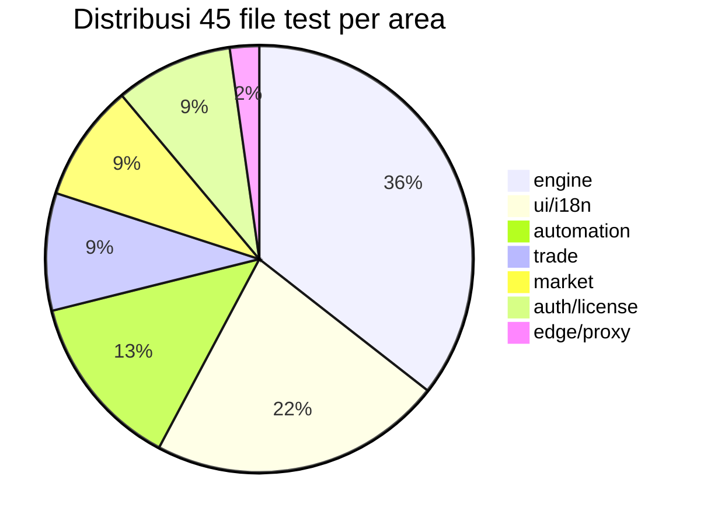
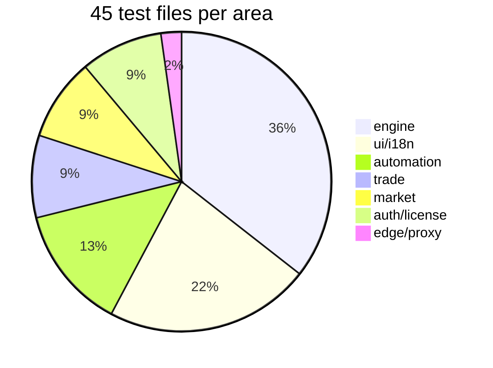

# Pengujian 01 — Inventaris Coverage / Testing 01 — Coverage Inventory

> Status verifikasi: angka dan path diverifikasi pada 2026-09-16. Kanonis: 45 file / 422 case (`node --test tests/*.test.mjs`); inventaris di bawah dibuat dari pemindaian folder `tests/` pada 2026-09-16.
> Verification status: figures and paths verified on 2026-09-16. Canonical: 45 files / 422 cases (`node --test tests/*.test.mjs`); the inventory below derives from a scan of the `tests/` folder on 2026-09-16.

[Bahasa Indonesia](#bagian-id) · [English](#english-part)

## Bagian ID

### Ringkasan

Total 45 file / 422 case terdistribusi ke 7 area. Konsentrasi terbesar berada di engine, diikuti UI/i18n dan automation. Detail sebaran cocok untuk deep-dive prioritas testing berikutnya.

| Metrik | Nilai |
|---|---|
| File test | 45 |
| Total case | 422 |
| Framework | `node --test` dan `node:assert/strict` |
| Load | Vite SSR `ssrLoadModule` real `.ts` |
| Fokus | Pure trading-engine core (`src/core/engine/*`, `src/core/automation/*`, `src/core/trade/*`) |
| Celah | Edge I/O handler (`supabase/functions/*/index.ts`), interaksi UI runtime, hooks (lihat `02-gaps-and-conventions.md`) |

### Tabel per area

| Area | File count | Fokus |
|---|---|---|
| engine | 16 | Sinyal, regime, indikator, 3 konteks, enrichment, flow, fundamentals, backtest, kalibrasi |
| automation | 6 | Auto-journal core, discovery, alerts, recap periodik, manajemen universe |
| trade | 4 | Follow-trade model, setup chart, performa jurnal, success-rate publik |
| market | 4 | Market context, pulse mapper, screener universe, validasi CoinGecko |
| auth/license | 4 | Auth redirect, premium trial, dialog lisensi, skema testimoni |
| ui/i18n | 10 | Komposisi overlay, copy toast, chat widget, SEO preview, skeleton, empty-state, locale, performa terminal |
| edge/proxy | 1 | Cache/coalescing/stale/error/bypass proxy Cloudflare |

### Rincian file per area

#### engine (16 file)

| File | Fokus |
|---|---|
| `accumulation.test.mjs` | derive/apply akumulasi, gate volume, resample daily |
| `calibration.test.mjs` | `calibrateConfidence`, gate `MIN_CALIBRATION_SAMPLE=30` |
| `context-pipeline.test.mjs` | Derivasi konteks, de-rate counter-trend, parity missing-benchmark |
| `crypto-context.test.mjs` | Risk state BTC, de-rate counter-trend crypto |
| `engine-extras.test.mjs` | RSI series, crypto daily-change baseline |
| `enrichment.test.mjs` | Benchmark wajib, evidence display-only, isolasi cross-market |
| `fundamentals.test.mjs` | Blackout pre-earnings, consensus analis, valuasi |
| `idx-context.test.mjs` | Risk state IHSG dan rupiah, de-rate saham ID |
| `indicators-edge-cases.test.mjs` | Edge numerik RSI/EMA/MACD/Bollinger/StochRSI/DMI/ATR/OBV/MFI |
| `regime-engine.test.mjs` | 4 regime, collapsed-band, prioritas squeeze |
| `relative-strength.test.mjs` | Excess return, leader/laggard, cap conviction |
| `signal-engine.test.mjs` | Closed-candle gate, regime, parity production/backtest, gross/net R |
| `signal-episode.test.mjs` | Episode sinyal v5, blok episode, re-arm |
| `signal-suppressed.test.mjs` | Flag suppressed, invariant suppressed-menuju-neutral |
| `smart-money.test.mjs` | Mapping perp, positioning OI/funding, nudge bounded |
| `us-context.test.mjs` | Risk state S&P/VIX/DXY, de-rate counter-trend |

#### automation (6 file)

| File | Fokus |
|---|---|
| `alerts.test.mjs` | Mapping exit reason, section Discord, split multi-message |
| `asset-discovery-core.test.mjs` | Base perp, ranking kandidat, dedup, plan discovery, parser feed |
| `auto-journal-core.test.mjs` | Entry, replay candle, exit progresif/TP/final/reversal, retry, phantom guard |
| `daily-summary.test.mjs` | Scoreboard recap, empty day, window harian/mingguan/bulanan |
| `journal-assets-management.test.mjs` | Kurasi universe, active/source, batas auto |
| `journal-period.test.mjs` | Konfigurasi periode jurnal, bulan aktif, rollover |

#### trade (4 file)

| File | Fokus |
|---|---|
| `follow-trade-model.test.mjs` | P&L/R direction-aware, replay progressive-stop, exit reasons, bucket outcome |
| `journal-performance.test.mjs` | Agregat performa, kurva ekuitas, guard performa |
| `public-journal-success-rates.test.mjs` | Normalisasi bigint, RPC agregat-only, denominator tanpa impas |
| `trade-setup-model.test.mjs` | Domain chart, R-multiples, tick mapping, marker-candle |

#### market (4 file)

| File | Fokus |
|---|---|
| `coingecko.test.mjs` | Snapshot valid, delta BTC.D, fallback |
| `market-context.test.mjs` | Suffix BTC.D, stale quote, volatilitas Garman-Klass, sesi IHSG |
| `market-pulse-mapper.test.mjs` | Normalisasi risk appetite, mapping 5 kartu, fallback, sparkline |
| `screener-universe.test.mjs` | Group universe, fallback, filter inactive |

#### auth/license (4 file)

| File | Fokus |
|---|---|
| `auth-redirect.test.mjs` | Round-trip path/query/hash, sanitasi scheme dan encoding |
| `license-access-dialog.test.mjs` | Status premium versus form aktivasi |
| `premium-trial.test.mjs` | `isTrialActive`, stamp encode/decode, durasi `VITE_TRIAL_DURATION` |
| `testimonial-schema.test.mjs` | Trim valid, tolak konten pendek/oversize dan rating invalid |

#### ui/i18n (10 file)

| File | Fokus |
|---|---|
| `chat.test.mjs` | Endpoint chat, token, shape response |
| `chat-ui.test.mjs` | Komposisi widget copilot, dialog parity |
| `empty-state.test.mjs` | State kosong versus loading versus error |
| `i18n.test.mjs` | Parity key locale, namespace |
| `learn-i18n.test.mjs` | Copy edukasi, key label |
| `overlay-composition.test.mjs` | Komposisi Dialog/AlertDialog/Popover/Sheet/Select/DropdownMenu/Tooltip |
| `seo-preview.test.mjs` | Meta tag, preview card |
| `skeleton-loading.test.mjs` | Skeleton versus konten final |
| `terminal-performance.test.mjs` | Guard render terminal, worker, query observer |
| `toast-copy.test.mjs` | Helper notifikasi, parity locale, single-language copy |

#### edge/proxy (1 file)

| File | Fokus |
|---|---|
| `proxy.test.mjs` | Cache/coalescing/stale/error/bypass, pinning upstream origin |

### Distribusi

Catatan generate: inventaris dibuat dari pemindaian folder `tests/` pada 2026-09-16; total 45 file / 422 case dihitung dari `test("...")` per file.

### Terkait

- [`00-overview.md`](00-overview.md) — framework
- [`02-gaps-and-conventions.md`](02-gaps-and-conventions.md) — gap dan rekomendasi
- [`../02-technical-specs/06-engine-internals.md`](../02-technical-specs/06-engine-internals.md) — modul yang di-test

## English Part

### Summary

The total of 45 files / 422 cases spreads across 7 areas. The largest concentration sits in the engine, followed by UI/i18n and automation. The breakdown suits a deep look at future testing priorities.

| Metric | Value |
|---|---|
| Test files | 45 |
| Total cases | 422 |
| Framework | `node --test` and `node:assert/strict` |
| Loading | Vite SSR `ssrLoadModule` of real `.ts` |
| Focus | Pure trading-engine core (`src/core/engine/*`, `src/core/automation/*`, `src/core/trade/*`) |
| Gaps | Edge I/O handlers (`supabase/functions/*/index.ts`), runtime UI interaction, hooks (see `02-gaps-and-conventions.md`) |

### Per-area table

| Area | File count | Focus |
|---|---|---|
| engine | 16 | Signals, regime, indicators, 3 contexts, enrichment, flow, fundamentals, backtest, calibration |
| automation | 6 | Auto-journal core, discovery, alerts, periodic recaps, universe management |
| trade | 4 | Follow-trade model, chart setup, journal performance, public success rates |
| market | 4 | Market context, pulse mapper, screener universe, CoinGecko validation |
| auth/license | 4 | Auth redirect, premium trial, license dialog, testimonial schema |
| ui/i18n | 10 | Overlay composition, toast copy, chat widget, SEO preview, skeletons, empty states, locales, terminal performance |
| edge/proxy | 1 | Cloudflare proxy cache/coalescing/stale/error/bypass |

### File details per area

#### engine (16 files)

| File | Focus |
|---|---|
| `accumulation.test.mjs` | Accumulation derive/apply, volume gates, daily resample |
| `calibration.test.mjs` | `calibrateConfidence`, `MIN_CALIBRATION_SAMPLE=30` gate |
| `context-pipeline.test.mjs` | Context derivation, counter-trend de-rate, missing-benchmark parity |
| `crypto-context.test.mjs` | BTC risk state, crypto counter-trend de-rate |
| `engine-extras.test.mjs` | RSI series, crypto daily-change baseline |
| `enrichment.test.mjs` | Required benchmarks, display-only evidence, cross-market isolation |
| `fundamentals.test.mjs` | Pre-earnings blackout, analyst consensus, valuation |
| `idx-context.test.mjs` | IHSG and rupiah risk state, ID-stock de-rate |
| `indicators-edge-cases.test.mjs` | Numeric edges for RSI/EMA/MACD/Bollinger/StochRSI/DMI/ATR/OBV/MFI |
| `regime-engine.test.mjs` | 4 regimes, collapsed band, squeeze priority |
| `relative-strength.test.mjs` | Excess return, leader/laggard, conviction cap |
| `signal-engine.test.mjs` | Closed-candle gates, regime, production/backtest parity, gross/net R |
| `signal-episode.test.mjs` | Signal episodes v5, episode blocks, re-arm |
| `signal-suppressed.test.mjs` | Suppressed flag, suppressed-to-neutral invariant |
| `smart-money.test.mjs` | Perp mapping, OI/funding positioning, bounded nudge |
| `us-context.test.mjs` | S&P/VIX/DXY risk state, counter-trend de-rate |

#### automation (6 files)

| File | Focus |
|---|---|
| `alerts.test.mjs` | Exit-reason mapping, Discord sections, multi-message splits |
| `asset-discovery-core.test.mjs` | Perp base, candidate ranking, dedup, discovery plan, feed parsers |
| `auto-journal-core.test.mjs` | Entries, candle replay, progressive/TP/final/reversal exits, retry, phantom guards |
| `daily-summary.test.mjs` | Scoreboard recap, empty days, daily/weekly/monthly windows |
| `journal-assets-management.test.mjs` | Universe curation, active/source states, auto caps |
| `journal-period.test.mjs` | Journal period configuration, active months, rollover |

#### trade (4 files)

| File | Focus |
|---|---|
| `follow-trade-model.test.mjs` | Direction-aware P&L/R, progressive-stop replay, exit reasons, outcome buckets |
| `journal-performance.test.mjs` | Performance aggregates, equity curve, performance guards |
| `public-journal-success-rates.test.mjs` | Bigint normalization, aggregate-only RPC, ex-breakeven denominator |
| `trade-setup-model.test.mjs` | Chart domain, R-multiples, tick mapping, marker-candle alignment |

#### market (4 files)

| File | Focus |
|---|---|
| `coingecko.test.mjs` | Valid snapshots, BTC.D delta, fallbacks |
| `market-context.test.mjs` | BTC.D suffix, stale quotes, Garman-Klass volatility, IHSG session |
| `market-pulse-mapper.test.mjs` | Risk-appetite normalization, 5-card mapping, fallbacks, sparklines |
| `screener-universe.test.mjs` | Universe grouping, fallbacks, inactive filters |

#### auth/license (4 files)

| File | Focus |
|---|---|
| `auth-redirect.test.mjs` | Path/query/hash round-trip, scheme and encoding sanitization |
| `license-access-dialog.test.mjs` | Premium status versus activation form |
| `premium-trial.test.mjs` | `isTrialActive`, stamp encode/decode, `VITE_TRIAL_DURATION` length |
| `testimonial-schema.test.mjs` | Valid trims, rejection of short/oversized content and invalid ratings |

#### ui/i18n (10 files)

| File | Focus |
|---|---|
| `chat.test.mjs` | Chat endpoint, tokens, response shape |
| `chat-ui.test.mjs` | Copilot widget composition, dialog parity |
| `empty-state.test.mjs` | Empty versus loading versus error states |
| `i18n.test.mjs` | Locale key parity, namespaces |
| `learn-i18n.test.mjs` | Educational copy, label keys |
| `overlay-composition.test.mjs` | Dialog/AlertDialog/Popover/Sheet/Select/DropdownMenu/Tooltip composition |
| `seo-preview.test.mjs` | Meta tags, preview cards |
| `skeleton-loading.test.mjs` | Skeletons versus final content |
| `terminal-performance.test.mjs` | Terminal render guards, workers, query observers |
| `toast-copy.test.mjs` | Notification helpers, locale parity, single-language copy |

#### edge/proxy (1 file)

| File | Focus |
|---|---|
| `proxy.test.mjs` | Cache/coalescing/stale/error/bypass, upstream origin pinning |

### Distribution

Generation note: the inventory derives from a scan of the `tests/` folder on 2026-09-16; the 45-file / 422-case total counts `test("...")` per file.

### Related

- [`00-overview.md`](00-overview.md) — framework
- [`02-gaps-and-conventions.md`](02-gaps-and-conventions.md) — gaps and recommendations
- [`../02-technical-specs/06-engine-internals.md`](../02-technical-specs/06-engine-internals.md) — modules under test
