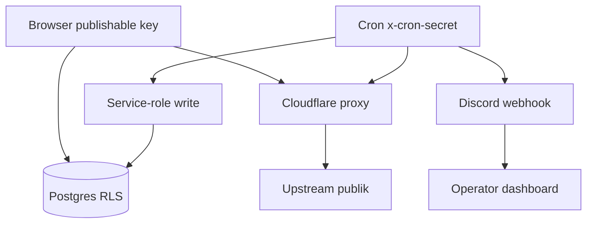

# Operasional 01 — Keamanan / Ops 01 — Security

> Status verifikasi: perintah dan path diverifikasi pada 2026-09-16. Kanonis: 16 tabel; 28 RPC; 38 migrasi; `.env.example` 2 vars.
> Verification status: commands and paths verified on 2026-09-16. Canonical: 16 tables; 28 RPCs; 38 migrations; 2-var `.env.example`.

[Bahasa Indonesia](#bagian-id) · [English](#english-part)

## 🇮🇩 Ringkasan

Prinsip inti tetap satu kalimat: browser tidak dipercaya sebagai penegak akses. Seluruh gerbang sensitif (premium, admin, tulis jurnal) ditegakkan di server Postgres melalui RLS plus RPC `SECURITY DEFINER`. Browser memakai publishable key yang terikat RLS. Cron memvalidasi header privat `x-cron-secret` sebelum memakai service-role. Alur sat-set dari request sampai data tetap terkunci rapi.

Rahasia (kode redeem, cron secret, service-role) tersimpan di Supabase Vault atau env function, tidak pernah masuk git.

## 🇮🇩 Model Ancaman

Sepuluh baris di bawah memetakan aset, ancaman, dan pertahanan. Tabel memakai 3 kolom agar nyaman dibaca di mobile.

| Aset | Ancaman | Pertahanan |
|---|---|---|
| `journal_trades` baca | Akun free mencoba membaca jurnal premium | RLS premium-read: authenticated plus `is_premium()`; anon nol baris |
| `journal_trades` tulis | Upaya tulis atau injeksi trade palsu | Tanpa policy tulis untuk klien; hanya service-role cron (INSERT/UPDATE) |
| `journal_assets` | Akun non-admin mencoba mengubah universe | RLS admin-only FOR ALL; premium hanya SELECT |
| `journal_settings` | Upaya mengubah pause atau interval | RLS admin-only via `is_admin()` |
| `access_codes`, `invitations` | Upaya membaca kode lalu redeem mandiri | Terkunci tanpa policy; akses hanya via RPC `redeem_*` |
| `profiles` tier dan flag | Upaya set `tier premium` atau `is_admin` | SELECT baris milik sendiri; tulis hanya via RPC `admin_*` |
| Brute-force kode | Tebakan kode berulang | RPC row-locked, return generik `invalid`, batas `max_redemptions` |
| Blokir diri sendiri | Admin memblokir atau menghapus akun sendiri | Guard anti-self di `admin_toggle_block_user` dan `admin_delete_user` |
| Manipulasi redirect OAuth | Parameter `redirect` diarahkan ke phishing | Sanitasi di `auth-redirect.ts`, teruji di `auth-redirect.test.mjs` |
| Phantom close | Candle transient memicu TP/SL palsu | Hanya candle timestamped memutuskan TP/SL; spot di atas SL diabaikan |

## 🇮🇩 Hierarki Kunci

| Kunci | Lingkup | Penyimpanan |
|---|---|---|
| `VITE_SUPABASE_PUBLISHABLE_KEY` | Browser, terikat RLS (read-only per policy) | `.env` gitignored |
| `SUPABASE_SERVICE_ROLE_KEY` | Cron edge function, bypass RLS | Auto-inject saat deploy; tanpa `secrets set`, tanpa bundle |
| `rabalaba_cron_secret` | Header privat pg_cron ke Edge Function | Vault plus env `CRON_SECRET` |
| Kode akses dan undangan | Baris DB, RPC-only | DB, di luar git |
| `DISCORD_WEBHOOK_URL` | Alert cron per function | Env function di dashboard |
| `COINGECKO_DEMO_API_KEY` | Proxy CoinGecko | Env Cloudflare Pages di dashboard |

Aturan baku: materi pembawa rahasia keluar dari git. `.env.example` hanya mencantumkan `VITE_SUPABASE_URL` plus `VITE_SUPABASE_PUBLISHABLE_KEY` (nama tanpa nilai). `.env` gitignored.

## 🇮🇩 Rasional Desain RLS

Browser dapat dimodifikasi melalui DevTools atau replay request. Pengecekan premium yang hanya berada di React (sembunyi tombol) mudah dilewati via fetch langsung. RLS dieksekusi di Postgres pada setiap query sehingga tidak dapat dilewati dari sisi klien. UI hanya menyembunyikan untuk kenyamanan; RLS yang mengunci secara nyata.

RPC berjalan dengan hak pemilik function, bukan pemanggil. Pola tersebut memungkinkan operasi yang tidak dimiliki pemanggil secara langsung (contoh `admin_create_user` menulis `auth.users`). Guard `is_admin()` di awal function menjadi gerbang server-side yang tidak dapat dilewati.

Jurnal merupakan output berbayar. Tanpa gerbang baca, tier premium kehilangan nilai. RLS `is_premium()` (premium atau trial aktif, menghormati `is_blocked`) menjadi gerbang baca; cron service-role tetap menulis tanpa hambatan.

Kode akses terkunci tanpa policy agar tidak dapat di-dump. Akses redeem hanya via RPC row-lock dengan return generik. Daftar admin memakai `admin_list_*` dengan guard `is_admin()`.

## 🇮🇩 Batas Kepercayaan

Caption: browser dan cron melewati gerbang berbeda menuju data yang sama; proxy dan webhook berada di luar zona data sensitif.

Zona merah (data sensitif: jurnal, profil, kode) hanya tersentuh via RLS atau service-role. Zona kuning (proxy market, webhook Discord) membawa data publik atau notifikasi tanpa akses tulis DB.

## 🇮🇩 Checklist Audit

| Item | Pemilik | Frekuensi |
|---|---|---|
| Service-role absen dari `src/` (hanya edge server-side) | Engineer | Tiap PR |
| Tiap tabel sensitif punya policy (kecuali locked intentional) | Engineer | Tiap migrasi |
| `redeem_*` return generik tanpa bocor eksistensi | Engineer | Tiap rilis auth |
| Rotasi `CRON_SECRET` dan sinkron Vault | Operator | Kuartalan |
| Review daftar admin dan owner | Owner | Bulanan |
| Review log `cron.job_run_details` anomali 401 dan 429 | Operator | Mingguan |
| CORS proxy tanpa header auth sensitif | Engineer | Tiap rilis proxy |

## 🇮🇩 Tautan Terkait

- Skema: `../02-technical-specs/03-database-schema.md`
- Auth: `../01-functional-specs/06-auth-entitlement.md`
- Runbook: `00-runbook.md`
- Proxy: `../02-technical-specs/04-cloudflare-proxy.md`

---

## 🇺🇸 Summary

Core principle remains one sentence: the browser never serves as access enforcer. Sensitive gates (premium, admin, journal writes) stay enforced on Postgres via RLS plus `SECURITY DEFINER` RPCs. The browser uses an RLS-bound publishable key. Cron validates a private `x-cron-secret` header before using service-role. Deep-dive flow from request to data remains neatly locked.

Secrets (redeem codes, cron secret, service-role) live in Supabase Vault or function env, never in git.

## 🇺🇸 Threat Model

Ten rows below map assets, threats, plus defenses. Tables use 3 columns for comfortable mobile reading.

| Asset | Threat | Defense |
|---|---|---|
| `journal_trades` read | Free accounts reading premium journal | Premium-read RLS: authenticated plus `is_premium()`; anon zero rows |
| `journal_trades` write | Fake trade writes or injection | No client write policy; service-role cron only (INSERT/UPDATE) |
| `journal_assets` | Non-admin universe edits | Admin-only RLS FOR ALL; premium SELECT only |
| `journal_settings` | Pause or interval tampering | Admin-only RLS via `is_admin()` |
| `access_codes`, `invitations` | Code reads plus self redeem | Locked without policies; `redeem_*` RPC access only |
| `profiles` tier plus flags | Forced `premium tier` or `is_admin` sets | Own-row SELECT; writes via `admin_*` RPCs only |
| Code brute-force | Repeated code guessing | Row-locked RPC, generic `invalid` return, `max_redemptions` cap |
| Self block | Admin blocking or deleting own account | Anti-self guard in `admin_toggle_block_user` plus `admin_delete_user` |
| OAuth redirect abuse | `redirect` param pointed at phishing | Sanitizer in `auth-redirect.ts`, covered in `auth-redirect.test.mjs` |
| Phantom close | Transient candles firing fake TP/SL | Timestamped candles decide TP/SL; above-SL spot ignored |

## 🇺🇸 Key Hierarchy

| Key | Scope | Storage |
|---|---|---|
| `VITE_SUPABASE_PUBLISHABLE_KEY` | Browser, RLS-bound (read-only per policy) | Gitignored `.env` |
| `SUPABASE_SERVICE_ROLE_KEY` | Cron edge function, RLS bypass | Auto-injected on deploy; no `secrets set`, no bundle |
| `rabalaba_cron_secret` | Private pg_cron header to Edge Function | Vault plus `CRON_SECRET` env |
| Access plus invitation codes | DB rows, RPC-only | DB, outside git |
| `DISCORD_WEBHOOK_URL` | Per-function cron alerts | Function env in dashboard |
| `COINGECKO_DEMO_API_KEY` | CoinGecko proxy | Cloudflare Pages env in dashboard |

Fixed rule: secret-bearing material stays out of git. `.env.example` lists `VITE_SUPABASE_URL` plus `VITE_SUPABASE_PUBLISHABLE_KEY` only (names without values). `.env` remains gitignored.

## 🇺🇸 RLS Design Rationale

Browsers accept modification through DevTools or request replay. Premium checks living only in React (button hiding) fall to direct fetch. RLS executes in Postgres on each query so no client-side bypass exists. UI hides for comfort; RLS locks for real.

RPCs run with function-owner privilege, not caller privilege. Pattern allows operations lacking direct caller rights (example `admin_create_user` writing `auth.users`). Leading `is_admin()` guards form server-side gates without bypass.

Journal serves as paid output. Without read gates, premium tiers lose value. RLS `is_premium()` (premium or active trial, respecting `is_blocked`) forms the read gate; service-role cron writes unimpeded.

Access codes stay locked without policies against dumps. Redeem access passes row-locked RPCs with generic returns. Admin lists use `admin_list_*` with `is_admin()` guards.

## 🇺🇸 Trust Boundary

Caption: browser plus cron pass separate gates toward shared data; proxy plus webhook sit outside sensitive data zones.

Red zone (sensitive data: journal, profiles, codes) accepts touches via RLS or service-role only. Yellow zone (market proxy, Discord webhook) carries public data or notifications without DB write access.

## 🇺🇸 Audit Checklist

| Item | Owner | Frequency |
|---|---|---|
| Service-role absent from `src/` (edge server-side only) | Engineer | Each PR |
| Each sensitive table holds policies (except intentional locks) | Engineer | Each migration |
| `redeem_*` generic returns without existence leaks | Engineer | Each auth release |
| `CRON_SECRET` rotation plus Vault sync | Operator | Quarterly |
| Admin plus owner list review | Owner | Monthly |
| `cron.job_run_details` anomaly review for 401 plus 429 | Operator | Weekly |
| Proxy CORS without sensitive auth headers | Engineer | Each proxy release |

## 🇺🇸 Related Links

- Schema: `../02-technical-specs/03-database-schema.md`
- Auth: `../01-functional-specs/06-auth-entitlement.md`
- Runbook: `00-runbook.md`
- Proxy: `../02-technical-specs/04-cloudflare-proxy.md`
