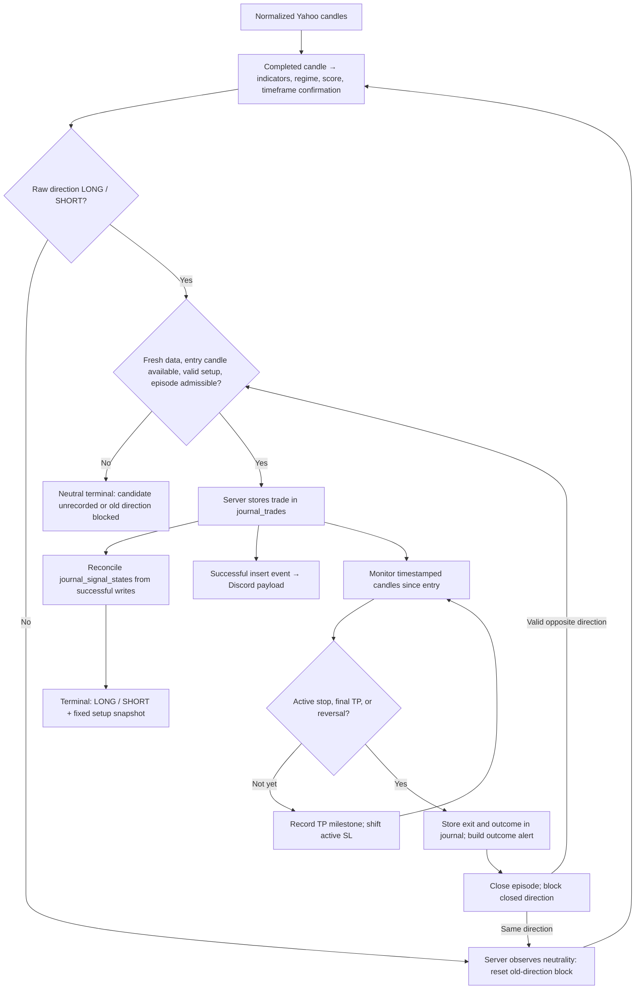

# Metodologi Trading — Trading Methodology

Status verifikasi: 2026-09-16 | Verification status: 2026-09-16 — engine v5, episode `journal_signal_states`, progressive exit v4, impas dikecualikan dari win rate publik | breakeven excluded from public win rate, MIN_CALIBRATION_SAMPLE=30, proyek react-rabalaba.

[Bahasa Indonesia](#bagian-id) · [English](#english-part)

## Bagian ID

### 1. Kontrak publikasi: analisis → episode → jurnal → Discord

- Terminal menampilkan trade simulasi yang sudah dicatat server.
- Membuka halaman, menyegarkan data, atau membuka dialog tidak membuat order broker dan tidak membuka trade jurnal.
- Analisis mentah dapat menunjuk LONG/SHORT sebelum entry layak tersedia; label LONG/SHORT terminal terbit setelah episode aktif tersimpan dengan setup valid.
- `journal_trades` menyimpan perjalanan dan hasil trade; `journal_signal_states` menyimpan status episode per simbol/timeframe beserta snapshot entry, SL awal, TP, dan R:R.
- Server merekonsiliasi state dengan trade yang benar-benar berhasil ditulis; tabel dan dialog membaca proyeksi yang sama.
- Event insert yang berhasil memasok payload Discord; kegagalan tulis tidak menghasilkan event.

*Caption: diagram TD memetakan alur analisis mentah sampai episode, jurnal, Discord, dan exit; blokir arah lama direset setelah sinyal mentah netral teramati server.*

Sumber implementasi: [engine sinyal](../../src/core/engine/signals.ts), [adapter Yahoo](../../src/services/adapters/yahoo-adapter.ts), [core jurnal](../../src/core/automation/auto-journal-core.ts), [proyeksi terminal](../../src/core/automation/signal-episode.ts), [pemantauan trade](../../src/core/trade/follow-trade-model.ts), [rumus rencana](../../src/core/engine/trading-plan.ts).

### 2. Lima status terminal

| Status internal | Label terlihat | Arti |
|---|---|---|
| `active` | Beli / LONG atau Jual / SHORT | Episode aktif memiliki snapshot setup valid; arah dan level mengikuti episode tersebut. |
| `pending` | Netral | Analisis berarah tetapi belum ada trade aktif tercatat; termasuk kandidat menunggu candle eksekusi atau pemrosesan server. |
| `blocked` | Netral | Arah mentah sama dengan arah trade yang sudah ditutup; dialog menjelaskan blokir entry ulang. |
| `neutral` | Netral | Tidak ada episode aktif dan analisis mentah netral; filter no-trade dapat menjelaskan kandidat yang ditahan. |
| `unavailable` | Tidak tersedia | Pembacaan state belum berhasil, identitas episode tidak cocok, atau setup aktif tidak valid; dialog menyediakan Coba lagi. |

- Snapshot valid wajib memuat arah LONG/SHORT, entry/SL/R:R positif dan finite, serta TP berurutan pada sisi profit.
- Snapshot baru memakai tiga TP; snapshot lama dua TP tetap didukung; LONG wajib memenuhi `SL < entry < TP1 < TP2 < TP3`, SHORT kebalikannya.
- Field yang hilang tidak diganti dengan level turunan harga terkini.
- Kandidat belum tercatat, arah terblokir, dan analisis mentah netral berbagi label Netral; status internal membedakan alasan untuk penjelasan dialog.
- Pembacaan terbaru yang gagal menahan publikasi walaupun cache episode lama tersedia.
- **Kasus NBIS/EQPT (ILUSTRASI, bukan sinyal real):** pada pemeriksaan 8 September 2026, arah analisis LONG berkekuatan sekitar 71% tercatat tanpa candle entry berikutnya maupun trade aktif; label terminal Netral tanpa setup terbit.

### 3. Candle, indikator, dan regime

- Jalur default market dan auto-journal memakai histori 60 hari dengan candle 1 jam (`swing`); candle yang masih terbentuk tidak dipakai sebagai candle keputusan.
- OHLC wajib fisik/valid dan bertimestamp; adapter menyaring candle rusak dan menangani batas sesi bursa.

| Profil engine | Data | Minimum candle selesai | Ambang arah absolut | Agregasi timeframe atas |
|---|---|---|---|---|
| Scalp | 1 hari / 5 menit | 120 | 0,40 | 12 candle → 1 jam |
| Swing, default produksi | 60 hari / 1 jam | 120 | 0,30 | 4 candle → 4 jam |
| Position | 6 bulan / 1 hari | 120 | 0,30 | 5 candle harian |

- Konfirmasi timeframe atas memerlukan minimal 50 candle agregasi; kelompok akhir yang belum lengkap dibuang.
- Arah selaras mengalikan skor 1,15 dan dibatasi ke `[-1,1]`; arah berlawanan mengalikan skor 0,5; kondisi sideways atau belum siap tanpa pengali.
- Setiap indikator masuk satu kategori; kontribusi positif mendukung LONG, negatif mendukung SHORT; skor kategori dinormalisasi ke `[-1,1]` lalu digabung dengan bobot sesuai regime.

| Kategori | Aturan indikator | Batas kontribusi / bobot dasar |
|---|---|---|
| Tren | EMA20/EMA50 dan posisi close: selaras ±1,5, pemulihan/pelemahan awal ±0,495; MACD histogram dan line searah ±1; ADX >25 menambah ±1 hanya jika arah EMA dan DMI sepakat. | 3,5 / 40% |
| Momentum | RSI <30 atau >70 dibaca sesuai tren; oversold pada downtrend kuat −0,5, overbought pada uptrend kuat +0,25, selain itu +1/−1; StochRSI <20 atau >80 memberi ±0,5 atau mengikuti tren ±0,25; divergensi RSI ±1, turun ke ±0,75 jika sekadar konfirmasi tren. | 2,5 / 30% |
| Volatilitas | Bollinger periode 20 dan 2 deviasi; pada tren, %B >0,8 bullish atau <0,2 bearish mendukung kelanjutan ±0,375; pada sideways, keluar band ±0,75 dan dekat tepi band ±0,375; harga dekat Fibonacci 0,618 mendukung arah tren ±1. | 1,75 / 20% |
| Volume | OBV naik/turun mendukung arah candle/EMA ±0,5, konflik setengah bobot; lonjakan volume >1,5× rata-rata 20 candle mengikuti perubahan close ±0,75; close datar tanpa kontribusi lonjakan. | 1,25 / 10% |

- Jika >30% dari maksimal 50 volume terakhir nol/hilang, atau seluruh volume tidak tersedia, kategori volume dinonaktifkan dan bobot lain dinormalisasi ulang.
- Data di bawah 120 candle memaksa arah netral; kekuatan dikurangi 20 poin dan dibatasi maksimal 25.
- Label tren memakai ADX dan kesepakatan EMA/DMI: ADX <20 berarti sideways; bullish memerlukan close/EMA bullish dan `+DI > -DI`, bearish kebalikannya; EMA200, pivot, ATR, dan swing sebagai konteks/struktur risiko tanpa suara arah tersendiri.

| Regime | Kondisi | Pengali tren / momentum / volatilitas / volume |
|---|---|---|
| `low_volatility` | Lebar Bollinger <3% dan ADX <20 | 1 / 1 / 1 / 1; arah ditahan netral |
| `trending` | ADX ≥25 | 1,5 / 0,8 / 0,8 / 1 |
| `high_volatility` | Setelah dua kondisi gagal, ATR/harga ≥5% kripto, ≥3,5% komoditas, ≥2,5% lainnya | 1 / 0,6 / 1,2 / 1 |
| `ranging` | Kondisi lainnya | 0,5 / 1,5 / 1,5 / 1 |

- Regime diperiksa berurutan sehingga squeeze didahulukan sebelum tren dan volatilitas tinggi.
- Skor akhir adalah rata-rata tertimbang kategori setelah pengali regime dan konfirmasi timeframe; skor ≥ambang menghasilkan kandidat LONG, ≤−ambang kandidat SHORT.
- Kandidat melawan tren ditahan kecuali divergensi RSI mendukung arah kandidat atau `|skor| ≥0,60`.
- Kekuatan = `round(|skor| × 100)`; tier A ≥80, B ≥60, C di bawahnya.
- Konteks benchmark BTC/IHSG/S&P dapat menurunkan skor dan kekuatan berlawanan menjadi 60% lalu menghitung tier ulang; penurunan tersebut tidak membalik atau menyembunyikan arah mentah.
- Smart money, fundamental, akumulasi, dan relative strength pada jalur utama sebagai informasi tambahan, bukan pemicu entry.
- Selama trade aktif, harga, indikator, kekuatan, tier, dan konteks boleh berubah; badge arah dan setup mengikuti episode tercatat.
- Label risiko berasal dari penalti analisis: data belum siap +2, arah mentah netral +1, volume tidak andal +1, melawan tren +2, kekuatan <50 +2 atau <75 +1; ATR relatif harga menambah +1 pada batas sedang atau +2 pada batas tinggi; arah nonnetral bervolume andal tanpa lonjakan +1; risiko rendah total ≤1 dan kekuatan ≥75, sedang total ≤3 dan kekuatan ≥50, sisanya tinggi; label tersebut tidak mengubah SL snapshot trade aktif.

### 4. Validasi entry dan pembentukan setup

Server memeriksa syarat berikut sebelum mencatat trade baru:

1. Aset termasuk universe scan aktif dan sesuai pengaturan jam pasar; robot tidak sedang dijeda.
2. Quote memiliki timestamp, usia maksimal 90 menit, dan tidak lebih dari 5 menit ke depan.
3. Candle keputusan sudah selesai dan berusia 0–15 menit pada waktu scan.
4. Candle eksekusi nyata tersedia setelah candle keputusan; entry memakai open candle eksekusi, bukan harga spot saat browser dibuka; timestamp eksekusi tidak mendahului close keputusan atau melebihi 5 menit ke depan.
5. Arah dan setup tersedia, tidak ada trade open lain untuk simbol/timeframe tersebut, dan arah tidak diblokir episode sebelumnya.

- Bar tambahan Yahoo tepat saat bursa tutup bukan otomatis candle eksekusi; adapter mewajibkan jarak minimal satu interval dari open keputusan.
- Setelah jeda sesi, data keputusan/quote tetap wajib lolos pemeriksaan kesegaran; sistem tidak mengejar sinyal lama secara otomatis.
- Rumus rencana di [trading-plan.ts](../../src/core/engine/trading-plan.ts):
  - ATR efektif memakai ATR terukur; fallback 3% harga untuk kripto atau 1,5% untuk lainnya jika ATR tidak tersedia/nol.
  - Stop awal mengambil invalidasi terlebar antara 1,5× ATR dan jarak swing/pivot struktural; buffer struktur = terbesar antara 0,25× ATR dan 0,1% harga.
  - Jarak risiko `r = |entry − SL awal|` dibatasi minimal 0,05% entry dan maksimal 12% kripto atau 8% lainnya.
  - R:R memakai jarak struktur lawan dibagi `r` jika ≥1 dan dibatasi maksimal 4; fallback ADX >30 → 2, >25 → 1,75, selain itu 1,5.
  - LONG: `TP1 = entry + r×RR`, `TP2 = entry + r×(RR+1)`, `TP3 = entry + r×(RR+2)`; SHORT memakai pengurangan setara.
- Setelah pencatatan, entry, TP, SL awal, dan R:R tersimpan sebagai snapshot; harga baru tidak menghitung ulang setup trade aktif.
- Jurnal menyimpan versi engine v5 dan waktu candle keputusan untuk audit kelompok aturan.

### 5. Setup tetap dan SL progresif

- SL awal sebagai bagian setup tetap dan denominator R; SL aktif mengikuti milestone tertinggi: sebelum TP1 = SL awal, setelah TP1 = entry, setelah TP2 = TP1; TP3 menutup seluruh posisi; TP1/TP2 tanpa penjualan sebagian.
- Mekanik progressive exit v4 bergerak monoton dan tidak pernah mundur.
- Contoh mekanik LONG (ILUSTRASI, bukan sinyal real): entry 50, TP 100/200/300, SL awal 20.

| Perjalanan harga | Setup tersimpan | SL aktif / hasil |
|---|---|---|
| Entry tercatat di 50 | Entry 50, SL awal 20, TP 100/200/300 | SL aktif 20 |
| Harga naik ke 80; browser dibuka ulang | Tetap sama | SL aktif 20; belum ada exit |
| TP1 100 tersentuh | Tetap sama | SL aktif naik ke 50 |
| Setelah TP1 harga kembali ke 50 | Tetap sama untuk audit | Tutup di 50, impas sebelum biaya |
| TP2 200 tersentuh | Tetap sama | SL aktif naik ke 100 |
| Setelah TP2 harga kembali ke 100 | Tetap sama untuk audit | Tutup di 100, profit; exit `progressive_stop` |
| TP3 300 tersentuh sebelum stop | Tetap sama untuk audit | Tutup di 300; exit `final_take_profit` |

- Contoh SHORT mengikuti pola rumus target (ILUSTRASI, bukan sinyal real): entry 100, SL awal 108, R:R 1,5, TP 88/80/72; penurunan ke 95 tidak mengubah setup; TP1 88 memindahkan SL aktif ke 100; TP2 80 ke 88; TP3 72 menutup seluruh posisi; rebound ke 88 setelah TP2 menghasilkan 12 per unit atau `12/8 = 1,5R` sebelum biaya.
- Gross R LONG `(exit − entry) / |entry − SL awal|`; SHORT `(entry − exit) / |entry − SL awal|`; denominator tidak mengecil saat SL aktif bergerak.
- Dialog market menampilkan SL awal; perjalanan SL aktif dan milestone mengikuti jurnal.
- Hasil impas dikecualikan dari win rate publik; metrik all-time memakai `win / (win + loss)`.

### 6. Wick, candle ambigu, dan gap

- OHLC tidak memberi urutan tiap transaksi dalam candle; evaluator memakai aturan konsisten berikut:
  1. Stop yang sudah aktif diperiksa lebih dulu; jika satu candle menyentuh stop aktif dan TP, hasil stop didahulukan.
  2. Stop yang baru naik karena TP tidak diterapkan mundur pada wick candle yang sama.
  3. Pada candle selesai, close dapat mengonfirmasi retracement melewati stop baru; pada candle berjalan, close sementara tidak memicu exit pada stop yang baru bergerak.
  4. Gap melewati stop yang sudah aktif diisi memakai harga open aktual, bukan level stop ideal.
- Contoh LONG entry 50, SL awal 20, TP1 100 (ILUSTRASI, bukan sinyal real): candle `O50 H110 L40 C90` mencapai TP1 sehingga SL aktif menjadi 50; low 40 saja tidak membuktikan sentuhan stop baru setelah TP1; jika candle selesai berakhir di 45, retracement terkonfirmasi dan exit di 50; candle `O50 H110 L15 C90` menghasilkan exit SL awal 20 menurut aturan stop-first.
- Setelah SL aktif LONG di 50, candle berikutnya dibuka di 45 → exit 45, bukan 50; pada SHORT berslot SL aktif 100 dan open berikutnya 105 → exit 105; gap dapat mengubah stop breakeven menjadi kerugian nyata.
- Server memutuskan exit berdasarkan candle bertimestamp sejak entry; harga spot sesaat tidak cukup.
- Replay histori default mencakup rolling 60 hari; milestone trade yang lebih tua tidak selalu dapat direkonstruksi waktu sentuhnya secara lengkap.

### 7. Exit, blokir arah lama, dan reversal

- Setelah exit, server menutup episode aktif dan memblokir arah yang ditutup.
- Jika LONG selesai tetapi analisis masih LONG, terminal Netral dengan penjelasan blokir; browser baru maupun refresh tidak membuka LONG lagi.
- Reset terjadi ketika server mengamati arah mentah netral; kandidat LONG berikutnya tetap wajib melewati validasi entry.
- Netral mentah tidak menutup trade aktif; SHORT mentah tidak langsung mengganti badge LONG aktif di browser.
- Server mengevaluasi stop/TP lebih dulu, kemudian memeriksa reversal memakai close candle terkoroborasi.
- Ketika closure LONG berhasil dan SHORT baru valid serta berhasil dicatat, episode langsung beralih SHORT tanpa fase netral wajib.
- Entry lawan wajib memenuhi semua aturan; jika penutupan berhasil tetapi entry lawan belum tersedia, posisi lama tetap tertutup dan terminal Netral sampai trade aktif baru tercatat.

### 8. Kekuatan, keberhasilan jurnal, dan backtest

| Angka | Sumber dan arti | Alasan perbedaan |
|---|---|---|
| Kekuatan / tier | Keselarasan kategori teknikal terkini, konfirmasi timeframe, dan penurunan conviction benchmark | 71% bukan peluang menang 71% dan bukan bukti entry tercatat. |
| Keberhasilan tabel market | Agregat jurnal all-time per simbol: `win / (win + loss)`; impas dikecualikan | Mengukur trade server selesai; angka identik untuk free dan premium. |
| Statistik jurnal | Trade simulasi tersimpan dalam filter/periode dashboard; hasil memakai entry/SL awal dan exit tercatat | Periode dan populasi trade dapat berbeda dari angka all-time. |
| Backtest dan kalibrasi dialog | Simulasi walk-forward pada histori tersedia; kalibrasi tier/regime memerlukan MIN_CALIBRATION_SAMPLE=30 | Beda jendela, populasi, biaya, dan mekanik eksekusi reversal dari jurnal live. |

- Backtest mengambil keputusan pada candle selesai dan entry di open berikutnya; reversal backtest dieksekusi di open berikutnya, sedangkan jurnal produksi memakai close candle terkoroborasi; backtest dapat menutup trade di akhir data.
- Biaya per sisi: kripto fee 0,04% + slippage 0,06%; lainnya 0,02% + 0,03%; nilai net backtest tidak identik dengan gross P&L jurnal.
- Tidak ada angka di atas yang menjamin hasil trade berikutnya.

### 9. Interval pembaruan dan kegagalan

| Proses | Interval/perilaku |
|---|---|
| Scan auto-journal | Cron dasar 30 menit; `journal_settings` mengatur enable, interval, dan jam pasar; scan admin menghormati pause. |
| Quote, candle, dan konteks market browser | Poll default 30 menit; cache Yahoo/proxy dan kondisi bursa memengaruhi kesegaran. |
| Status episode dan row jurnal browser | Poll 60 detik selama query aktif; baca ulang saat halaman dipasang dan browser kembali aktif. |
| Refresh market / refresh jurnal / scan admin selesai | Menyegarkan cache episode dan jurnal terkait; refresh data tidak mengeksekusi order. |
| Rekap Discord | Trigger per jam dengan gate waktu WIB untuk rekap harian/mingguan/bulanan. |

- Polling 60 detik membaca hasil server; bukan berarti scan entry berjalan tiap menit.
- Tabel dan jurnal dapat memerlukan satu siklus baca untuk menampilkan tulisan terbaru; pembacaan memakai snapshot tersimpan sehingga pembaruan harga tidak menggeser setup.
- Feed aset gagal atau basi: entry ditahan dan server tidak menutup trade dari spot tanpa koroborasi; trade yang gagal diperiksa tetap tersimpan untuk scan berikutnya.
- State episode gagal dibaca / snapshot rusak: label Tidak tersedia tanpa setup buatan; gunakan Coba lagi; kegagalan satu API informasi tambahan hanya memengaruhi informasi tersebut.
- Penulisan jurnal gagal: perubahan gagal tanpa event Discord dan tanpa aktivasi state rekonsiliasi; penulisan trade dan state terpisah; bila persistensi state gagal, publikasi browser dapat tertinggal sampai rekonsiliasi berikutnya.
- Discord gagal: jurnal yang berhasil tetap sah; alert entry membawa snapshot entry/TP/SL awal yang sama; alert exit membawa hasil tercatat; pengiriman best-effort tanpa antrean permanen; HTTP 429 mendapat satu retry jika waktu tunggu dalam batas 12 detik; kegagalan batch menghentikan sisa pengiriman pada run tersebut; webhook yang belum dikonfigurasi berarti tidak ada pesan terkirim.
- Dialog market dan jurnal memasang query serta analisis detail hanya selama terbuka; screener melewati smart money, akumulasi, dan relative strength yang tidak tampil pada tabel.
- Backtest aset terpilih memakai engine yang sama dalam Web Worker; cache mengikuti simbol, timeframe, dan `dataUpdatedAt`; worker dihentikan setelah selesai, gagal, atau dialog ditutup.
- Refresh mempertahankan halaman tabel; filter, pencarian, dan sorting kembali ke halaman pertama; halaman dibatasi ke hasil yang tersedia; API aset gagal tidak menghapus favorit tersimpan.
- State UI/filter/auth dikelola Redux pada proyek react-rabalaba; tidak memakai Zustand untuk state tersebut.

### 10. Pengujian kontrak

- [Tes proyeksi episode](../../tests/signal-episode.test.mjs) mencakup kandidat tanpa candle entry, kandidat tanpa episode, snapshot rusak, pembacaan gagal meski ada cache, setup tetap saat harga berubah, kesinambungan snapshot jurnal/terminal/payload Discord, blokir setelah exit, reset netral, reversal langsung, dan contoh SL progresif; payload Discord diuji sebagai data tanpa pengiriman pesan.
- Aturan evaluator candle dan guard server diuji [tes auto-journal](../../tests/auto-journal-core.test.mjs), [tes follow-trade](../../tests/follow-trade-model.test.mjs), dan [tes engine](../../tests/signal-engine.test.mjs).
- Inventori pengujian mencatat 45 file dan 422 kasus; lihat [inventori coverage](../03-testing/01-coverage-inventory.md).
- Validasi proyek memakai `npm test`, `npm run build`, dan `npm run lint`.

---

## English Part

### 1. Publication contract: analysis → episode → journal → Discord

- The terminal displays simulated trades already recorded by the server.
- Opening a page, refreshing data, or opening a dialog creates no broker order and no journal trade.
- Raw analysis can point LONG/SHORT before an eligible entry exists; the terminal publishes LONG/SHORT only after an active episode with a valid setup is stored.
- `journal_trades` stores trade progression and outcome; `journal_signal_states` stores episode status per symbol/timeframe plus entry, initial SL, TP, and R:R snapshot.
- The server reconciles state against successfully written trades; table and dialog read the same projection.
- Successful insert events supply Discord payloads; failed writes produce no event.

*Caption: the TD diagram maps the path from raw analysis to episode, journal, Discord, and exit; the closed-direction block resets after server-observed raw neutrality.*

Implementation sources: [signal engine](../../src/core/engine/signals.ts), [Yahoo adapter](../../src/services/adapters/yahoo-adapter.ts), [journal core](../../src/core/automation/auto-journal-core.ts), [terminal projection](../../src/core/automation/signal-episode.ts), [trade monitor](../../src/core/trade/follow-trade-model.ts), [plan formula](../../src/core/engine/trading-plan.ts).

### 2. Five terminal states

| Internal state | Visible label | Meaning |
|---|---|---|
| `active` | Buy / LONG or Sell / SHORT | The active episode holds a valid setup snapshot; direction and levels follow that episode. |
| `pending` | Neutral | Analysis is directional but no active trade is recorded; includes candidates awaiting an execution candle or server processing. |
| `blocked` | Neutral | Raw direction matches a closed trade; the dialog explains the re-entry block. |
| `neutral` | Neutral | No active episode exists and raw analysis is neutral; no-trade filters can explain a withheld candidate. |
| `unavailable` | Unavailable | State read is unsuccessful, episode identity mismatches, or the active setup is invalid; the dialog provides Retry. |

- A valid snapshot requires LONG/SHORT direction, positive finite entry/SL/R:R, and ordered profit-side targets.
- New snapshots use three TPs; legacy two-TP snapshots remain supported; LONG requires `SL < entry < TP1 < TP2 < TP3`, SHORT reverses the inequalities.
- Missing fields receive no replacement levels derived from the current price.
- Unrecorded candidates, blocked directions, and raw neutrality share Neutral; internal states separate the reasons for dialog explanations.
- A failed latest read withholds publication even when an older episode cache exists.
- **NBIS/EQPT case (ILLUSTRATION, not a real signal):** on the 8 September 2026 check, LONG analysis near 71% strength appeared with no next execution candle and no active trade; the terminal label stayed Neutral with no published setup.

### 3. Candles, indicators, and regime

- Default market and auto-journal paths use 60 days of hourly candles (`swing`); a forming candle never serves as decision candle.
- OHLC values must be physical/valid and timestamped; the adapter filters malformed candles and handles session boundaries.

| Engine profile | Data | Minimum completed candles | Absolute direction threshold | Higher-timeframe aggregation |
|---|---|---|---|---|
| Scalp | 1 day / 5 minutes | 120 | 0.40 | 12 candles → 1 hour |
| Swing, production default | 60 days / 1 hour | 120 | 0.30 | 4 candles → 4 hours |
| Position | 6 months / 1 day | 120 | 0.30 | 5 daily candles |

- Higher-timeframe confirmation needs at least 50 aggregated candles; an incomplete trailing group is discarded.
- Aligned direction multiplies the score by 1.15 and clamps to `[-1,1]`; opposing direction multiplies by 0.5; sideways or unready conditions apply no multiplier.
- Each indicator belongs to one category; positive contributions support LONG and negative ones support SHORT; category scores normalize to `[-1,1]` and combine with regime weights.

| Category | Indicator rules | Contribution cap / base weight |
|---|---|---|
| Trend | EMA20/EMA50 and close position: aligned ±1.5, early recovery/weakness ±0.495; aligned MACD histogram and line ±1; ADX >25 adds ±1 only when EMA and DMI agree. | 3.5 / 40% |
| Momentum | RSI <30 or >70 read with trend; oversold in strong downtrend −0.5, overbought in strong uptrend +0.25, otherwise +1/−1; StochRSI <20 or >80 gives ±0.5 or trend-following ±0.25; RSI divergence ±1, reduced to ±0.75 for mere trend confirmation. | 2.5 / 30% |
| Volatility | Bollinger 20 periods and 2 deviations; in trend, bullish %B >0.8 or bearish %B <0.2 supports continuation at ±0.375; sideways uses outside-band ±0.75 and near-edge ±0.375; price near Fibonacci 0.618 supports trend direction at ±1. | 1.75 / 20% |
| Volume | Rising/falling OBV supports candle/EMA direction at ±0.5, conflict at half weight; volume >1.5× the 20-candle average follows close change at ±0.75; flat close gives no spike contribution. | 1.25 / 10% |

- When >30% of the latest up-to-50 volume values are zero/missing, or all volume is unavailable, the volume category disables and other weights renormalize.
- Data below 120 candles forces neutral direction; strength loses 20 points and caps at 25.
- Trend labels use ADX and EMA/DMI agreement: ADX <20 means sideways; bullish needs bullish close/EMA plus `+DI > -DI`, bearish reverses the pair; EMA200, pivots, ATR, and swings provide context/risk structure with no independent direction vote.

| Regime | Condition | Trend / momentum / volatility / volume multipliers |
|---|---|---|
| `low_volatility` | Bollinger width <3% and ADX <20 | 1 / 1 / 1 / 1; direction held neutral |
| `trending` | ADX ≥25 | 1.5 / 0.8 / 0.8 / 1 |
| `high_volatility` | After both conditions fail, ATR/price ≥5% crypto, ≥3.5% commodities, ≥2.5% others | 1 / 0.6 / 1.2 / 1 |
| `ranging` | Other conditions | 0.5 / 1.5 / 1.5 / 1 |

- Regimes evaluate in order so squeeze precedes trend and high volatility.
- The final score is the regime-weighted category average plus timeframe confirmation; score ≥ threshold gives LONG, ≤ negative threshold gives SHORT.
- Counter-trend candidates stay withheld unless RSI divergence supports the candidate or `|score| ≥0.60`.
- Strength is `round(|score| × 100)`; tier A ≥80, B ≥60, C below.
- BTC/IHSG/S&P benchmark context can reduce opposing score and strength to 60% and recalculate tier; the reduction never reverses or hides raw direction.
- Smart money, fundamentals, accumulation, and relative strength on the canonical path provide supporting information, not entry triggers.
- During an active trade, price, indicators, strength, tier, and context can change; direction badge and setup follow the recorded episode.
- Risk-label penalties are: data not ready +2, raw neutral +1, unreliable volume +1, counter-trend +2, strength <50 adds +2 or <75 adds +1; ATR/price adds +1 at moderate bounds or +2 at high bounds; directional reliable-volume signal without spike +1; low needs total ≤1 and strength ≥75, medium total ≤3 and strength ≥50, else high; the label never changes the active trade snapshot SL.

### 4. Entry validation and setup creation

Before recording a trade, the server checks:

1. The asset belongs to the active scan universe and market-hour settings permit it; the robot is not paused.
2. The quote has a timestamp no more than 90 minutes old and no more than 5 minutes in the future.
3. The decision candle is complete and 0–15 minutes old at scan time.
4. A real execution candle exists after the decision candle; entry uses that candle open, not the spot price at browser open; execution timestamp neither precedes decision close nor exceeds 5 minutes ahead.
5. Direction and setup exist, no other open trade covers the symbol/timeframe, and the previous episode blocks no such direction.

- An extra Yahoo bar exactly at exchange close never counts automatically as execution candle; the adapter requires at least one full interval since decision open.
- After a session break, decision/quote data must still pass freshness checks; the system never chases old signals automatically.
- The [trading-plan formula](../../src/core/engine/trading-plan.ts) uses:
  - Measured ATR, with 3% of price for crypto or 1.5% otherwise when ATR is unavailable/zero.
  - The wider initial invalidation between 1.5× ATR and structural swing/pivot distance; structural buffer is the greater of 0.25× ATR and 0.1% of price.
  - Risk distance `r = |entry − initial SL|`, clamped between 0.05% of entry and 12% for crypto or 8% otherwise.
  - R:R from opposing-structure distance divided by `r` when ≥1, capped at 4; fallback ADX >30 → 2, >25 → 1.75, otherwise 1.5.
  - LONG targets: `TP1 = entry + r×RR`, `TP2 = entry + r×(RR+1)`, `TP3 = entry + r×(RR+2)`; SHORT subtracts the same distances.
- After recording, entry, TPs, initial SL, and R:R become a saved snapshot; later prices never recalculate the active setup.
- The journal stores engine v5 version and decision-candle time for rule-cohort audit.

### 5. Fixed setup and progressive SL

- Initial SL stays fixed as the R denominator; active SL follows the highest milestone: initial SL before TP1, entry after TP1, TP1 after TP2; TP3 closes the whole position; TP1/TP2 sell no fraction.
- Progressive exit v4 moves monotonically and never steps back.
- Illustrative LONG mechanics (ILLUSTRATION, not a real signal): entry 50, TPs 100/200/300, initial SL 20.

| Price journey | Saved setup | Active SL / outcome |
|---|---|---|
| Entry recorded at 50 | Entry 50, initial SL 20, TPs 100/200/300 | Active SL 20 |
| Price reaches 80; browser reopens | Unchanged | Active SL 20; no exit |
| TP1 at 100 touched | Unchanged | Active SL moves to 50 |
| Price returns to 50 after TP1 | Retained for audit | Exit at 50, breakeven before costs |
| TP2 at 200 touched | Unchanged | Active SL moves to 100 |
| Price returns to 100 after TP2 | Retained for audit | Exit at 100, profit; `progressive_stop` |
| TP3 at 300 touched before stop | Retained for audit | Exit at 300; `final_take_profit` |

- SHORT following the target formula (ILLUSTRATION, not a real signal): entry 100, initial SL 108, R:R 1.5, TPs 88/80/72; a decline to 95 changes no level; TP1 at 88 moves active SL to 100; TP2 at 80 moves it to 88; TP3 at 72 closes the whole position; a rebound to 88 after TP2 yields 12 per unit or `12/8 = 1.5R` before costs.
- Gross R is `(exit − entry) / |entry − initial SL|` for LONG and `(entry − exit) / |entry − initial SL|` for SHORT; the denominator never shrinks as active SL moves.
- The market dialog shows initial SL; the journal tracks active-stop progression and milestones.
- Breakeven results stay excluded from the public win rate; the all-time metric uses `wins / (wins + losses)`.

### 6. Wicks, ambiguous candles, and gaps

- OHLC cannot reveal every transaction order inside a candle; evaluation follows consistent rules:
  1. An already-active stop checks first; when one candle touches that stop and a TP, the stop outcome takes precedence.
  2. A newly raised stop never applies retroactively to the same candle wick.
  3. On a completed candle, close can confirm retracement through the new stop; on a forming candle, temporary close triggers no exit at a newly moved stop.
  4. A gap through an already-active stop fills at actual open, not the ideal stop level.
- LONG entry 50, initial SL 20, TP1 100 (ILLUSTRATION, not a real signal): candle `O50 H110 L40 C90` reaches TP1 and moves active SL to 50; low 40 alone never proves a post-TP1 stop touch; when that completed candle ends at 45, retracement confirms and exit lands at 50; candle `O50 H110 L15 C90` exits at initial SL 20 under stop-first evaluation.
- With LONG active SL at 50, the next candle opening at 45 exits at 45, not 50; SHORT with active SL 100 and next open 105 exits at 105; gaps can turn a breakeven stop into a realized loss.
- The server decides exits from timestamped candles since entry; momentary spot quotes never suffice.
- Default replay history covers a rolling 60 days; exact touch times for older milestones cannot always be fully reconstructed.

### 7. Exit, old-direction block, and reversal

- After exit, the server closes the active episode and blocks the closed direction.
- When LONG closes while raw analysis stays LONG, the terminal turns Neutral with a block explanation; another browser or refresh never reopens LONG.
- The reset happens when the server observes raw neutrality; the next LONG candidate must still pass entry validation.
- Raw neutrality never closes an active trade; raw SHORT never directly replaces a live LONG badge in the browser.
- The server evaluates stop/TP first, then checks reversal with a corroborated candle close.
- After successful LONG closure plus valid, successfully recorded SHORT entry, the episode switches directly to SHORT with no mandatory neutral phase.
- The opposite entry must satisfy all rules; when closure succeeds but that entry is unavailable, the old position stays closed and the terminal remains Neutral until a new active trade is recorded.

### 8. Strength, journal success, and backtest

| Metric | Source and meaning | Reason for divergence |
|---|---|---|
| Strength / tier | Current technical-category alignment, timeframe confirmation, and benchmark conviction reduction | 71% is no 71% win probability and no proof of a recorded entry. |
| Market-table success | All-time journal aggregate per symbol: `wins / (wins + losses)`; breakeven excluded | Completed server trades; identical numbers for free and premium. |
| Journal statistics | Stored simulated trades in dashboard filters/period; outcome uses recorded entry/initial SL/exit | Period and trade population can differ from all-time aggregates. |
| Dialog backtest / calibration | Walk-forward simulation over available history; tier/regime calibration needs MIN_CALIBRATION_SAMPLE=30 | Window, population, costs, and reversal execution differ from the live journal. |

- Backtest decides on completed candles with entries at the next open; backtest reversal also executes at the next open, while the production journal uses a corroborated candle close; backtest can close a trade at end of data.
- Per-side costs are crypto fee 0.04% + slippage 0.06%; otherwise 0.02% + 0.03%; net backtest values never equal gross journal P&L.
- None of the numbers above guarantees the next trade outcome.

### 9. Refresh intervals and failures

| Process | Interval / behavior |
|---|---|
| Auto-journal scan | Base cron every 30 minutes; `journal_settings` controls enablement, interval, and market hours; admin scans respect pause. |
| Browser quotes, candles, and market context | Default 30-minute polling; Yahoo/proxy caches and exchange conditions affect freshness. |
| Browser episode state and journal rows | 60-second polling while queries stay active; reread on mount and window focus. |
| Market/journal refresh or completed admin scan | Refreshes related episode/journal caches; data refresh executes no orders. |
| Discord summaries | Hourly trigger with WIB time gates for daily, weekly, and monthly summaries. |

- A 60-second read never means entry scans run every minute.
- Table and journal can need one read cycle to show the latest writes; reads use saved snapshots so price updates never move setup levels.
- Failed/stale asset feed: entry withholds and the server never closes a trade from uncorroborated spot data; unchecked trades remain stored for the next scan.
- Failed episode read / malformed snapshot: Unavailable with no fabricated setup; use Retry; failure of an optional information API affects only that information.
- Failed journal write: the failed change produces no Discord event and activates no reconciled state; trade and state writes stay separate; when state persistence fails, browser publication can lag until the next reconciliation.
- Failed Discord delivery: a successful journal record stays valid; entry alerts carry the same entry/TP/initial-SL snapshot; exit alerts carry the recorded outcome; delivery is best effort with no durable retry queue; HTTP 429 gets one retry when the wait fits within 12 seconds; a failed batch stops remaining deliveries in that run; no configured webhook means no message is sent.
- Market and journal dialogs mount detail queries and analysis only while open; the screener skips smart money, accumulation, and relative strength absent from the table.
- The selected-asset backtest runs the same engine in a Web Worker; cache follows symbol, timeframe, and candle `dataUpdatedAt`; the worker terminates on completion, failure, or dialog closure.
- Refresh retains the table page; filters, search, and sorting reset to page one; pages clamp to available results; asset API failures never remove stored favorites.
- UI/filter/auth state uses Redux in the react-rabalaba project; Zustand serves no such role.

### 10. Contract validation

- [Episode projection tests](../../tests/signal-episode.test.mjs) cover candidates without execution candles, candidates without episodes, malformed snapshots, failed reads despite cached state, fixed setups during price updates, journal/terminal/Discord snapshot consistency, post-exit blocking, neutral reset, direct reversal, and progressive-SL examples; Discord payloads are tested as data with no message delivery.
- Candle evaluation and server guards are covered by [auto-journal tests](../../tests/auto-journal-core.test.mjs), [follow-trade tests](../../tests/follow-trade-model.test.mjs), and [engine tests](../../tests/signal-engine.test.mjs).
- The test inventory records 45 files and 422 cases; see [coverage inventory](../03-testing/01-coverage-inventory.md).
- Project validation uses `npm test`, `npm run build`, and `npm run lint`.

## Terkait / Related

- [Cara kerja auto-journal (ELI5)](01-auto-journal-explained.md) | [Auto-journal ELI5](01-auto-journal-explained.md)
- [Desain sistem auto-journal](02-auto-journal-system-design.md) | [Auto-journal system design](02-auto-journal-system-design.md)
- [Server vs browser](03-server-vs-browser.md) | [Server vs browser](03-server-vs-browser.md)
- [Engine trading](../01-functional-specs/02-trading-engine.md) | [Trading engine](../01-functional-specs/02-trading-engine.md)
- [Auto-journal FSD](../01-functional-specs/03-auto-journal.md) | [Auto-journal FSD](../01-functional-specs/03-auto-journal.md)
- [Diagram alur sinyal](../02-technical-specs/08-signal-flow-diagrams.md) | [Signal flow diagrams](../02-technical-specs/08-signal-flow-diagrams.md)
