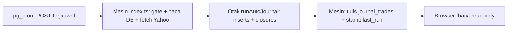
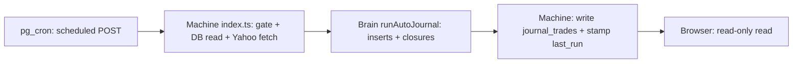

# Auto-Journal ELI5 — Cara Kerja Robot Jurnal | How the Journal Robot Works

Status verifikasi: 2026-09-16 | Verification status: 2026-09-16 — cron 30 menit | 30-minute cron, bundle `src/core/edge-engine.ts` → `supabase/functions/auto-journal/_engine.mjs`, episode `journal_signal_states`, proyek react-rabalaba.

[Bahasa Indonesia](#bagian-id) · [English](#english-part)

## Bagian ID

### 1. Ringkasan sat-set

- Robot terjadwal bangun tiap 30 menit, menarik harga pasar, memutuskan trade yang dibuka/ditutup, lalu mencatat ke database — tanpa browser terbuka.
- Website berperan sebagai pembaca catatan robot; tampilan tidak menulis jurnal.
- Detail formal tersedia pada [desain sistem](02-auto-journal-system-design.md); peta runtime pada [server vs browser](03-server-vs-browser.md).

### 2. Para pemeran: pemicu, otak, mesin, buku, alarm

| Pemeran | Peran | File / tabel |
|---|---|---|
| Pemicu | Mengambil chart Yahoo dan mengubah menjadi aset terpadu berisi harga, candle, sinyal, dan plan. | `src/services/adapters/yahoo-adapter.ts` |
| Otak | Memutuskan INSERT dan CLOSE secara murni tanpa I/O; menerima data dan mengembalikan rencana. | `src/core/automation/auto-journal-core.ts` |
| Mesin | Menjalankan fetch, membaca jadwal, dan menulis DB di runtime Deno terjadwal. | `supabase/functions/auto-journal/index.ts` |
| Buku | Menyimpan trade, episode sinyal, universe, dan pengaturan jadwal. | `journal_trades`, `journal_signal_states`, `journal_assets`, `journal_settings` |
| Alarm | Membangunkan mesin tiap interval melalui HTTP POST terjadwal. | `pg_cron` + `supabase/schedule-auto-journal.sql` |

- Otak yang sama dipakai website untuk sinyal live; satu sumber logika, dua runtime eksekusi.
- Logika dasar TP/SL dan pembangunan trade berada pada [model follow-trade](../../src/core/trade/follow-trade-model.ts).
- Pintu bundle berada pada [edge-engine.ts](../../src/core/edge-engine.ts); hasil build `_engine.mjs` tidak disunting manual.

### 3. Otak lawan mesin

- Otak berpikir: menerima aset dan baris open, mengembalikan inserts, closures, progress, dan update episode.
- Otak tidak menarik internet dan tidak menyentuh DB sehingga mudah diuji unit melalui [tes auto-journal](../../tests/auto-journal-core.test.mjs).
- Mesin bertindak: mengambil service-role key, membaca trade open dan universe, mengambil Yahoo paralel, memanggil otak, lalu menulis hasil.
- Setelah TP/SL, arah lama diblokir sampai sinyal mentah sempat netral; reversal valid dapat langsung membuka arah lawan.
- Data basi dilewati melalui guard quote; trade tanpa candle baru sejak entry tetap open sampai data segar tiba.

### 4. Bundle: edge-engine.ts menjadi _engine.mjs

- Runtime Deno tidak me-resolve alias `@/...`; bundle `esbuild` meratakan semua import dari pintu engine menjadi satu file ESM mandiri.
- Alur build: edit `src/` → re-export melalui `edge-engine.ts` → `npm run deploy:auto-journal` membangun `_engine.mjs` + deploy function.
- File `_engine.mjs` tertimpa tiap build; sumber kebenaran tetap pada `src/`.
- Aturan praktis: ubah logika keputusan pada otak/model; ubah fetch, tulis DB, dan jadwal pada mesin; bangun ulang bundle setelah perubahan engine.

*Caption: diagram LR merangkum satu siklus penuh dari alarm sampai pembaca browser; keputusan murni terisolasi pada tahap otak.*

### 5. Contoh satu siklus 14:30 WIB

- Skenario (ILUSTRASI, bukan sinyal real): pukul 14:30 WIB, interval 30 menit, satu trade open `SOL-USD` short dan sinyal short baru `BTC-USD`.

| Tahap | Kejadian |
|---|---|
| 0 | Alarm pg_cron 14:30 mengirim HTTP POST ke function. |
| 1 | Mesin bangun dan memakai service-role key melewati RLS. |
| 2 | Gate `journal_settings` diperiksa: aktif dan jatuh tempo → lanjut. |
| 3 | Trade open dan universe dibaca dari `journal_trades` + `journal_assets` + konstanta komoditas/forex. |
| 4 | Fetch Yahoo per simbol paralel → adapter → aset berisi harga, candle, sinyal, plan. |
| 5 | Otak memutuskan: EMIT short baru `BTC-USD` (ILUSTRASI, bukan sinyal real), CLOSE `SOL-USD` (ILUSTRASI, bukan sinyal real) karena TP. |
| 6 | Mesin UPDATE `SOL-USD` lebih dulu lalu INSERT sinyal aktif ke `journal_trades` (ILUSTRASI, bukan sinyal real). |
| 7 | Stamp `last_run_at` ditulis, ringkasan JSON dikembalikan, robot tidur. |

- Pada tahap 5, otak melewati data basi dan mendedup simbol/timeframe yang masih open.
- Urutan tulis menutup posisi lama sebelum membuka posisi baru pada siklus yang sama.

### 6. Aturan emas

1. Ubah logika keputusan pada `auto-journal-core.ts` atau `follow-trade-model.ts`.
2. Ubah I/O dan jadwal (fetch, tulis DB) pada `index.ts`.
3. Setelah ubah engine, jalankan `npm run deploy:auto-journal`; jangan sentuh `_engine.mjs`.
4. Universe kripto/saham dikelola pada `/admin` (DB); komoditas/forex sebagai konstanta.
5. Catatan pemahaman: satu siklus cukup diamati dari ringkasan JSON dan baris jurnal terbaru.

---

## English Part

### 1. Quick sat-set summary

- A scheduled robot wakes every 30 minutes, pulls market prices, decides which trades open/close, then records the results in the database — with no browser open.
- The website acts as a reader of robot records; views never write the journal.
- Formal detail lives in the [system design](02-auto-journal-system-design.md); the runtime map lives in [server vs browser](03-server-vs-browser.md).

### 2. The cast: trigger, brain, machine, ledger, alarm

| Cast | Role | File / table |
|---|---|---|
| Trigger | Fetches Yahoo charts and converts results into unified assets with price, candles, signal, and plan. | `src/services/adapters/yahoo-adapter.ts` |
| Brain | Decides INSERTs and CLOSEs purely with no I/O; receives data and returns a plan. | `src/core/automation/auto-journal-core.ts` |
| Machine | Runs fetching, schedule reads, and DB writes on the scheduled Deno runtime. | `supabase/functions/auto-journal/index.ts` |
| Ledger | Stores trades, signal episodes, universe, and schedule settings. | `journal_trades`, `journal_signal_states`, `journal_assets`, `journal_settings` |
| Alarm | Wakes the machine each interval through a scheduled HTTP POST. | `pg_cron` + `supabase/schedule-auto-journal.sql` |

- The website uses the same brain for live signals; one logic source, two execution runtimes.
- Base TP/SL math and trade construction live in the [follow-trade model](../../src/core/trade/follow-trade-model.ts).
- The bundle door lives in [edge-engine.ts](../../src/core/edge-engine.ts); the `_engine.mjs` build output receives no manual edits.

### 3. Brain versus machine

- The brain thinks: receives assets and open rows, returns inserts, closures, progress, and episode updates.
- The brain touches no network and no DB, so unit tests stay simple through [auto-journal tests](../../tests/auto-journal-core.test.mjs).
- The machine acts: takes the service-role key, reads open trades and universe, fetches Yahoo in parallel, calls the brain, then writes results.
- After TP/SL, the old direction stays blocked until raw signal turns neutral; a valid reversal can open the opposite direction immediately.
- Stale data is skipped through quote guards; trades without new candles since entry stay open until fresh data arrives.

### 4. Bundle: edge-engine.ts into _engine.mjs

- The Deno runtime never resolves `@/...` aliases; the `esbuild` bundle flattens all imports from the engine door into one standalone ESM file.
- Build path: edit `src/` → re-export through `edge-engine.ts` → `npm run deploy:auto-journal` rebuilds `_engine.mjs` + deploys the function.
- Each build overwrites `_engine.mjs`; the source of truth remains in `src/`.
- Practical rule: change decision logic in brain/model; change fetch, DB writes, and schedule in machine; rebuild the bundle after engine changes.

*Caption: the LR diagram summarizes one full cycle from alarm to browser reader; pure decisions stay isolated in the brain stage.*

### 5. One 14:30 WIB cycle example

- Scenario (ILLUSTRATION, not a real signal): at 14:30 WIB, 30-minute interval, one open `SOL-USD` short trade and a fresh `BTC-USD` short signal.

| Stage | Event |
|---|---|
| 0 | The 14:30 pg_cron alarm sends an HTTP POST to the function. |
| 1 | The machine wakes and uses the service-role key past RLS. |
| 2 | The `journal_settings` gate checks enabled and due → continue. |
| 3 | Open trades and universe load from `journal_trades` + `journal_assets` + commodity/forex constants. |
| 4 | Parallel per-symbol Yahoo fetch → adapter → assets with price, candles, signal, plan. |
| 5 | The brain decides: EMIT new `BTC-USD` short (ILLUSTRATION, not a real signal), CLOSE `SOL-USD` (ILLUSTRATION, not a real signal) on TP. |
| 6 | The machine UPDATEs `SOL-USD` first, then INSERTs the active signal into `journal_trades` (ILLUSTRATION, not a real signal). |
| 7 | `last_run_at` stamps, a JSON summary returns, the robot sleeps. |

- At stage 5, the brain skips stale data and dedupes still-open symbol/timeframe pairs.
- Write order closes the old position before opening the new position in the same cycle.

### 6. Golden rules

1. Change decision logic in `auto-journal-core.ts` or `follow-trade-model.ts`.
2. Change I/O and schedule (fetch, DB writes) in `index.ts`.
3. After an engine change, run `npm run deploy:auto-journal`; never touch `_engine.mjs`.
4. Manage the crypto/stock universe in `/admin` (DB); commodities/forex stay constants.
5. Reading note: one cycle is best observed from the JSON summary and newest journal rows.

## Terkait / Related

- [Metodologi trading](00-trading-methodology.md) | [Trading methodology](00-trading-methodology.md)
- [Desain sistem auto-journal](02-auto-journal-system-design.md) | [Auto-journal system design](02-auto-journal-system-design.md)
- [Server vs browser](03-server-vs-browser.md) | [Server vs browser](03-server-vs-browser.md)
- [Arsitektur](../02-technical-specs/00-architecture.md) | [Architecture](../02-technical-specs/00-architecture.md)
- [Fungsi edge](../02-technical-specs/05-edge-functions.md) | [Edge functions](../02-technical-specs/05-edge-functions.md)
