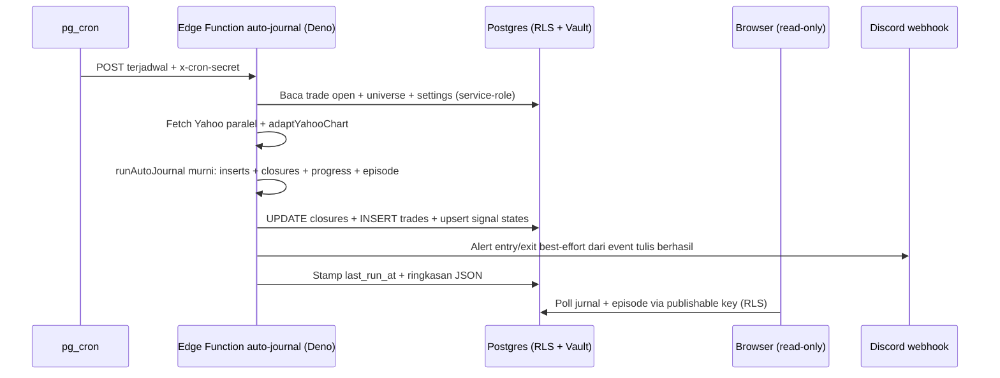
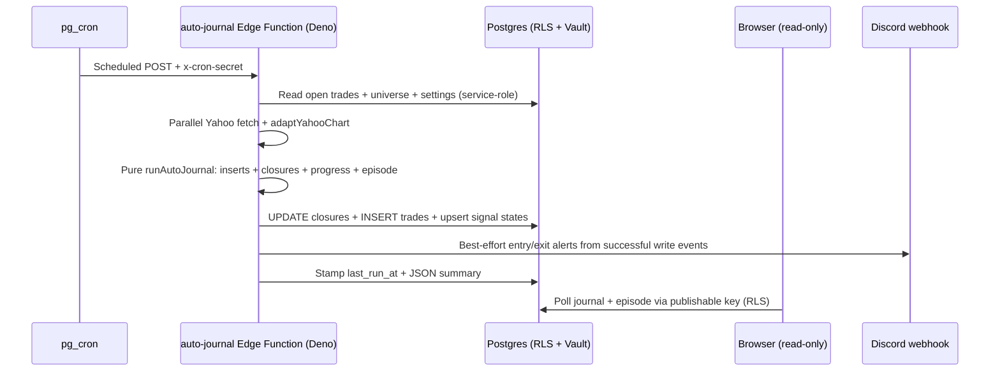

# Desain Sistem Auto-Journal — Auto-Journal System Design

Status verifikasi: 2026-09-16 | Verification status: 2026-09-16 — engine v5, episode `journal_signal_states`, progressive exit v4, impas dikecualikan dari win rate publik | breakeven excluded from public win rate, 38 migrasi | migrations, 16 tabel | tables, 28 RPC, 45 file / 422 kasus uji | test files / cases, proyek react-rabalaba.

[Bahasa Indonesia](#bagian-id) · [English](#english-part)

## Bagian ID

### 1. Ringkasan eksekutif

- Jurnal trade berjalan otonom di sisi server sebagai rekam jejak global atas sinyal engine dan resolusinya.
- Edge Function terjadwal mengeksekusi ulang engine sinyal yang sama dengan aplikasi web, menerbitkan sinyal LONG/SHORT segar ke `journal_trades`, menutup trade open pada TP/SL atau reversal, dan merekonsiliasi `journal_signal_states` — tanpa browser terbuka.
- Aplikasi web berperan sebagai konsumen read-only atas jurnal melalui TanStack Query dengan interval 60 detik.
- Akses premium bersumber pada kebenaran server: Supabase Auth + baris `profiles.tier`, dengan redeem kode melalui RPC `SECURITY DEFINER`; tier free tetap anonim, trial bersifat konfigurabel melalui `trial_days` dan durasi default.
- State UI/filter/auth dikelola Redux pada proyek react-rabalaba; tidak memakai Zustand untuk state tersebut.

### 2. Evolusi: model manual menjadi otomatis

| Aspek | Sebelum (manual) | Sesudah (otomatis) |
|---|---|---|
| Pemicu | Klik Follow manual | pg_cron tiap 30 menit |
| Lokasi eksekusi | Tab browser | Edge Function Deno |
| Penyimpanan | `localStorage` per perangkat | Postgres `journal_trades` global |
| Penutupan TP/SL | Klien, hanya saat tab terbuka | Server, tiap tick cron dengan candle replay |
| Penutupan reversal | Tidak ada | Server, LONG↔SHORT dengan pengaman TP tersentuh |
| Peran frontend | Pemilik baca + tulis | Konsumen read-only |
| Gerbang premium | Flag `localStorage` | Auth + `profiles.tier` sebagai kebenaran server |
| Kode akses | Terkirim dalam bundle | Hanya DB, redeem via RPC |

- Migrasi menghapus tombol follow manual, aksi close/delete manual, loop `applyPriceSync` sisi klien, dan lapisan `localStorage`.
- Fase lanjutan menambahkan episode sinyal satu-trade-per-episode (`journal_signal_states`), progressive exit v4 monoton, dan pengecualian impas dari win rate publik.
- Kalibrasi tier/regime pada dialog memakai MIN_CALIBRATION_SAMPLE=30.

### 3. Arsitektur

*Caption: sequenceDiagram memetakan aliran cron dari alarm sampai alert; keputusan murni terisolasi sebelum tulis DB dan pengiriman alert.*

- Tumpukan teknologi: React + Vite SPA, react-router, react-i18next (en/id), TanStack Query, shadcn/ui, recharts, Redux Toolkit; proxy data market Cloudflare Pages Functions; backend Supabase (Postgres, Edge Functions Deno, pg_cron + pg_net + Vault, Auth).
- Mesin keputusan berada satu kali pada `src/` dan dipakai bersama aplikasi dan cron melalui pintu [edge-engine.ts](../../src/core/edge-engine.ts) yang dibundle menjadi [\_engine.mjs](../../supabase/functions/auto-journal/_engine.mjs) via esbuild.
- Semua export pintu bersifat murni (tanpa React, DOM, Vite, atau `fetch`) sehingga ter-bundle bersih untuk Deno.
- Aturan rilis: tiap perubahan logika engine/jurnal mewajibkan `npm run deploy:auto-journal`; `npm run build` saja tidak memperbarui cron.
- Cron aktif: auto-journal tiap 30 menit, rekap Discord per jam dengan gate WIB harian/mingguan/bulanan, discovery aset harian.

### 4. Model data: lima tabel inti

- `journal_trades` — jurnal global; kolom: id uuid PK, symbol/name/asset_type, signal long/short, timeframe, entry_price, stop_loss, take_profits double[], risk_reward_ratio, strength_at_entry, grade A/B/C, engine_version, decision_candle_open_at/closed_at, regime, higher_timeframe_trend, direction_score, status open/tp1/tp2/tp3/sl/reversed, highest_tp_reached monoton 0..3, exit_reason, reversed flag audit, opened_at/closed_at/close_price, created_at/updated_at via trigger.
- Dedup memakai partial unique index `(symbol, timeframe) WHERE status = 'open'` sehingga cron ganda idempoten (insert kedua gagal `23505` dan ditelan non-fatal).
- Status `reversed` mencatat tiap flip sinyal; milestone TP tetap pada `highest_tp_reached`; `exit_reason='reversal'` otoritatif.
- `journal_signal_states` — episode satu-trade-per-episode per simbol/timeframe (migrasi engine v5); kolom: symbol, timeframe, active_signal, blocked_signal, last_raw_signal, decision_candle open/closed_at, entry_price, stop_loss, take_profits, risk_reward_ratio, updated_at; browser memproyeksikan status terminal active/pending/blocked/neutral/unavailable dari tabel ini.
- `journal_assets` — universe kripto/saham terkelola via `/admin`; komoditas/forex sebagai default konstanta; simbol benchmark-only diambil untuk konteks tanpa dijurnal.
- `journal_settings` — saklar enable, interval, dan jam pasar; scan admin menghormati pause.
- `profiles` — entitlement per pengguna sebagai kebenaran server; kolom: user_id uuid PK → auth.users cascade, tier free/trial/premium default free, trial_expires_at, updated_at; panjang trial konfigurabel via `trial_days` kode dan durasi default.
- Total skema: 16 tabel dan 28 RPC pada 38 migrasi berurutan; RPC kunci mencakup `redeem_access_code`, `is_premium`, `is_admin`, `handle_new_user`, `claim_auto_journal_slot`, `get_public_journal_success_rates`.

### 5. Alur: emit, close, rekap, discovery

- Emit: tiap kandidat LONG/SHORT berplan segar dengan candle keputusan dan eksekusi valid, tanpa episode open/blokir pada pasangan simbol-timeframe, dicatat dengan entry = open candle eksekusi, bukan quote spot belakangan; konteks benchmark menerapkan de-rate strength/tier yang sama dengan screener tanpa menyembunyikan sinyal tampil.
- Close 1 (TP/SL): replay candle sejak entry untuk tiap trade open lalu `applyPriceSync`; TP1 menaikkan stop ke entry dan TP2 ke TP1; pada candle final yang mencapai TP baru, hanya close yang mengonfirmasi stop baru; wick ambigu tidak cukup; TP final menutup posisi; gap melalui stop aktif terisi pada open aktual.
- Close 2 (reversal LONG↔SHORT): untuk trade yang masih open setelah Close 1, jika sinyal engine kini berlawanan arah, exit pada close candle terkoroborasi terbaru, status dan `exit_reason` = `reversed`/`reversal`, progres TP tetap pada `highest_tp_reached`; netral tidak pernah menutup.
- Blokir episode: TP/SL memblokir arah sama sampai sinyal mentah netral teramati; reversal dapat flip pada scan yang sama; observasi netral mempersenjatai ulang arah lama.
- Rekap: trigger per jam mengevaluasi gate WIB lalu menulis ringkasan harian/mingguan/bulanan dan mengirim alert Discord best-effort; HTTP 429 mendapat satu retry dalam batas 12 detik; batch gagal menghentikan sisa pengiriman pada run tersebut.
- Discovery: job harian mengkurasi universe dari Yahoo, CoinGecko, dan Binance melalui proxy dengan override `DISCOVERY_PROXY_BASE`; cache selalu warm dan kuota tidak terkuras.
- Metrik publik memakai `get_public_journal_success_rates` dengan impas dikecualikan: `win / (win + loss)`.

### 6. Peta file src menuju functions

| Area | Path |
|---|---|
| Entrypoint edge (Deno) | `supabase/functions/auto-journal/index.ts` |
| Pintu engine (dibundle) | `src/core/edge-engine.ts` → `supabase/functions/auto-journal/_engine.mjs` |
| Core keputusan murni | `src/core/automation/auto-journal-core.ts` |
| Proyeksi episode terminal | `src/core/automation/signal-episode.ts` |
| Model trade (emit/close/stat) | `src/core/trade/follow-trade-model.ts` |
| Mapper baris ↔ trade | `src/core/trade/journal-mapper.ts` |
| Engine sinyal v5 | `src/core/engine/signals.ts` |
| Rumus rencana | `src/core/engine/trading-plan.ts` |
| Kalibrasi (MIN_CALIBRATION_SAMPLE=30) | `src/core/engine/calibration.ts` |
| Hook baca jurnal | `src/features/journal/hooks/use-journal-trades.ts` |
| Dashboard | `src/features/journal/components/journal-dashboard.tsx` |
| Jadwal cron | `supabase/schedule-auto-journal.sql`, `supabase/schedule-daily-summary.sql`, `supabase/schedule-asset-discovery.sql` |

### 7. Deployment dan operasi

- Terapkan migrasi berurutan (`npx supabase db push` atau SQL Editor) sampai 38 migrasi; skema mencakup 16 tabel dan 28 RPC.
- Deploy function: `npm run deploy:auto-journal` (= `build:edge` lalu deploy auto-journal).
- Daftarkan cron satu kali via `supabase/schedule-*.sql` (pg_cron + pg_net aktif, URL function + secret privat pada Vault, job auto-journal-30m, daily-summary-hourly, asset-discovery-daily); samakan nilai secret dengan secret function `CRON_SECRET`.
- Konfigurasi Auth: provider email pada dashboard; aliran menangani konfirmasi email aktif/nonaktif.
- Seed kode akses via SQL Editor (contoh `PREMIUM-XXXX` full sekali pakai, `TRIAL-2026` trial 7 hari).
- Operasi rutin: kirim perubahan engine/jurnal via `deploy:auto-journal`; kosongkan jurnal via truncate (penuh) atau delete non-open (histori); inspeksi cron via `cron.job` dan `cron.job_run_details`; verifikasi deploy via log Edge Function.
- Environment: `VITE_SUPABASE_URL` dan `VITE_SUPABASE_PUBLISHABLE_KEY` untuk klien browser (baca terikat RLS); `CRON_SECRET` untuk request cron via `x-cron-secret`; `SUPABASE_URL`/`SUPABASE_SERVICE_ROLE_KEY` terinjeksi otomatis pada Edge Function (tulis, bypass RLS).
- Detail setup dan recovery mengikuti runbook [ops](../04-operations/00-runbook.md) dan README supabase; dokumen ini tidak menduplikasi runbook tersebut.

### 8. Model keamanan

- Entitlement sebagai kebenaran server: `profiles.tier` hanya dapat ditulis RPC `SECURITY DEFINER`; baris hanya dapat dibaca pemilik via RLS.
- Kode tidak pernah terkirim ke klien dan dibatasi sekali pakai/kuota via `code_redemptions` + `max_redemptions`.
- Tulis cron memakai service-role key khusus server (tidak pernah dalam bundle); browser hanya memegang publishable key terikat RLS.
- Baca jurnal ter-gate premium/trial aktif via `is_premium()`; tulis universe/admin ter-gate `is_admin()`; redeem kode via RPC server tanpa secret sampai ke browser; tulis jurnal hanya oleh robot (service-role), browser read-only.
- Secret cron `CRON_SECRET` divalidasi sebelum klien service-role dipakai; pemicu manual memakai sesi admin/owner.
- Caveat jujur by design: SPA murni mengeksekusi engine sinyal pada browser sehingga komputasi klien pada dasarnya dapat diekstrak; migrasi auth menutup ancaman realistis (rekayasa `localStorage`), menghentikan trial-farming, dan membuat premium portabel lintas perangkat; permukaan yang sepenuhnya enforceable adalah data ter-gate server, termasuk `journal_trades` kini.

### 9. Keterbatasan

- Kadensi 30 menit dapat melewatkan wick sub-bar antar tick (termitigasi replay candle sejak open, tetapi tidak tick-perfect).
- Dominasi CoinGecko tier free terbatasi rate; jika payload gagal, BTC.D tampil tanpa delta dan footer kripto tak tersedia sebagian.
- Konfirmasi email sebagai toggle dashboard Supabase, bukan enforcement pada kode.
- Langkah lanjut potensial: analitik per-grade lebih kaya, halaman share SSR/OG, dan pemeriksaan entitlement server berbutir halus jika komputasi premium berpindah ke server.

### 10. Changelog

| Fase | Isi |
|---|---|
| 1 | Migrasi DB + path tulis (`journal_trades`, dedup, RLS) |
| 2 | Frontend beralih baca DB; follow/close/delete manual + sync klien dihapus |
| 3 | Auth + entitlement: Supabase Auth, `profiles`, `redeem_access_code`, halaman login/register, menu akun; baca `journal_trades` ter-gate premium via RLS |
| 3.1 | Refinement reversal-close: amankan TP tersentuh (`tp{n}`) sebagai pengganti label generik |
| v4 | Progressive exit monoton + `journal_signal_states` episode satu-trade-per-episode |
| v5 | Engine v5 + episode sinyal + pengecualian impas dari win rate publik |

- Perintah validasi: `npm test`, `npm run build`, `npm run lint`; inventori pengujian mencatat 45 file dan 422 kasus (lihat [inventori coverage](../03-testing/01-coverage-inventory.md)).

---

## English Part

### 1. Executive summary

- The trade journal runs autonomously server-side as a global track record of engine signals and resolutions.
- A scheduled Edge Function reruns the same signal engine as the web app, publishes fresh LONG/SHORT signals into `journal_trades`, closes open trades on TP/SL or reversal, and reconciles `journal_signal_states` — with no browser open.
- The web app acts as a read-only consumer of that journal through TanStack Query on a 60-second interval.
- Premium access follows server truth: Supabase Auth + a `profiles.tier` row, with code redemption through a `SECURITY DEFINER` RPC; the free tier stays anonymous, trial stays configurable through code `trial_days` and default duration.
- UI/filter/auth state uses Redux in the react-rabalaba project; Zustand serves no such role.

### 2. Evolution: manual model into automated model

| Aspect | Before (manual) | After (automated) |
|---|---|---|
| Trigger | Manual Follow click | pg_cron every 30 minutes |
| Execution site | Browser tab | Deno Edge Function |
| Storage | Per-device `localStorage` | Global Postgres `journal_trades` |
| TP/SL close | Client, only while tab stayed open | Server, each cron tick with candle replay |
| Reversal close | None | Server, LONG↔SHORT securing touched TP |
| Frontend role | Read + write owner | Read-only consumer |
| Premium gate | `localStorage` flag | Auth + `profiles.tier` as server truth |
| Access codes | Shipped inside bundle | DB-only, redemption via RPC |

- Migration removed the manual follow button, manual close/delete actions, the client-side `applyPriceSync` loop, and the `localStorage` layer.
- Later phases added one-trade-per-episode signal episodes (`journal_signal_states`), monotonic progressive exit v4, and breakeven exclusion from the public win rate.
- Dialog tier/regime calibration uses MIN_CALIBRATION_SAMPLE=30.

### 3. Architecture

*Caption: the sequenceDiagram maps cron flow from alarm to alert; pure decisions stay isolated before DB writes and alert delivery.*

- Tech stack: React + Vite SPA, react-router, react-i18next (en/id), TanStack Query, shadcn/ui, recharts, Redux Toolkit; Cloudflare Pages Functions market-data proxies; Supabase backend (Postgres, Deno Edge Functions, pg_cron + pg_net + Vault, Auth).
- Decision logic exists once in `src/` and is shared by app and cron through the [edge-engine.ts](../../src/core/edge-engine.ts) door bundled into [\_engine.mjs](../../supabase/functions/auto-journal/_engine.mjs) via esbuild.
- All door exports stay pure (no React, DOM, Vite, or `fetch`) for clean Deno bundling.
- Release rule: every engine/journal logic change requires `npm run deploy:auto-journal`; `npm run build` alone never updates the cron.
- Active crons: auto-journal every 30 minutes, hourly Discord summaries with daily/weekly/monthly WIB gates, daily asset discovery.

### 4. Data model: five core tables

- `journal_trades` — the global journal; columns: id uuid PK, symbol/name/asset_type, signal long/short, timeframe, entry_price, stop_loss, take_profits double[], risk_reward_ratio, strength_at_entry, grade A/B/C, engine_version, decision_candle open/closed_at, regime, higher_timeframe_trend, direction_score, status open/tp1/tp2/tp3/sl/reversed, monotonic highest_tp_reached 0..3, exit_reason, reversed audit flag, opened_at/closed_at/close_price, created_at/updated_at via trigger.
- Dedup uses partial unique index `(symbol, timeframe) WHERE status = 'open'` so double cron runs stay idempotent (second insert fails `23505` and is swallowed non-fatal).
- Status `reversed` records every signal flip; TP milestones persist in `highest_tp_reached`; `exit_reason='reversal'` is authoritative.
- `journal_signal_states` — one-trade-per-episode episodes per symbol/timeframe (engine v5 migration); columns: symbol, timeframe, active_signal, blocked_signal, last_raw_signal, decision_candle open/closed_at, entry_price, stop_loss, take_profits, risk_reward_ratio, updated_at; the browser projects active/pending/blocked/neutral/unavailable terminal status from this table.
- `journal_assets` — the `/admin`-managed crypto/stock universe; commodities/forex as constant defaults; benchmark-only symbols load for context with no journaling.
- `journal_settings` — enable switch, interval, and market hours; admin scans respect pause.
- `profiles` — per-user entitlement as server truth; columns: user_id uuid PK → auth.users cascade, tier free/trial/premium default free, trial_expires_at, updated_at; trial length configurable via code `trial_days` and default duration.
- Schema totals: 16 tables and 28 RPCs across 38 ordered migrations; key RPCs include `redeem_access_code`, `is_premium`, `is_admin`, `handle_new_user`, `claim_auto_journal_slot`, `get_public_journal_success_rates`.

### 5. Flows: emit, close, recap, discovery

- Emit: each fresh planned LONG/SHORT candidate with valid decision and execution candles, no open/blocked episode on the symbol-timeframe pair, records entry = execution-candle open, not a later spot quote; benchmark context applies the same strength/tier de-rate as the screener with no hiding of displayed signals.
- Close 1 (TP/SL): replay candles since entry for each open trade, then `applyPriceSync`; TP1 raises stop to entry and TP2 to TP1; on a final candle reaching a new TP, only close confirms the new stop; ambiguous wicks never suffice; final TP closes the position; gaps through an active stop fill at actual open.
- Close 2 (LONG↔SHORT reversal): for trades still open after Close 1, when the current engine signal points opposite, exit at the latest corroborated candle close, status and `exit_reason` = `reversed`/`reversal`, TP progress persists in `highest_tp_reached`; neutrality never closes.
- Episode blocking: TP/SL blocks the same direction until observed raw neutral; reversal can flip in the same scan; neutral observation re-arms the old direction.
- Recap: an hourly trigger evaluates WIB gates, then writes daily/weekly/monthly summaries and sends best-effort Discord alerts; HTTP 429 gets one retry within a 12-second bound; a failed batch stops remaining deliveries in that run.
- Discovery: a daily job curates the universe from Yahoo, CoinGecko, and Binance through proxies with `DISCOVERY_PROXY_BASE` override; caches stay warm and quotas stay intact.
- Public metrics use `get_public_journal_success_rates` with breakeven excluded: `wins / (wins + losses)`.

### 6. File map from src to functions

| Area | Path |
|---|---|
| Edge entrypoint (Deno) | `supabase/functions/auto-journal/index.ts` |
| Engine door (bundled) | `src/core/edge-engine.ts` → `supabase/functions/auto-journal/_engine.mjs` |
| Pure decision core | `src/core/automation/auto-journal-core.ts` |
| Terminal episode projection | `src/core/automation/signal-episode.ts` |
| Trade model (emit/close/stats) | `src/core/trade/follow-trade-model.ts` |
| Row ↔ trade mapper | `src/core/trade/journal-mapper.ts` |
| Signal engine v5 | `src/core/engine/signals.ts` |
| Plan formula | `src/core/engine/trading-plan.ts` |
| Calibration (MIN_CALIBRATION_SAMPLE=30) | `src/core/engine/calibration.ts` |
| Journal read hook | `src/features/journal/hooks/use-journal-trades.ts` |
| Dashboard | `src/features/journal/components/journal-dashboard.tsx` |
| Cron schedules | `supabase/schedule-auto-journal.sql`, `supabase/schedule-daily-summary.sql`, `supabase/schedule-asset-discovery.sql` |

### 7. Deployment and operations

- Apply ordered migrations (`npx supabase db push` or SQL Editor) through all 38 migrations; the schema covers 16 tables and 28 RPCs.
- Deploy the function: `npm run deploy:auto-journal` (= `build:edge` then auto-journal deploy).
- Register crons once via `supabase/schedule-*.sql` (pg_cron + pg_net enabled, function URL + private secret in Vault, auto-journal-30m, daily-summary-hourly, asset-discovery-daily jobs); match the secret value with the function secret `CRON_SECRET`.
- Auth config: email provider on the dashboard; the flow handles email confirmation on/off.
- Seed access codes via SQL Editor (sample full one-use `PREMIUM-XXXX`, 7-day `TRIAL-2026` trial).
- Routine ops: ship engine/journal changes via `deploy:auto-journal`; wipe the journal via truncate (full) or non-open delete (history); inspect crons via `cron.job` and `cron.job_run_details`; verify deploys via Edge Function logs.
- Environment: `VITE_SUPABASE_URL` and `VITE_SUPABASE_PUBLISHABLE_KEY` for the browser client (RLS-bound reads); `CRON_SECRET` for cron requests via `x-cron-secret`; auto-injected `SUPABASE_URL`/`SUPABASE_SERVICE_ROLE_KEY` in the Edge Function (writes, RLS bypass).
- Setup and recovery detail follows the [ops runbook](../04-operations/00-runbook.md) and the supabase README; this document never duplicates that runbook.

### 8. Security model

- Entitlement as server truth: `profiles.tier` writable only by the `SECURITY DEFINER` RPC; rows readable only by owners via RLS.
- Codes never ship to the client and stay single-use/capped via `code_redemptions` + `max_redemptions`.
- Cron writes use the server-only service-role key (never inside the bundle); the browser holds only the RLS-bound publishable key.
- Journal reads gate to active premium/trial via `is_premium()`; universe/admin writes gate via `is_admin()`; code redemption runs via server RPC with no secret reaching the browser; journal writes belong to the robot (service-role) alone, the browser stays read-only.
- The `CRON_SECRET` cron secret validates before the service-role client is used; manual triggers use an admin/owner session.
- Honest caveat by design: a pure SPA executes the signal engine in the browser, so client-computable logic is inherently extractable; the auth migration closes the realistic threat (`localStorage` tampering), stops trial-farming, and keeps premium portable across devices; the only fully enforceable surface is server-gated data, which `journal_trades` now is.

### 9. Limitations

- A 30-minute cadence can miss sub-bar wicks between ticks (mitigated by candle replay since open, but not tick-perfect).
- Free-tier CoinGecko dominance is rate-limited; on payload failure, BTC.D shows with no delta and part of the crypto footer stays unavailable.
- Email confirmation is a Supabase dashboard toggle, not code enforcement.
- Potential next steps: richer per-grade analytics, SSR/OG share pages, and finer-grained server entitlement checks when premium computation moves server-side.

### 10. Change log

| Phase | Content |
|---|---|
| 1 | DB migration + write path (`journal_trades`, dedup, RLS) |
| 2 | Frontend switched to DB reads; manual follow/close/delete + client sync removed |
| 3 | Auth + entitlements: Supabase Auth, `profiles`, `redeem_access_code`, login/register pages, account menu; `journal_trades` reads premium-gated via RLS |
| 3.1 | Reversal-close refinement: secure the touched TP (`tp{n}`) instead of a generic label |
| v4 | Monotonic progressive exit + one-trade-per-episode `journal_signal_states` |
| v5 | Engine v5 + signal episodes + breakeven exclusion from public win rate |

- Validation commands: `npm test`, `npm run build`, `npm run lint`; the test inventory records 45 files and 422 cases (see [coverage inventory](../03-testing/01-coverage-inventory.md)).

## Terkait / Related

- [Metodologi trading](00-trading-methodology.md) | [Trading methodology](00-trading-methodology.md)
- [Cara kerja auto-journal (ELI5)](01-auto-journal-explained.md) | [Auto-journal ELI5](01-auto-journal-explained.md)
- [Server vs browser](03-server-vs-browser.md) | [Server vs browser](03-server-vs-browser.md)
- [Arsitektur](../02-technical-specs/00-architecture.md) | [Architecture](../02-technical-specs/00-architecture.md)
- [Skema database](../02-technical-specs/03-database-schema.md) | [Database schema](../02-technical-specs/03-database-schema.md)
- [Runbook ops](../04-operations/00-runbook.md) | [Ops runbook](../04-operations/00-runbook.md)
