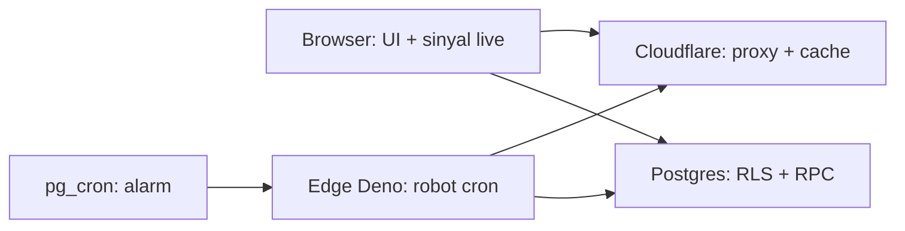
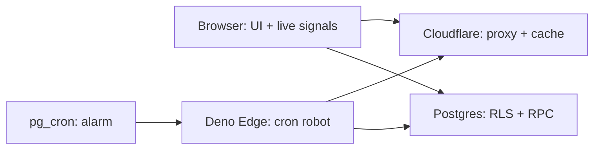

# Server vs Browser — Pointer Runtime | Runtime Pointer

Status verifikasi: 2026-09-16 | Verification status: 2026-09-16 — pointer ringkas menuju [arsitektur](../02-technical-specs/00-architecture.md) | concise pointer to [architecture](../02-technical-specs/00-architecture.md), proyek react-rabalaba.

[Bahasa Indonesia](#bagian-id) · [English](#english-part)

## Bagian ID

### 1. Pointer

- Dokumen ini sebagai pointer ringkas; sumber otoritatif untuk arsitektur pada [00-architecture](../02-technical-specs/00-architecture.md), aliran data pada [02-data-flow](../02-technical-specs/02-data-flow.md), proxy pada [04-cloudflare-proxy](../02-technical-specs/04-cloudflare-proxy.md), dan fungsi edge pada [05-edge-functions](../02-technical-specs/05-edge-functions.md).
- Produk berupa frontend murni + serverless tanpa server backend buatan sendiri; keamanan premium/admin ditegakkan di server karena browser dapat dimodifikasi pengguna.
- Cara kerja robot pada [auto-journal ELI5](01-auto-journal-explained.md); desain formal pada [system design](02-auto-journal-system-design.md).

### 2. Empat runtime

| Runtime | Peran |
|---|---|
| Browser (perangkat pengguna) | Aplikasi React: render UI, chart, dialog, screener; state UI/filter/auth via Redux. |
| Edge Function Deno | Robot cron: auto-journal tiap 30 menit, rekap per jam, discovery harian; tanpa browser. |
| Postgres + pg_cron + RLS | Database, jadwal cron, keamanan, auth; 16 tabel dan 28 RPC pada 38 migrasi. |
| Cloudflare Pages + Functions | Hosting statis + proxy data market dengan cache fresh/stale/error. |

### 3. Matriks halaman menuju lokasi

| Hal / fitur | Browser | Edge Deno | Postgres | Cloudflare |
|---|:---:|:---:|:---:|:---:|
| Render UI/chart/dialog | Ya | | | |
| Screener: sinyal live | Ya | | | Proxy Yahoo |
| Robot auto-journal 30m | | Ya | | |
| Jadwal cron | | | Ya (pg_cron) | |
| Simpan trade/universe/setting/profil | | | Ya | |
| Gerbang baca premium/admin | Minta | | Ya (RLS putuskan) | |
| Login + redeem kode | UI | | Ya (Auth + RPC) | |
| Baca jurnal di web | Ya (minta) | | Ya (RLS putuskan) | |
| Kelola universe `/admin` | UI | | Ya (RLS tulis) | |
| Proxy market + cache | | | | Ya (Function) |

### 4. Twist single-source

- Otak engine pada `src/` berjalan di dua rumah: browser untuk sinyal live screener, robot Deno untuk jurnal otomatis via bundle `src/core/edge-engine.ts` → `supabase/functions/auto-journal/_engine.mjs`.
- Satu sumber kode, dua tempat eksekusi; pertanyaan server-atau-browser untuk engine dijawab: dua-duanya.
- Aturan rilis: perubahan engine mewajibkan `npm run deploy:auto-journal`.

### 5. Jalur market

- Browser: Yahoo melalui proxy `/api/yahoo` (crumb/cookie gating hanya dapat dilakukan proxy); CoinGecko `/global` + `/coins/markets` dan Binance derivatives langsung ke upstream memakai IP pengunjung agar kuota terpisah per pengunjung dan terhindar dari 429 IP shared.
- Auto-journal/daily-summary (Deno): default melalui `/api/yahoo` agar snapshot candle sama dengan web; override via `YAHOO_PROXY_BASE`.
- Asset-discovery (Deno): default melalui `/api/yahoo`, `/api/coingecko`, `/api/binance`; override via `DISCOVERY_PROXY_BASE`; proxy CoinGecko & Binance dipertahankan untuk cron harian bervolume rendah.
- Konsekuensi: rate limit upstream produksi terutama dipicu robot cron via proxy; browser direct memakai kuota per pengunjung; cache proxy fresh/stale/error menahan spam request.

### 6. Jangan percaya browser

- Premium/admin diputuskan server via RLS + `is_premium()`/`is_admin()` pada Postgres; UI hanya menyembunyikan tombol, RLS sebagai pengunci nyata.
- Redeem kode via RPC `SECURITY DEFINER`; secret kode tidak pernah sampai ke browser.
- Tulis jurnal hanya oleh robot (service-role); browser read-only.

*Caption: diagram LR mini memetakan empat runtime dan arah ketergantungan; database sebagai penegak keamanan.*

---

## English Part

### 1. Pointer

- This document is a concise pointer; authoritative sources are [00-architecture](../02-technical-specs/00-architecture.md) for architecture, [02-data-flow](../02-technical-specs/02-data-flow.md) for data flow, [04-cloudflare-proxy](../02-technical-specs/04-cloudflare-proxy.md) for proxies, and [05-edge-functions](../02-technical-specs/05-edge-functions.md) for edge functions.
- The product is pure frontend + serverless with no hand-built backend server; premium/admin security is enforced on the server because the browser is user-modifiable.
- Robot behavior lives in [auto-journal ELI5](01-auto-journal-explained.md); formal design lives in [system design](02-auto-journal-system-design.md).

### 2. Four runtimes

| Runtime | Role |
|---|---|
| Browser (user device) | React app: UI render, charts, dialogs, screener; UI/filter/auth state via Redux. |
| Deno Edge Function | Cron robot: auto-journal every 30 minutes, hourly recap, daily discovery; no browser. |
| Postgres + pg_cron + RLS | Database, cron schedule, security, auth; 16 tables and 28 RPCs across 38 migrations. |
| Cloudflare Pages + Functions | Static hosting + market-data proxies with fresh/stale/error cache. |

### 3. Page-to-location matrix

| Page / feature | Browser | Deno Edge | Postgres | Cloudflare |
|---|---|:---:|:---:|:---:|:---:|
| UI/chart/dialog render | Yes | | | |
| Screener: live signals | Yes | | | Yahoo proxy |
| 30m auto-journal robot | | Yes | | |
| Cron schedule | | | Yes (pg_cron) | |
| Trade/universe/setting/profile store | | | Yes | |
| Premium/admin read gate | Request | | Yes (RLS decides) | |
| Login + code redeem | UI | | Yes (Auth + RPC) | |
| Journal read on web | Yes (request) | | Yes (RLS decides) | |
| Universe management at `/admin` | UI | | Yes (RLS writes) | |
| Market proxy + cache | | | | Yes (Function) |

### 4. Single-source twist

- The engine brain in `src/` runs in two homes: browser for live screener signals, Deno robot for the automatic journal via bundle `src/core/edge-engine.ts` → `supabase/functions/auto-journal/_engine.mjs`.
- One code source, two execution sites; the server-or-browser question for the engine answers: both.
- Release rule: engine changes require `npm run deploy:auto-journal`.

### 5. Market path

- Browser: Yahoo through the `/api/yahoo` proxy (crumb/cookie gating only the proxy can perform); CoinGecko `/global` + `/coins/markets` and Binance derivatives direct to upstream on visitor IP so quotas stay per-visitor and shared-IP 429s stay avoided.
- Auto-journal/daily-summary (Deno): default through `/api/yahoo` so candle snapshots match the web; override via `YAHOO_PROXY_BASE`.
- Asset-discovery (Deno): default through `/api/yahoo`, `/api/coingecko`, `/api/binance`; override via `DISCOVERY_PROXY_BASE`; the CoinGecko & Binance proxies remain for the low-volume daily cron.
- Consequence: production upstream rate limits come mainly from cron robots via proxy; direct browser calls use per-visitor quota; fresh/stale/error proxy caches contain request spam.

### 6. Never trust the browser

- Premium/admin resolves on the server via RLS + `is_premium()`/`is_admin()` in Postgres; UI only hides buttons, RLS is the real lock.
- Code redemption runs via `SECURITY DEFINER` RPC; code secrets never reach the browser.
- Journal writes belong to the robot (service-role) alone; the browser stays read-only.

*Caption: the mini LR diagram maps the four runtimes and dependency directions; the database is the security enforcer.*

## Terkait / Related

- [Metodologi trading](00-trading-methodology.md) | [Trading methodology](00-trading-methodology.md)
- [Cara kerja auto-journal (ELI5)](01-auto-journal-explained.md) | [Auto-journal ELI5](01-auto-journal-explained.md)
- [Desain sistem auto-journal](02-auto-journal-system-design.md) | [Auto-journal system design](02-auto-journal-system-design.md)
- [Arsitektur](../02-technical-specs/00-architecture.md) | [Architecture](../02-technical-specs/00-architecture.md)
- [Aliran data](../02-technical-specs/02-data-flow.md) | [Data flow](../02-technical-specs/02-data-flow.md)
