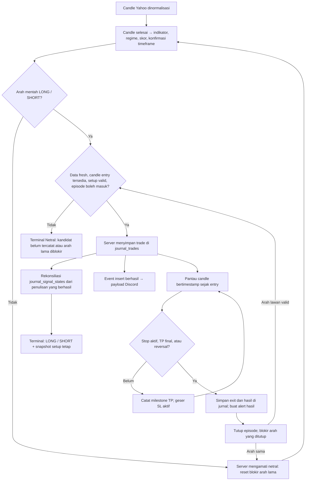

# Aturan main trading RabaLaba

Terminal menampilkan **trade simulasi yang sudah dicatat server**. Membuka halaman, menyegarkan data, atau membuka dialog tidak membuat order broker dan tidak membuka trade jurnal. Analisis mentah dapat mengarah LONG/SHORT sebelum ada entry yang layak; label LONG/SHORT terminal baru terbit setelah episode aktif tersimpan dengan setup valid.

Dokumen ini menjelaskan kontrak aplikasi saat ini. Sumber implementasi utama: [engine sinyal](../../src/core/engine/signals.ts), [adapter Yahoo](../../src/services/adapters/yahoo-adapter.ts), [core jurnal](../../src/core/automation/auto-journal-core.ts), [proyeksi terminal](../../src/core/automation/signal-episode.ts), dan [pemantauan trade](../../src/core/trade/follow-trade-model.ts).

## 1. Satu alur dari analisis sampai hasil

`journal_trades` menyimpan perjalanan dan hasil trade. `journal_signal_states` menyimpan status episode per simbol/timeframe serta snapshot entry, SL awal, TP, dan R:R. Server merekonsiliasi state dengan trade yang benar-benar berhasil ditulis. Tabel dan dialog membaca proyeksi yang sama; Discord memakai event hasil penulisan jurnal.

## 2. Arti status terminal

| Status internal | Label yang terlihat | Arti |
|---|---|---|
| `active` | Beli / LONG atau Jual / SHORT | Episode aktif memiliki snapshot setup valid. Arah dan setup mengikuti episode tersebut. |
| `pending` | Netral | Analisis punya arah, tetapi belum ada trade aktif tercatat. Termasuk ketika candle entry belum tersedia atau kandidat belum diproses server. |
| `blocked` | Netral | Arah mentah sama dengan arah trade yang sudah ditutup. Dialog menjelaskan blokir entry ulang. |
| `neutral` | Netral | Tidak ada episode aktif dan analisis mentah netral. Filter no-trade dapat menjelaskan kenapa kandidat ditahan. |
| `unavailable` | Tidak tersedia | Pembacaan state belum berhasil, identitas episode tidak cocok, atau setup aktif tidak valid. Dialog menyediakan **Coba lagi**. |

Snapshot valid harus memiliki arah LONG/SHORT, entry/SL/R:R positif dan finite, serta TP berurutan pada sisi profit. Snapshot baru memakai tiga TP; snapshot lama dua TP tetap didukung. LONG harus memenuhi `SL < entry < TP1 < TP2 < TP3`; SHORT kebalikannya. Data tidak lengkap tidak diganti dengan setup dari harga terkini.

Kandidat yang belum tercatat, arah yang diblokir setelah exit, dan analisis mentah netral memakai label terminal **Netral** yang sama. Status internal tetap membedakan alasannya agar dialog dapat memberi penjelasan yang tepat. Label Netral berarti tidak ada arah trade aktif yang diterbitkan, sehingga tidak harus sama dengan arah analisis indikator.

Kegagalan pembacaan terbaru menahan publikasi walaupun ada cache episode lama. Ketika pembacaan berhasil tetapi simbol belum punya episode, kandidat menjadi `pending` dengan label Netral. Filter LONG/SHORT hanya memasukkan episode aktif; filter Netral mencakup baris tanpa arah trade terbit. Kegagalan pembacaan atau snapshot rusak tetap berlabel Tidak tersedia.

**Kasus NBIS/EQPT:** pada pemeriksaan 8 September 2026, keduanya punya arah analisis LONG dengan kekuatan sekitar 71%, tetapi belum ada candle entry berikutnya maupun trade aktif. Label terminalnya **Netral**, tanpa setup terbit. Persentase analisis tidak otomatis berarti ada trade yang bisa dicatat.

## 3. Data dan pembentukan arah mentah

### Candle dan timeframe

Jalur default market dan auto-journal menggunakan histori **60 hari dengan candle 1 jam** (`swing`). Candle yang masih terbentuk tidak dipakai sebagai candle keputusan. OHLC harus fisik/valid dan bertimestamp; adapter menyaring candle rusak dan menangani batas sesi bursa.

| Profil engine | Data | Minimum candle selesai | Ambang arah absolut | Agregasi timeframe lebih tinggi |
|---|---|---|---|---|
| Scalp | 1 hari / 5 menit | 120 | 0,40 | 12 candle → 1 jam |
| Swing, default produksi | 60 hari / 1 jam | 120 | 0,30 | 4 candle → 4 jam |
| Position | 6 bulan / 1 hari | 120 | 0,30 | 5 candle harian |

Konfirmasi timeframe tinggi memerlukan minimal 50 candle hasil agregasi; kelompok akhir yang belum lengkap dibuang. Jika siap dan arah selaras, skor dikali 1,15 lalu dibatasi ke `[-1,1]`. Jika berlawanan, skor dikali 0,5. Jika belum siap atau sideways, tidak ada pengali tersebut.

### Indikator dan kategori

Setiap indikator masuk satu kategori. Kontribusi positif mendukung LONG, negatif mendukung SHORT. Nilai kategori dinormalisasi ke `[-1,1]`, lalu digabung memakai bobot sesuai regime.

| Kategori | Aturan indikator | Batas jumlah kontribusi / bobot dasar |
|---|---|---|
| Tren | EMA20/EMA50 dan posisi close: selaras ±1,5, pemulihan/pelemahan awal ±0,495. MACD histogram dan line searah ±1. ADX >25 menambah ±1 hanya jika arah EMA dan DMI sepakat. | 3,5 / 40% |
| Momentum | RSI <30 atau >70 dinilai sesuai tren, bukan selalu beli/jual otomatis. Di downtrend kuat, RSI oversold bernilai −0,5; di uptrend kuat, overbought +0,25; selain itu +1/−1. StochRSI <20 atau >80 memberi ±0,5, atau mengikuti tren sebesar ±0,25. Divergensi RSI memberi ±1, berkurang menjadi ±0,75 jika sekadar mengonfirmasi tren. | 2,5 / 30% |
| Volatilitas | Bollinger memakai periode 20 dan 2 standar deviasi. Dalam tren, %B >0,8 bullish atau <0,2 bearish mendukung kelanjutan ±0,375. Saat sideways, keluar band memberi arah pembalikan ±0,75, dekat tepi band ±0,375. Harga dekat Fibonacci 0,618 mendukung arah tren ±1; toleransi setengah ATR relatif harga dibatasi 0,3–1%, fallback 0,5%. | 1,75 / 20% |
| Volume | OBV naik/turun mendukung arah candle/EMA ±0,5, konflik memberi setengah bobot. Lonjakan volume >1,5× rata-rata 20 candle sebelumnya mengikuti perubahan close ±0,75; close datar tidak mendapat kontribusi lonjakan. | 1,25 / 10% |

Jika >30% dari maksimal 50 volume terakhir nol/hilang, atau seluruh volume tidak tersedia, kategori volume dinonaktifkan dan bobot kategori lain dinormalisasi ulang. Data kurang dari 120 candle membuat arah netral; kekuatan dikurangi 20 poin dan dibatasi maksimal 25.

Label tren memakai ADX dan kesepakatan EMA/DMI: ADX <20 berarti sideways; bullish memerlukan close/EMA bullish dan `+DI > -DI`, bearish kebalikannya. EMA200, level pivot, ATR, dan swing juga tersedia sebagai konteks/struktur risiko; EMA200 tidak mendapat suara arah tersendiri.

### Regime dan keputusan

Regime diperiksa berurutan, sehingga squeeze lebih dulu dari tren dan volatilitas tinggi:

| Regime | Kondisi | Pengali bobot tren / momentum / volatilitas / volume |
|---|---|---|
| `low_volatility` | Lebar Bollinger <3% **dan** ADX <20 | 1 / 1 / 1 / 1; arah ditahan menjadi netral |
| `trending` | ADX ≥25 | 1,5 / 0,8 / 0,8 / 1 |
| `high_volatility` | Setelah dua kondisi di atas gagal, ATR/harga ≥5% kripto, ≥3,5% komoditas, ≥2,5% lainnya | 1 / 0,6 / 1,2 / 1 |
| `ranging` | Kondisi lainnya | 0,5 / 1,5 / 1,5 / 1 |

Skor akhir adalah rata-rata tertimbang kategori setelah pengali regime, lalu konfirmasi timeframe tinggi. Skor ≥ambang menghasilkan kandidat LONG; skor ≤−ambang kandidat SHORT. Kandidat melawan tren ditahan kecuali ada divergensi RSI sesuai arah kandidat atau `|skor| ≥0,60`. Squeeze tetap menahan arah menjadi netral.

Kekuatan = `round(|skor| × 100)`. Tier A ≥80, B ≥60, C di bawahnya. Konteks benchmark BTC/IHSG/S&P dapat menurunkan skor dan kekuatan menjadi 60% ketika melawan konteks pasar, lalu menghitung tier lagi; penurunan ini tidak membalik atau menyembunyikan arah mentah. Smart money, fundamental, akumulasi, dan relative strength di jalur utama merupakan informasi tambahan, bukan pemicu entry.

Saat trade aktif, harga, indikator, kekuatan, tier, dan konteks tetap boleh berubah. Badge arah dan setup mengikuti episode tercatat. Karena itu analisis baru yang kena filter no-trade tidak mengubah trade aktif menjadi label **Ditahan**.

Label risiko berasal dari penalti analisis: data belum siap +2, arah mentah netral +1, volume tidak andal +1, melawan tren +2, kekuatan <50 +2 atau <75 +1. ATR relatif harga menambah +1 pada batas sedang (kripto 2,5%, komoditas 1,8%, lainnya 1,2%) atau +2 pada batas tinggi di tabel regime. Arah nonnetral dengan volume andal tetapi tanpa lonjakan juga +1. Risiko rendah memerlukan total ≤1 dan kekuatan ≥75; sedang total ≤3 dan kekuatan ≥50; sisanya tinggi. Label ini tidak mengubah SL snapshot trade aktif.

## 4. Validasi entry dan pembentukan setup

Server memeriksa berikut sebelum mencatat trade baru:

1. Aset termasuk universe scan aktif dan sesuai pengaturan jam pasar; robot tidak sedang dijeda.
2. Quote memiliki timestamp, usianya tidak lebih dari **90 menit**, dan tidak lebih dari **5 menit ke depan**.
3. Candle keputusan sudah selesai, berusia **0–15 menit** pada waktu scan.
4. Ada candle eksekusi nyata setelah candle keputusan. Entry menggunakan **open candle eksekusi**, bukan harga spot saat browser dibuka. Timestamp eksekusi tidak boleh sebelum close keputusan atau lebih dari 5 menit ke depan.
5. Ada arah dan setup, belum ada trade lain yang tetap open untuk simbol/timeframe tersebut, dan arah tidak diblokir episode sebelumnya.

Candle tambahan Yahoo tepat saat bursa tutup bukan otomatis candle eksekusi. Adapter juga memerlukan jarak minimal satu interval dari open keputusan. Contohnya candle saham terakhir 19:30–20:00 UTC pada interval 1 jam tidak boleh memakai pseudo-bar 20:00 sebagai entry. Setelah jeda sesi, data keputusan/quote tetap harus lolos pemeriksaan kesegaran; sistem tidak mengejar sinyal lama secara otomatis.

Rumus rencana di [trading-plan.ts](../../src/core/engine/trading-plan.ts):

- ATR efektif memakai ATR terukur; jika tidak tersedia/0, fallback 3% harga untuk kripto atau 1,5% untuk lainnya.
- Stop awal mengambil invalidasi yang lebih lebar antara **1,5× ATR** dan swing/pivot struktural. Buffer struktur = terbesar antara 0,25× ATR dan 0,1% harga.
- Jarak risiko `r = |entry − SL awal|` dibatasi minimal 0,05% entry, maksimal 12% kripto atau 8% lainnya. Karena ada batas ini, stop hasil akhir bisa lebih dekat daripada struktur awal.
- R:R memakai jarak ke struktur lawan dibagi `r`, jika ≥1, dibatasi maksimal 4. Fallback: ADX >30 → 2; >25 → 1,75; selain itu 1,5.
- LONG: `TP1 = entry + r×RR`, `TP2 = entry + r×(RR+1)`, `TP3 = entry + r×(RR+2)`. SHORT memakai pengurangan dengan jarak yang sama.

Setelah pencatatan, entry, TP, SL awal, dan R:R disimpan sebagai snapshot. Harga baru tidak menjalankan rumus ulang untuk trade yang sedang aktif. Jurnal juga menyimpan versi engine dan waktu candle keputusan agar audit dapat membedakan kelompok aturan.

## 5. Setup tetap dan SL progresif

**SL awal** merupakan bagian setup tetap serta dasar perhitungan R. **SL aktif** mengikuti milestone tertinggi: sebelum TP1 = SL awal; setelah TP1 = entry; setelah TP2 = TP1. TP3 menutup seluruh posisi. TP1/TP2 tidak menjual sebagian posisi.

Contoh mekanik LONG sesuai ilustrasi: entry **50**, TP **100/200/300**, SL awal **20**. Angka ini sengaja sederhana untuk menjelaskan perjalanan; risiko 60% dan jarak targetnya bukan keluaran rumus produksi di bagian sebelumnya.

| Perjalanan harga | Setup tersimpan | SL aktif / hasil |
|---|---|---|
| Entry tercatat di 50 | Entry 50, SL awal 20, TP 100/200/300 | SL aktif 20 |
| Harga naik ke 80; browser dibuka ulang | Tetap sama | SL aktif 20; belum ada exit |
| TP1 100 tersentuh | Tetap sama | SL aktif naik ke 50 |
| Setelah TP1 harga kembali ke 50 | Tetap sama untuk audit | Tutup di 50, impas sebelum biaya |
| TP2 200 tersentuh | Tetap sama | SL aktif naik ke 100 |
| Setelah TP2 harga kembali ke 100 | Tetap sama untuk audit | Tutup di 100, profit; exit `progressive_stop` |
| TP3 300 tersentuh sebelum stop | Tetap sama untuk audit | Tutup di 300, exit `final_take_profit` |

Contoh SHORT yang mengikuti pola rumus target: entry **100**, SL awal **108**, R:R **1,5**, TP **88/80/72**. Harga turun ke 95 tidak mengubah setup; TP1 88 memindahkan SL aktif ke 100; TP2 80 memindahkannya ke 88; TP3 72 menutup seluruh posisi. Jika setelah TP2 harga naik ke 88, hasilnya profit 12 per unit atau `12/8 = 1,5R` sebelum biaya.

Perhitungan gross R: LONG `(exit − entry) / |entry − SL awal|`; SHORT `(entry − exit) / |entry − SL awal|`. Denominator tidak mengecil ketika SL aktif bergerak. Dialog market menampilkan **SL awal**, sedangkan perjalanan SL aktif dan milestone mengikuti jurnal.

## 6. Wick, candle ambigu, dan gap

OHLC tidak memberi urutan setiap transaksi dalam candle. Evaluator memakai aturan berikut secara konsisten:

1. **Stop yang sudah aktif diperiksa lebih dulu.** Jika satu candle menyentuh stop aktif dan TP, hasil stop didahulukan.
2. Stop yang baru naik karena TP tidak diterapkan mundur pada wick candle yang sama.
3. Pada candle yang **sudah selesai**, close dapat mengonfirmasi retracement melewati stop baru. Pada candle yang masih berjalan, close sementara tidak boleh memicu exit pada stop yang baru bergerak.
4. Gap melewati stop yang sudah aktif diisi menggunakan harga **open aktual**, bukan level stop ideal.

Contoh LONG entry 50, SL awal 20, TP1 100: candle `O50 H110 L40 C90` mencapai TP1, lalu SL aktif menjadi 50; low 40 saja tidak membuktikan stop baru tersentuh setelah TP1. Jika candle yang sudah selesai berakhir di 45, retracement terkonfirmasi dan exit di 50. Namun candle `O50 H110 L15 C90` lebih dulu menghasilkan exit SL awal 20 menurut aturan stop-first.

Sesudah SL aktif LONG berada di 50, candle berikutnya membuka di 45 → exit **45**, bukan 50. Pada SHORT dengan SL aktif 100, open berikutnya 105 → exit **105**. Gap dapat mengubah stop breakeven menjadi kerugian nyata.

Server hanya memutuskan exit berdasarkan candle bertimestamp sejak entry; harga spot sesaat tidak cukup. Histori replay default terbatas rolling 60 hari. Milestone trade yang lebih tua dari jendela itu tidak selalu dapat direkonstruksi waktu sentuhnya secara lengkap; jangan menganggap histori tersebut sebagai data tick lengkap.

## 7. Exit, blokir arah lama, dan reversal

Setelah exit, server mematikan episode aktif dan memblokir arah yang ditutup. Jika LONG selesai tetapi analisis masih LONG, terminal **Netral** dengan penjelasan blokir; browser baru maupun refresh tidak membuka LONG lagi. Reset terjadi ketika **server** mengamati arah mentah netral. Setelah itu kandidat LONG berikutnya tetap harus melewati validasi entry.

Raw netral tidak menutup trade yang masih aktif. Raw SHORT juga tidak langsung mengganti badge trade LONG di browser. Server lebih dulu mengevaluasi stop/TP, kemudian memeriksa reversal memakai close candle yang terkoroborasi. Ketika closure LONG berhasil dan SHORT baru valid serta berhasil dicatat, episode langsung beralih SHORT. Tidak wajib menunggu fase netral di antara arah yang berlawanan.

Reversal hanya boleh menghasilkan posisi lawan jika entry-nya memenuhi semua aturan. Jika penutupan berhasil tetapi entry lawan belum tersedia, posisi lama tetap tertutup dan terminal berlabel Netral sampai ada trade aktif baru yang tercatat.

## 8. Kekuatan, keberhasilan jurnal, dan backtest

| Angka | Sumber dan arti | Mengapa bisa berbeda |
|---|---|---|
| Kekuatan / tier | Keselarasan kategori teknikal terkini, ditambah konfirmasi timeframe dan penurunan conviction benchmark | 71% bukan peluang menang 71%; bukan bukti ada entry tercatat. |
| Keberhasilan tabel market | RPC publik agregat jurnal all-time per simbol: `win / (win + loss)`; impas dikecualikan | Mengukur trade server yang sudah selesai; angka sama untuk free dan premium. |
| Statistik jurnal | Trade simulasi tersimpan dalam filter/periode dashboard; hasil memakai entry/SL awal dan exit tercatat | Periode dan kumpulan trade dapat berbeda dari angka all-time. |
| Backtest dan kalibrasi dialog | Simulasi walk-forward pada histori yang tersedia; kalibrasi sesuai tier/regime memerlukan minimal 30 sampel | Beda jendela, kumpulan trade, biaya, dan mekanik eksekusi reversal dari jurnal live. |

Backtest mengambil keputusan pada candle selesai dan entry di open berikutnya. Reversal backtest dieksekusi di open berikutnya; jurnal produksi memakai close candle terkoroborasi. Backtest juga dapat menutup trade di akhir data. Biaya per sisi: kripto fee 0,04% + slippage 0,06%; lainnya 0,02% + 0,03%. Nilai net backtest karena itu tidak identik dengan gross P&L jurnal. Tidak ada angka di atas yang menjamin hasil trade berikutnya.

## 9. Interval pembaruan dan kegagalan

| Proses | Interval/perilaku |
|---|---|
| Scan auto-journal | Cron dasar 30 menit; `journal_settings` mengatur enable, interval, dan jam pasar. Scan admin tetap menghormati pause. |
| Quote, candle, dan konteks market browser | Poll default 30 menit; cache Yahoo/proxy dan kondisi bursa ikut menentukan kesegaran data. |
| Status episode dan row jurnal browser | Poll **60 detik** selama query aktif; baca ulang ketika halaman dipasang dan browser kembali aktif. |
| Refresh market / refresh jurnal / scan admin selesai | Menyegarkan cache episode dan jurnal terkait; refresh data tidak mengeksekusi order. |
| Rekap Discord | Trigger per jam dengan gate waktu WIB untuk rekap harian/mingguan/bulanan. |

Polling 60 detik membaca hasil server; bukan berarti scan entry terjadi setiap menit. Tabel dan jurnal dapat membutuhkan satu siklus pembacaan untuk melihat penulisan terbaru. Pembacaan selalu mengambil snapshot tersimpan, sehingga pembaruan harga tidak menggeser setup.

- **Feed aset gagal atau basi:** entry ditahan dan server tidak menutup trade dari spot yang tidak terkoroborasi. Trade yang gagal diperiksa tetap tersimpan untuk scan berikutnya.
- **State episode gagal dibaca / snapshot rusak:** label **Tidak tersedia**, tanpa setup buatan; gunakan **Coba lagi**. Kegagalan satu API informasi tambahan hanya memengaruhi informasi tersebut.
- **Penulisan jurnal gagal:** perubahan yang gagal tidak menjadi event Discord dan tidak boleh diaktifkan dalam state hasil rekonsiliasi. Penulisan trade dan state adalah operasi terpisah; bila persistensi state gagal, publikasi browser bisa tertinggal sampai server merekonsiliasi lagi.
- **Discord gagal:** jurnal yang sudah berhasil tetap sah. Alert entry membawa snapshot entry, TP, dan SL awal yang sama; alert exit membawa hasil tercatat. Pengiriman best-effort, tidak ada antrean permanen untuk mengulang setiap kegagalan. HTTP 429 mendapat satu retry jika waktu tunggu masih dalam batas 12 detik; kegagalan batch menghentikan sisa pengiriman pada run tersebut. Webhook belum dikonfigurasi berarti tidak ada pesan terkirim.

## 10. Pengujian kontrak

[Tes proyeksi episode](../../tests/signal-episode.test.mjs) mencakup kandidat NBIS/EQPT tanpa candle entry, kandidat tanpa episode, snapshot rusak, pembacaan gagal meski ada cache, setup tetap ketika harga berubah, kesinambungan snapshot jurnal/terminal/payload Discord, blokir setelah exit, reset netral, reversal langsung, dan contoh SL progresif. Payload Discord diuji sebagai data, tanpa mengirim pesan.

Aturan evaluator candle dan guard server juga diuji oleh [tes auto-journal](../../tests/auto-journal-core.test.mjs), [tes follow-trade](../../tests/follow-trade-model.test.mjs), dan [tes engine](../../tests/signal-engine.test.mjs). Jalankan `npm test`, `npm run build`, dan `npm run lint` untuk validasi proyek.

Lihat juga [screener](../fsd/01-terminal-screener.md), [engine](../fsd/02-trading-engine.md), [auto-journal](../fsd/03-auto-journal.md), dan [diagram teknis](../tsd/08-core-signal-flow-diagrams.md).
