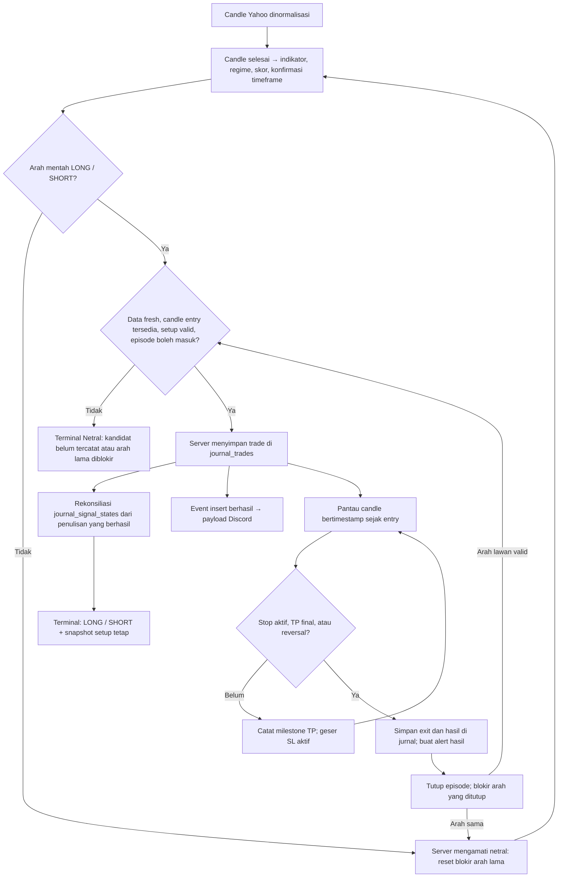

# Trading Methodology

[Indonesia](#bahasa-indonesia) · [English](#english)

## Bahasa Indonesia

Terminal menampilkan **trade simulasi yang sudah dicatat server**. Membuka halaman, menyegarkan data, atau membuka dialog tidak membuat order broker dan tidak membuka trade jurnal. Analisis mentah dapat mengarah LONG/SHORT sebelum ada entry yang layak; label LONG/SHORT terminal baru terbit setelah episode aktif tersimpan dengan setup valid.

Dokumen ini menjelaskan kontrak aplikasi saat ini. Sumber implementasi utama: [engine sinyal](../../src/core/engine/signals.ts), [adapter Yahoo](../../src/services/adapters/yahoo-adapter.ts), [core jurnal](../../src/core/automation/auto-journal-core.ts), [proyeksi terminal](../../src/core/automation/signal-episode.ts), dan [pemantauan trade](../../src/core/trade/follow-trade-model.ts).

### 1. Satu alur dari analisis sampai hasil

`journal_trades` menyimpan perjalanan dan hasil trade. `journal_signal_states` menyimpan status episode per simbol/timeframe serta snapshot entry, SL awal, TP, dan R:R. Server merekonsiliasi state dengan trade yang benar-benar berhasil ditulis. Tabel dan dialog membaca proyeksi yang sama; Discord memakai event hasil penulisan jurnal.

### 2. Arti status terminal

| Status internal | Label yang terlihat | Arti |
|---|---|---|
| `active` | Beli / LONG atau Jual / SHORT | Episode aktif memiliki snapshot setup valid. Arah dan setup mengikuti episode tersebut. |
| `pending` | Netral | Analisis punya arah, tetapi belum ada trade aktif tercatat. Termasuk ketika candle entry belum tersedia atau kandidat belum diproses server. |
| `blocked` | Netral | Arah mentah sama dengan arah trade yang sudah ditutup. Dialog menjelaskan blokir entry ulang. |
| `neutral` | Netral | Tidak ada episode aktif dan analisis mentah netral. Filter no-trade dapat menjelaskan kenapa kandidat ditahan. |
| `unavailable` | Tidak tersedia | Pembacaan state belum berhasil, identitas episode tidak cocok, atau setup aktif tidak valid. Dialog menyediakan **Coba lagi**. |

Snapshot valid harus memiliki arah LONG/SHORT, entry/SL/R:R positif dan finite, serta TP berurutan pada sisi profit. Snapshot baru memakai tiga TP; snapshot lama dua TP tetap didukung. LONG harus memenuhi `SL < entry < TP1 < TP2 < TP3`; SHORT kebalikannya. Data tidak lengkap tidak diganti dengan setup dari harga terkini.

Kandidat yang belum tercatat, arah yang diblokir setelah exit, dan analisis mentah netral memakai label terminal **Netral** yang sama. Status internal tetap membedakan alasannya agar dialog dapat memberi penjelasan yang tepat. Label Netral berarti tidak ada arah trade aktif yang diterbitkan, sehingga tidak harus sama dengan arah analisis indikator.

Kegagalan pembacaan terbaru menahan publikasi walaupun ada cache episode lama. Ketika pembacaan berhasil tetapi simbol belum punya episode, kandidat menjadi `pending` dengan label Netral. Filter LONG/SHORT hanya memasukkan episode aktif; filter Netral mencakup baris tanpa arah trade terbit. Kegagalan pembacaan atau snapshot rusak tetap berlabel Tidak tersedia.

**Kasus NBIS/EQPT:** pada pemeriksaan 8 September 2026, keduanya punya arah analisis LONG dengan kekuatan sekitar 71%, tetapi belum ada candle entry berikutnya maupun trade aktif. Label terminalnya **Netral**, tanpa setup terbit. Persentase analisis tidak otomatis berarti ada trade yang bisa dicatat.

### 3. Data dan pembentukan arah mentah

#### Candle dan timeframe

Jalur default market dan auto-journal menggunakan histori **60 hari dengan candle 1 jam** (`swing`). Candle yang masih terbentuk tidak dipakai sebagai candle keputusan. OHLC harus fisik/valid dan bertimestamp; adapter menyaring candle rusak dan menangani batas sesi bursa.

| Profil engine | Data | Minimum candle selesai | Ambang arah absolut | Agregasi timeframe lebih tinggi |
|---|---|---|---|---|
| Scalp | 1 hari / 5 menit | 120 | 0,40 | 12 candle → 1 jam |
| Swing, default produksi | 60 hari / 1 jam | 120 | 0,30 | 4 candle → 4 jam |
| Position | 6 bulan / 1 hari | 120 | 0,30 | 5 candle harian |

Konfirmasi timeframe tinggi memerlukan minimal 50 candle hasil agregasi; kelompok akhir yang belum lengkap dibuang. Jika siap dan arah selaras, skor dikali 1,15 lalu dibatasi ke `[-1,1]`. Jika berlawanan, skor dikali 0,5. Jika belum siap atau sideways, tidak ada pengali tersebut.

#### Indikator dan kategori

Setiap indikator masuk satu kategori. Kontribusi positif mendukung LONG, negatif mendukung SHORT. Nilai kategori dinormalisasi ke `[-1,1]`, lalu digabung memakai bobot sesuai regime.

| Kategori | Aturan indikator | Batas jumlah kontribusi / bobot dasar |
|---|---|---|
| Tren | EMA20/EMA50 dan posisi close: selaras ±1,5, pemulihan/pelemahan awal ±0,495. MACD histogram dan line searah ±1. ADX >25 menambah ±1 hanya jika arah EMA dan DMI sepakat. | 3,5 / 40% |
| Momentum | RSI <30 atau >70 dinilai sesuai tren, bukan selalu beli/jual otomatis. Di downtrend kuat, RSI oversold bernilai −0,5; di uptrend kuat, overbought +0,25; selain itu +1/−1. StochRSI <20 atau >80 memberi ±0,5, atau mengikuti tren sebesar ±0,25. Divergensi RSI memberi ±1, berkurang menjadi ±0,75 jika sekadar mengonfirmasi tren. | 2,5 / 30% |
| Volatilitas | Bollinger memakai periode 20 dan 2 standar deviasi. Dalam tren, %B >0,8 bullish atau <0,2 bearish mendukung kelanjutan ±0,375. Saat sideways, keluar band memberi arah pembalikan ±0,75, dekat tepi band ±0,375. Harga dekat Fibonacci 0,618 mendukung arah tren ±1; toleransi setengah ATR relatif harga dibatasi 0,3–1%, fallback 0,5%. | 1,75 / 20% |
| Volume | OBV naik/turun mendukung arah candle/EMA ±0,5, konflik memberi setengah bobot. Lonjakan volume >1,5× rata-rata 20 candle sebelumnya mengikuti perubahan close ±0,75; close datar tidak mendapat kontribusi lonjakan. | 1,25 / 10% |

Jika >30% dari maksimal 50 volume terakhir nol/hilang, atau seluruh volume tidak tersedia, kategori volume dinonaktifkan dan bobot kategori lain dinormalisasi ulang. Data kurang dari 120 candle membuat arah netral; kekuatan dikurangi 20 poin dan dibatasi maksimal 25.

Label tren memakai ADX dan kesepakatan EMA/DMI: ADX <20 berarti sideways; bullish memerlukan close/EMA bullish dan `+DI > -DI`, bearish kebalikannya. EMA200, level pivot, ATR, dan swing juga tersedia sebagai konteks/struktur risiko; EMA200 tidak mendapat suara arah tersendiri.

#### Regime dan keputusan

Regime diperiksa berurutan, sehingga squeeze lebih dulu dari tren dan volatilitas tinggi:

| Regime | Kondisi | Pengali bobot tren / momentum / volatilitas / volume |
|---|---|---|
| `low_volatility` | Lebar Bollinger <3% **dan** ADX <20 | 1 / 1 / 1 / 1; arah ditahan menjadi netral |
| `trending` | ADX ≥25 | 1,5 / 0,8 / 0,8 / 1 |
| `high_volatility` | Setelah dua kondisi di atas gagal, ATR/harga ≥5% kripto, ≥3,5% komoditas, ≥2,5% lainnya | 1 / 0,6 / 1,2 / 1 |
| `ranging` | Kondisi lainnya | 0,5 / 1,5 / 1,5 / 1 |

Skor akhir adalah rata-rata tertimbang kategori setelah pengali regime, lalu konfirmasi timeframe tinggi. Skor ≥ambang menghasilkan kandidat LONG; skor ≤−ambang kandidat SHORT. Kandidat melawan tren ditahan kecuali ada divergensi RSI sesuai arah kandidat atau `|skor| ≥0,60`. Squeeze tetap menahan arah menjadi netral.

Kekuatan = `round(|skor| × 100)`. Tier A ≥80, B ≥60, C di bawahnya. Konteks benchmark BTC/IHSG/S&P dapat menurunkan skor dan kekuatan menjadi 60% ketika melawan konteks pasar, lalu menghitung tier lagi; penurunan ini tidak membalik atau menyembunyikan arah mentah. Smart money, fundamental, akumulasi, dan relative strength di jalur utama merupakan informasi tambahan, bukan pemicu entry.

Saat trade aktif, harga, indikator, kekuatan, tier, dan konteks tetap boleh berubah. Badge arah dan setup mengikuti episode tercatat. Karena itu analisis baru yang kena filter no-trade tidak mengubah trade aktif menjadi label **Ditahan**.

Label risiko berasal dari penalti analisis: data belum siap +2, arah mentah netral +1, volume tidak andal +1, melawan tren +2, kekuatan <50 +2 atau <75 +1. ATR relatif harga menambah +1 pada batas sedang (kripto 2,5%, komoditas 1,8%, lainnya 1,2%) atau +2 pada batas tinggi di tabel regime. Arah nonnetral dengan volume andal tetapi tanpa lonjakan juga +1. Risiko rendah memerlukan total ≤1 dan kekuatan ≥75; sedang total ≤3 dan kekuatan ≥50; sisanya tinggi. Label ini tidak mengubah SL snapshot trade aktif.

### 4. Validasi entry dan pembentukan setup

Server memeriksa berikut sebelum mencatat trade baru:

1. Aset termasuk universe scan aktif dan sesuai pengaturan jam pasar; robot tidak sedang dijeda.
2. Quote memiliki timestamp, usianya tidak lebih dari **90 menit**, dan tidak lebih dari **5 menit ke depan**.
3. Candle keputusan sudah selesai, berusia **0–15 menit** pada waktu scan.
4. Ada candle eksekusi nyata setelah candle keputusan. Entry menggunakan **open candle eksekusi**, bukan harga spot saat browser dibuka. Timestamp eksekusi tidak boleh sebelum close keputusan atau lebih dari 5 menit ke depan.
5. Ada arah dan setup, belum ada trade lain yang tetap open untuk simbol/timeframe tersebut, dan arah tidak diblokir episode sebelumnya.

Candle tambahan Yahoo tepat saat bursa tutup bukan otomatis candle eksekusi. Adapter juga memerlukan jarak minimal satu interval dari open keputusan. Contohnya candle saham terakhir 19:30–20:00 UTC pada interval 1 jam tidak boleh memakai pseudo-bar 20:00 sebagai entry. Setelah jeda sesi, data keputusan/quote tetap harus lolos pemeriksaan kesegaran; sistem tidak mengejar sinyal lama secara otomatis.

Rumus rencana di [trading-plan.ts](../../src/core/engine/trading-plan.ts):

- ATR efektif memakai ATR terukur; jika tidak tersedia/0, fallback 3% harga untuk kripto atau 1,5% untuk lainnya.
- Stop awal mengambil invalidasi yang lebih lebar antara **1,5× ATR** dan swing/pivot struktural. Buffer struktur = terbesar antara 0,25× ATR dan 0,1% harga.
- Jarak risiko `r = |entry − SL awal|` dibatasi minimal 0,05% entry, maksimal 12% kripto atau 8% lainnya. Karena ada batas ini, stop hasil akhir bisa lebih dekat daripada struktur awal.
- R:R memakai jarak ke struktur lawan dibagi `r`, jika ≥1, dibatasi maksimal 4. Fallback: ADX >30 → 2; >25 → 1,75; selain itu 1,5.
- LONG: `TP1 = entry + r×RR`, `TP2 = entry + r×(RR+1)`, `TP3 = entry + r×(RR+2)`. SHORT memakai pengurangan dengan jarak yang sama.

Setelah pencatatan, entry, TP, SL awal, dan R:R disimpan sebagai snapshot. Harga baru tidak menjalankan rumus ulang untuk trade yang sedang aktif. Jurnal juga menyimpan versi engine dan waktu candle keputusan agar audit dapat membedakan kelompok aturan.

### 5. Setup tetap dan SL progresif

**SL awal** merupakan bagian setup tetap serta dasar perhitungan R. **SL aktif** mengikuti milestone tertinggi: sebelum TP1 = SL awal; setelah TP1 = entry; setelah TP2 = TP1. TP3 menutup seluruh posisi. TP1/TP2 tidak menjual sebagian posisi.

Contoh mekanik LONG sesuai ilustrasi: entry **50**, TP **100/200/300**, SL awal **20**. Angka ini sengaja sederhana untuk menjelaskan perjalanan; risiko 60% dan jarak targetnya bukan keluaran rumus produksi di bagian sebelumnya.

| Perjalanan harga | Setup tersimpan | SL aktif / hasil |
|---|---|---|
| Entry tercatat di 50 | Entry 50, SL awal 20, TP 100/200/300 | SL aktif 20 |
| Harga naik ke 80; browser dibuka ulang | Tetap sama | SL aktif 20; belum ada exit |
| TP1 100 tersentuh | Tetap sama | SL aktif naik ke 50 |
| Setelah TP1 harga kembali ke 50 | Tetap sama untuk audit | Tutup di 50, impas sebelum biaya |
| TP2 200 tersentuh | Tetap sama | SL aktif naik ke 100 |
| Setelah TP2 harga kembali ke 100 | Tetap sama untuk audit | Tutup di 100, profit; exit `progressive_stop` |
| TP3 300 tersentuh sebelum stop | Tetap sama untuk audit | Tutup di 300, exit `final_take_profit` |

Contoh SHORT yang mengikuti pola rumus target: entry **100**, SL awal **108**, R:R **1,5**, TP **88/80/72**. Harga turun ke 95 tidak mengubah setup; TP1 88 memindahkan SL aktif ke 100; TP2 80 memindahkannya ke 88; TP3 72 menutup seluruh posisi. Jika setelah TP2 harga naik ke 88, hasilnya profit 12 per unit atau `12/8 = 1,5R` sebelum biaya.

Perhitungan gross R: LONG `(exit − entry) / |entry − SL awal|`; SHORT `(entry − exit) / |entry − SL awal|`. Denominator tidak mengecil ketika SL aktif bergerak. Dialog market menampilkan **SL awal**, sedangkan perjalanan SL aktif dan milestone mengikuti jurnal.

### 6. Wick, candle ambigu, dan gap

OHLC tidak memberi urutan setiap transaksi dalam candle. Evaluator memakai aturan berikut secara konsisten:

1. **Stop yang sudah aktif diperiksa lebih dulu.** Jika satu candle menyentuh stop aktif dan TP, hasil stop didahulukan.
2. Stop yang baru naik karena TP tidak diterapkan mundur pada wick candle yang sama.
3. Pada candle yang **sudah selesai**, close dapat mengonfirmasi retracement melewati stop baru. Pada candle yang masih berjalan, close sementara tidak boleh memicu exit pada stop yang baru bergerak.
4. Gap melewati stop yang sudah aktif diisi menggunakan harga **open aktual**, bukan level stop ideal.

Contoh LONG entry 50, SL awal 20, TP1 100: candle `O50 H110 L40 C90` mencapai TP1, lalu SL aktif menjadi 50; low 40 saja tidak membuktikan stop baru tersentuh setelah TP1. Jika candle yang sudah selesai berakhir di 45, retracement terkonfirmasi dan exit di 50. Namun candle `O50 H110 L15 C90` lebih dulu menghasilkan exit SL awal 20 menurut aturan stop-first.

Sesudah SL aktif LONG berada di 50, candle berikutnya membuka di 45 → exit **45**, bukan 50. Pada SHORT dengan SL aktif 100, open berikutnya 105 → exit **105**. Gap dapat mengubah stop breakeven menjadi kerugian nyata.

Server hanya memutuskan exit berdasarkan candle bertimestamp sejak entry; harga spot sesaat tidak cukup. Histori replay default terbatas rolling 60 hari. Milestone trade yang lebih tua dari jendela itu tidak selalu dapat direkonstruksi waktu sentuhnya secara lengkap; jangan menganggap histori tersebut sebagai data tick lengkap.

### 7. Exit, blokir arah lama, dan reversal

Setelah exit, server mematikan episode aktif dan memblokir arah yang ditutup. Jika LONG selesai tetapi analisis masih LONG, terminal **Netral** dengan penjelasan blokir; browser baru maupun refresh tidak membuka LONG lagi. Reset terjadi ketika **server** mengamati arah mentah netral. Setelah itu kandidat LONG berikutnya tetap harus melewati validasi entry.

Raw netral tidak menutup trade yang masih aktif. Raw SHORT juga tidak langsung mengganti badge trade LONG di browser. Server lebih dulu mengevaluasi stop/TP, kemudian memeriksa reversal memakai close candle yang terkoroborasi. Ketika closure LONG berhasil dan SHORT baru valid serta berhasil dicatat, episode langsung beralih SHORT. Tidak wajib menunggu fase netral di antara arah yang berlawanan.

Reversal hanya boleh menghasilkan posisi lawan jika entry-nya memenuhi semua aturan. Jika penutupan berhasil tetapi entry lawan belum tersedia, posisi lama tetap tertutup dan terminal berlabel Netral sampai ada trade aktif baru yang tercatat.

### 8. Kekuatan, keberhasilan jurnal, dan backtest

| Angka | Sumber dan arti | Mengapa bisa berbeda |
|---|---|---|
| Kekuatan / tier | Keselarasan kategori teknikal terkini, ditambah konfirmasi timeframe dan penurunan conviction benchmark | 71% bukan peluang menang 71%; bukan bukti ada entry tercatat. |
| Keberhasilan tabel market | RPC publik agregat jurnal all-time per simbol: `win / (win + loss)`; impas dikecualikan | Mengukur trade server yang sudah selesai; angka sama untuk free dan premium. |
| Statistik jurnal | Trade simulasi tersimpan dalam filter/periode dashboard; hasil memakai entry/SL awal dan exit tercatat | Periode dan kumpulan trade dapat berbeda dari angka all-time. |
| Backtest dan kalibrasi dialog | Simulasi walk-forward pada histori yang tersedia; kalibrasi sesuai tier/regime memerlukan minimal 30 sampel | Beda jendela, kumpulan trade, biaya, dan mekanik eksekusi reversal dari jurnal live. |

Backtest mengambil keputusan pada candle selesai dan entry di open berikutnya. Reversal backtest dieksekusi di open berikutnya; jurnal produksi memakai close candle terkoroborasi. Backtest juga dapat menutup trade di akhir data. Biaya per sisi: kripto fee 0,04% + slippage 0,06%; lainnya 0,02% + 0,03%. Nilai net backtest karena itu tidak identik dengan gross P&L jurnal. Tidak ada angka di atas yang menjamin hasil trade berikutnya.

### 9. Interval pembaruan dan kegagalan

| Proses | Interval/perilaku |
|---|---|
| Scan auto-journal | Cron dasar 30 menit; `journal_settings` mengatur enable, interval, dan jam pasar. Scan admin tetap menghormati pause. |
| Quote, candle, dan konteks market browser | Poll default 30 menit; cache Yahoo/proxy dan kondisi bursa ikut menentukan kesegaran data. |
| Status episode dan row jurnal browser | Poll **60 detik** selama query aktif; baca ulang ketika halaman dipasang dan browser kembali aktif. |
| Refresh market / refresh jurnal / scan admin selesai | Menyegarkan cache episode dan jurnal terkait; refresh data tidak mengeksekusi order. |
| Rekap Discord | Trigger per jam dengan gate waktu WIB untuk rekap harian/mingguan/bulanan. |

Polling 60 detik membaca hasil server; bukan berarti scan entry terjadi setiap menit. Tabel dan jurnal dapat membutuhkan satu siklus pembacaan untuk melihat penulisan terbaru. Pembacaan selalu mengambil snapshot tersimpan, sehingga pembaruan harga tidak menggeser setup.

- **Feed aset gagal atau basi:** entry ditahan dan server tidak menutup trade dari spot yang tidak terkoroborasi. Trade yang gagal diperiksa tetap tersimpan untuk scan berikutnya.
- **State episode gagal dibaca / snapshot rusak:** label **Tidak tersedia**, tanpa setup buatan; gunakan **Coba lagi**. Kegagalan satu API informasi tambahan hanya memengaruhi informasi tersebut.
- **Penulisan jurnal gagal:** perubahan yang gagal tidak menjadi event Discord dan tidak boleh diaktifkan dalam state hasil rekonsiliasi. Penulisan trade dan state adalah operasi terpisah; bila persistensi state gagal, publikasi browser bisa tertinggal sampai server merekonsiliasi lagi.
- **Discord gagal:** jurnal yang sudah berhasil tetap sah. Alert entry membawa snapshot entry, TP, dan SL awal yang sama; alert exit membawa hasil tercatat. Pengiriman best-effort, tidak ada antrean permanen untuk mengulang setiap kegagalan. HTTP 429 mendapat satu retry jika waktu tunggu masih dalam batas 12 detik; kegagalan batch menghentikan sisa pengiriman pada run tersebut. Webhook belum dikonfigurasi berarti tidak ada pesan terkirim.

#### Pekerjaan di browser

Dialog market dan jurnal memasang query serta analisis detail hanya selama terbuka. Screener melewati smart money, akumulasi, dan relative strength yang tidak ditampilkan pada tabel. Backtest aset terpilih memakai engine yang sama dalam Web Worker; cache mengikuti simbol, timeframe, dan `dataUpdatedAt` candle. Worker dihentikan setelah selesai, gagal, atau dialog ditutup. Panel statistik memiliki loading, error, dan retry sendiri. Data candle tetap 60 hari / 1 jam.

Refresh mempertahankan halaman tabel; filter, pencarian, dan sorting kembali ke halaman pertama. Halaman dibatasi ke hasil yang masih tersedia. API aset gagal tidak menghapus favorit tersimpan. Bar kekuatan/keberhasilan memakai CSS dan sparkline memakai SVG statis 30 titik; angka serta arti metrik tetap sama.

### 10. Pengujian kontrak

[Tes proyeksi episode](../../tests/signal-episode.test.mjs) mencakup kandidat NBIS/EQPT tanpa candle entry, kandidat tanpa episode, snapshot rusak, pembacaan gagal meski ada cache, setup tetap ketika harga berubah, kesinambungan snapshot jurnal/terminal/payload Discord, blokir setelah exit, reset netral, reversal langsung, dan contoh SL progresif. Payload Discord diuji sebagai data, tanpa mengirim pesan.

Aturan evaluator candle dan guard server juga diuji oleh [tes auto-journal](../../tests/auto-journal-core.test.mjs), [tes follow-trade](../../tests/follow-trade-model.test.mjs), dan [tes engine](../../tests/signal-engine.test.mjs). Jalankan `npm test`, `npm run build`, dan `npm run lint` untuk validasi proyek.

[Tes performa terminal](../../tests/terminal-performance.test.mjs) memeriksa dialog tertutup, kesetaraan hasil worker dengan engine, cache per revisi, pembatalan, error, dan retry.

Lihat juga [screener](../fsd/01-terminal-screener.md), [engine](../fsd/02-trading-engine.md), [auto-journal](../fsd/03-auto-journal.md), dan [diagram teknis](../tsd/08-core-signal-flow-diagrams.md).

## English

The terminal publishes **simulated trades already recorded by the server**. Opening a page, refreshing data, or opening a dialog does not place a broker order or create a journal trade. Raw analysis can point LONG/SHORT before an eligible entry exists; the terminal publishes LONG/SHORT only after an active episode with a valid setup has been saved.

This document describes the current application contract. Its implementation sources are the [signal engine](../../src/core/engine/signals.ts), [Yahoo adapter](../../src/services/adapters/yahoo-adapter.ts), [journal core](../../src/core/automation/auto-journal-core.ts), [terminal projection](../../src/core/automation/signal-episode.ts), and [trade monitoring](../../src/core/trade/follow-trade-model.ts).

### 1. From analysis to outcome

Normalized Yahoo candles feed completed-candle indicators, regime classification, scoring, and higher-timeframe confirmation. A directional candidate must pass freshness, execution-candle, setup, and episode checks. Otherwise the terminal remains Neutral. The server saves eligible trades to `journal_trades`, reconciles `journal_signal_states` against successful writes, and publishes the saved direction and setup. Successful journal events supply Discord payloads.

The server then monitors timestamped candles from entry onward. Partial TP milestones move the active stop; an active stop, final TP, or validated reversal closes the trade and records the outcome. Closure blocks the old direction. Observed raw neutrality resets that block; an eligible opposite direction may enter directly without waiting for neutrality.

`journal_trades` holds each trade's progression and outcome. `journal_signal_states` holds the symbol/timeframe episode and its entry, initial SL, TP, and R:R snapshot. Table and dialog use the same projection; Discord uses successful journal-write events.

### 2. Terminal states

| Internal state | Visible label | Meaning |
|---|---|---|
| `active` | Buy / LONG or Sell / SHORT | The active episode has a valid saved setup. Its direction and levels govern the display. |
| `pending` | Neutral | Analysis is directional but no active trade has been recorded, including candidates awaiting an execution candle or server processing. |
| `blocked` | Neutral | Raw analysis matches the direction of a closed trade. The dialog explains the re-entry block. |
| `neutral` | Neutral | No active episode exists and raw analysis is neutral. No-trade filters may explain a withheld candidate. |
| `unavailable` | Unavailable | State has not been read successfully, the episode identity mismatches, or an active setup is invalid. The dialog provides Retry. |

A valid snapshot requires LONG/SHORT direction, positive finite entry/SL/R:R, and ordered profit-side targets. New snapshots use three TPs; legacy two-TP snapshots remain supported. LONG requires `SL < entry < TP1 < TP2 < TP3`; SHORT reverses those inequalities. Missing fields are never replaced with levels derived from the current price.

Unrecorded candidates, blocked directions, and raw neutrality share the visible Neutral label. Internal states preserve the reason for the dialog. Neutral means no active trade direction is published; it need not match the current indicator direction.

A failed latest state read withholds publication even when an older episode is cached. A successful read with no matching episode makes a directional candidate pending/Neutral. LONG/SHORT filters include only active episodes; the Neutral filter includes rows without a published direction. Read failures or invalid snapshots remain Unavailable.

**NBIS/EQPT example:** on 8 September 2026, both had raw LONG analysis with roughly 71% strength but no next execution candle or active trade. Their terminal label was Neutral with no published setup. An analysis percentage alone does not establish an executable journal entry.

### 3. Data and raw direction

#### Candles and timeframes

The default market and auto-journal paths retain **60 days of hourly candles** (`swing`). An unfinished candle cannot be the decision candle. OHLC values must be physically valid and timestamped; the adapter filters malformed candles and handles exchange-session boundaries.

| Engine profile | History / interval | Minimum completed candles | Absolute direction threshold | Higher-timeframe aggregation |
|---|---|---|---|---|
| Scalp | 1 day / 5 minutes | 120 | 0.40 | 12 candles → 1 hour |
| Swing, production default | 60 days / 1 hour | 120 | 0.30 | 4 candles → 4 hours |
| Position | 6 months / 1 day | 120 | 0.30 | 5 daily candles |

Higher-timeframe confirmation needs at least 50 aggregated candles; an incomplete trailing group is discarded. When ready, aligned direction multiplies the score by 1.15, clamped to `[-1,1]`; opposing direction multiplies it by 0.5. Insufficient or sideways confirmation applies neither multiplier.

#### Indicators and categories

Each indicator belongs to one category. Positive contributions support LONG and negative contributions support SHORT. Category scores are normalized to `[-1,1]` and combined with regime-adjusted weights.

| Category | Indicator rules | Contribution cap / base weight |
|---|---|---|
| Trend | EMA20/EMA50 and close alignment: ±1.5 when aligned, ±0.495 for early recovery/weakening. Aligned MACD histogram and line: ±1. ADX >25 contributes ±1 only when EMA and DMI agree. | 3.5 / 40% |
| Momentum | RSI <30 or >70 is interpreted with trend. Oversold in a strong downtrend: −0.5; overbought in a strong uptrend: +0.25; otherwise +1/−1. StochRSI <20 or >80 contributes ±0.5, or trend-following ±0.25. RSI divergence contributes ±1, reduced to ±0.75 when merely confirming trend. | 2.5 / 30% |
| Volatility | Bollinger uses 20 periods and 2 standard deviations. In a trend, bullish %B >0.8 or bearish %B <0.2 supports continuation at ±0.375. Sideways conditions use reversals outside the band at ±0.75 or near its edge at ±0.375. Proximity to Fibonacci 0.618 supports trend direction at ±1; tolerance is half ATR relative to price, clamped to 0.3–1%, with a 0.5% fallback. | 1.75 / 20% |
| Volume | Rising/falling OBV aligned with candle/EMA direction contributes ±0.5; disagreement halves it. Volume >1.5× the previous 20-candle average follows the close change at ±0.75; an unchanged close contributes no volume-spike vote. | 1.25 / 10% |

If more than 30% of the latest up-to-50 volume values are zero/missing, or all volume is unavailable, the volume category is disabled and other weights are renormalized. Fewer than 120 candles force neutral direction, subtract 20 strength points, and cap strength at 25.

Trend labels use ADX and EMA/DMI agreement: ADX <20 is sideways; bullish requires bullish close/EMA positioning and `+DI > -DI`; bearish reverses those conditions. EMA200, pivots, ATR, and swings provide context/risk structure; EMA200 has no independent direction vote.

#### Regime and decision

Regimes are evaluated in this order, so a squeeze takes precedence over trend and high volatility:

| Regime | Condition | Trend / momentum / volatility / volume weight multipliers |
|---|---|---|
| `low_volatility` | Bollinger width <3% **and** ADX <20 | 1 / 1 / 1 / 1; direction withheld as neutral |
| `trending` | ADX ≥25 | 1.5 / 0.8 / 0.8 / 1 |
| `high_volatility` | After the previous conditions fail, ATR/price ≥5% for crypto, ≥3.5% for commodities, ≥2.5% otherwise | 1 / 0.6 / 1.2 / 1 |
| `ranging` | All other conditions | 0.5 / 1.5 / 1.5 / 1 |

The final score is the weighted category average after regime multipliers and higher-timeframe confirmation. A score at or above the threshold produces a LONG candidate; at or below its negative produces SHORT. Counter-trend candidates are withheld unless RSI divergence supports the candidate or `|score| ≥0.60`. A squeeze still forces neutral direction.

Strength is `round(|score| × 100)`: tier A ≥80, B ≥60, C otherwise. BTC/IHSG/S&P benchmark context can reduce opposing conviction and strength to 60%, then recalculate the tier; this does not reverse or hide raw direction. Smart money, fundamentals, accumulation, and relative strength are supporting information on the canonical path, not entry triggers.

For an active trade, price, indicators, strength, tier, and context may continue changing. The published direction and setup follow the saved episode. A new no-trade analysis filter therefore does not relabel an active trade as Withheld.

Risk-label penalties are: data not ready +2; raw neutral direction +1; unreliable volume +1; counter-trend +2; strength <50 adds +2, otherwise strength <75 adds +1. ATR/price adds +1 at moderate thresholds (crypto 2.5%, commodities 1.8%, others 1.2%) or +2 at the high thresholds in the regime table. A directional signal with reliable volume but no volume spike adds +1. Low risk requires total ≤1 and strength ≥75; medium requires total ≤3 and strength ≥50; otherwise high. This label never changes an active trade's saved SL.

### 4. Entry validation and setup creation

Before recording a trade, the server checks:

1. The asset belongs to the active scan universe, market-hour settings permit it, and the robot is not paused.
2. The quote has a timestamp no more than **90 minutes old** or **5 minutes in the future**.
3. The decision candle is complete and **0–15 minutes old** at scan time.
4. A real execution candle exists after the decision candle. Entry uses that candle's **open**, not the spot price when a browser opens. Its timestamp cannot precede the decision close or exceed the current time by more than 5 minutes.
5. Direction and setup exist, no other trade remains open for the symbol/timeframe, and the previous episode does not block that direction.

An extra Yahoo bar exactly at the exchange close is not automatically an execution candle. The adapter also requires at least one full interval since the decision candle's open. For example, a final stock candle from 19:30–20:00 UTC at a one-hour interval cannot use a 20:00 pseudo-bar as entry. After a session break, decision and quote data must still pass freshness checks; the system does not automatically chase old signals.

The [trading-plan formula](../../src/core/engine/trading-plan.ts) uses:

- Measured ATR, falling back to 3% of price for crypto or 1.5% otherwise when ATR is unavailable/zero.
- The wider initial invalidation between **1.5× ATR** and structural swing/pivot distance. Structural buffer is the greater of 0.25× ATR and 0.1% of price.
- Risk distance `r = |entry − initial SL|`, clamped between 0.05% of entry and 12% for crypto or 8% otherwise. This cap can put the final stop inside the original structure.
- R:R from opposing-structure distance divided by `r` when ≥1, capped at 4. Fallback: ADX >30 → 2; >25 → 1.75; otherwise 1.5.
- LONG targets: `TP1 = entry + r×RR`, `TP2 = entry + r×(RR+1)`, `TP3 = entry + r×(RR+2)`. SHORT subtracts the same distances.

Entry, TPs, initial SL, and R:R become a saved snapshot. Later prices do not recalculate an active setup. The journal also stores engine version and decision-candle time for auditing rule cohorts.

### 5. Fixed setup and progressive SL

The **initial SL** is fixed and remains the R denominator. The **active SL** follows the highest milestone: initial SL before TP1; entry after TP1; TP1 after TP2. TP3 closes the entire position. TP1/TP2 do not sell a fraction of it.

Illustrative LONG: entry **50**, TPs **100/200/300**, initial SL **20**. These deliberately simple levels illustrate mechanics; their 60% initial risk and target spacing are not outputs of the production formula above.

| Price journey | Saved setup | Active SL / outcome |
|---|---|---|
| Entry recorded at 50 | Entry 50, initial SL 20, TPs 100/200/300 | Active SL 20 |
| Price reaches 80; browser is reopened | Unchanged | Active SL 20; no exit |
| TP1 at 100 is touched | Unchanged | Active SL moves to 50 |
| Price returns to 50 after TP1 | Retained for audit | Exit at 50, breakeven before costs |
| TP2 at 200 is touched | Unchanged | Active SL moves to 100 |
| Price returns to 100 after TP2 | Retained for audit | Exit at 100, profit; `progressive_stop` |
| TP3 at 300 is touched before the stop | Retained for audit | Exit at 300; `final_take_profit` |

SHORT using the target formula: entry **100**, initial SL **108**, R:R **1.5**, TPs **88/80/72**. A decline to 95 changes no setup level. TP1 at 88 moves active SL to 100; TP2 at 80 moves it to 88; TP3 at 72 closes the whole position. A rebound to 88 after TP2 yields 12 per unit or `12/8 = 1.5R` before costs.

Gross R is `(exit − entry) / |entry − initial SL|` for LONG and `(entry − exit) / |entry − initial SL|` for SHORT. The denominator does not shrink as the active stop moves. The market dialog displays the **initial SL**; the journal tracks active-stop progression and milestones.

### 6. Wicks, ambiguous candles, and gaps

OHLC cannot reveal the order of every transaction within a candle. Evaluation follows these rules:

1. **An already-active stop is checked first.** If the same candle touches it and a TP, the stop outcome takes precedence.
2. A newly raised stop is not applied retroactively to that candle's wick.
3. A **completed** candle's close may confirm retracement through the new stop. A forming candle's temporary close cannot trigger an exit at a newly moved stop.
4. A gap through an already-active stop fills at the **actual open**, not the ideal stop level.

For LONG entry 50, initial SL 20, TP1 100, candle `O50 H110 L40 C90` reaches TP1 and moves active SL to 50. Low 40 alone does not prove a stop touch after TP1. If that completed candle ends at 45, retracement is confirmed and exit is at 50. However, `O50 H110 L15 C90` exits at initial SL 20 under stop-first evaluation.

With LONG active SL at 50, the next candle opening at 45 exits at **45**, not 50. With SHORT active SL at 100, the next open at 105 exits at **105**. Gaps can turn a breakeven stop into a realized loss.

The server determines exits from timestamped candles since entry; a momentary spot quote is insufficient. Default replay history covers a rolling 60 days. Exact touch times for older milestones cannot always be fully reconstructed; this is not complete tick history.

### 7. Exit, blocking the old direction, and reversal

After exit, the server closes the active episode and blocks its direction. If LONG closes while raw analysis remains LONG, the terminal is Neutral with a re-entry explanation. Opening another browser or refreshing cannot reopen LONG. The block resets when the **server** observes raw neutrality; the next LONG candidate must still pass entry validation.

Raw neutrality does not close an active trade. Raw SHORT also does not immediately replace a live LONG badge in the browser. The server evaluates stop/TP first, then checks reversal using a corroborated candle close. After successful LONG closure and valid, successfully recorded SHORT entry, the episode switches directly to SHORT. No intervening neutral phase is required for opposite directions.

The opposite entry must satisfy every entry rule. If closure succeeds but that entry is unavailable, the old position stays closed and the terminal remains Neutral until a new active trade is recorded.

### 8. Strength, journal success, and backtest

| Metric | Source and meaning | Why values differ |
|---|---|---|
| Strength / tier | Current technical-category alignment, timeframe confirmation, and benchmark conviction reduction | 71% is not a 71% win probability and does not prove an entry exists. |
| Market-table success | Public all-time journal aggregate per symbol: `wins / (wins + losses)`; breakeven excluded | Completed server trades; identical numbers for free and premium users. |
| Journal statistics | Saved simulated trades in the dashboard's filters/period; recorded entry, initial SL, and exit | The period and trade population may differ from all-time aggregates. |
| Dialog backtest / calibration | Walk-forward simulation over available history; tier/regime calibration needs at least 30 samples | Its window, population, costs, and reversal execution differ from the live journal. |

Backtest decisions use completed candles and entries execute at the next open. Backtest reversal also executes at the next open; the production journal uses a corroborated candle close. A backtest may close a position at the end of data. Per-side costs are crypto fee 0.04% + slippage 0.06%; otherwise 0.02% + 0.03%. Net backtest values therefore differ from gross journal P&L. None of these figures guarantees the next trade's outcome.

### 9. Refresh intervals and failures

| Process | Interval / behavior |
|---|---|
| Auto-journal scan | Base cron every 30 minutes; `journal_settings` controls enablement, interval, and market hours. Admin scans respect pause. |
| Browser quotes, candles, and market context | Default 30-minute polling; Yahoo/proxy caches and exchange conditions affect freshness. |
| Browser episode state and journal rows | **60-second** polling while queries are active; reads again on mount and window focus. |
| Market/journal refresh or completed admin scan | Refreshes related episode/journal caches; refreshing data does not execute orders. |
| Discord summaries | Hourly trigger with WIB time gates for daily, weekly, and monthly summaries. |

A 60-second read does not mean entry scans run every minute. Table and journal may need one read cycle to show the latest writes. Reads use saved snapshots, so price updates do not move setup levels.

- **Failed/stale asset feed:** entry is withheld; the server does not close a trade from uncorroborated spot data. Unchecked trades stay saved for the next scan.
- **Failed episode read / malformed snapshot:** Unavailable with no fabricated setup; use Retry. Failure of an optional information API affects only that information.
- **Failed journal write:** the failed change produces no Discord event and cannot activate reconciled state. Trade and state writes are separate; if state persistence fails, browser publication can lag until server reconciliation.
- **Failed Discord delivery:** a successful journal record remains valid. Entry alerts carry the same entry/TP/initial-SL snapshot; exit alerts carry the recorded outcome. Delivery is best effort without a durable retry queue. HTTP 429 gets one retry if its wait fits within 12 seconds; a failed batch stops remaining deliveries in that run. No configured webhook means no message is sent.

#### Browser execution

Market and journal dialogs mount detail queries and analysis only while open. The screener skips smart money, accumulation, and relative strength that its table does not display. The selected asset's backtest runs the same engine in a Web Worker, cached by symbol, timeframe, and candle `dataUpdatedAt`. The worker terminates on completion, failure, or dialog closure. Statistics have their own loading, error, and retry state. Candle history remains 60 days / 1 hour.

Refresh retains the table page; filters, search, and sorting reset to page one. A shrinking result set clamps the page to available results. Asset API failures do not remove saved favorites. Strength/success meters use CSS and sparklines use static 30-point SVGs; metric values and meanings remain unchanged.

### 10. Contract validation

[Episode projection tests](../../tests/signal-episode.test.mjs) cover NBIS/EQPT candidates without execution candles, candidates without episodes, malformed snapshots, failed reads despite cached state, fixed setups during price updates, journal/terminal/Discord snapshot consistency, post-exit blocking, neutral reset, direct reversal, and progressive-SL examples. Discord payloads are tested as data without sending messages.

Candle evaluation and server guards are covered by [auto-journal tests](../../tests/auto-journal-core.test.mjs), [follow-trade tests](../../tests/follow-trade-model.test.mjs), and [engine tests](../../tests/signal-engine.test.mjs). [Terminal performance tests](../../tests/terminal-performance.test.mjs) cover closed dialogs, worker/engine parity, revision caching, cancellation, errors, and retry. Run `npm test`, `npm run build`, and `npm run lint`.

See the [screener](../fsd/01-terminal-screener.md), [engine](../fsd/02-trading-engine.md), [auto-journal](../fsd/03-auto-journal.md), and [technical diagrams](../tsd/08-core-signal-flow-diagrams.md).
