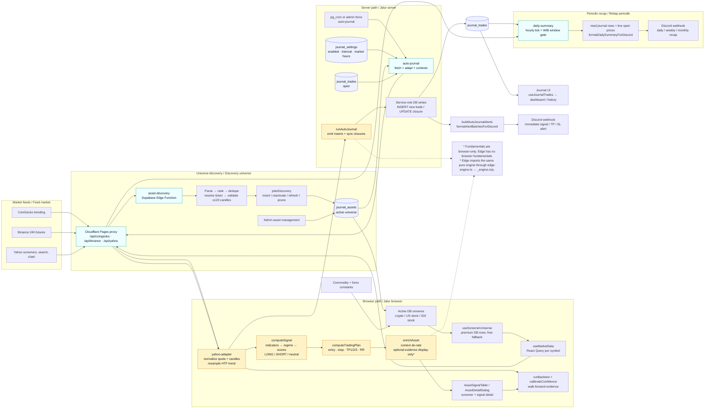
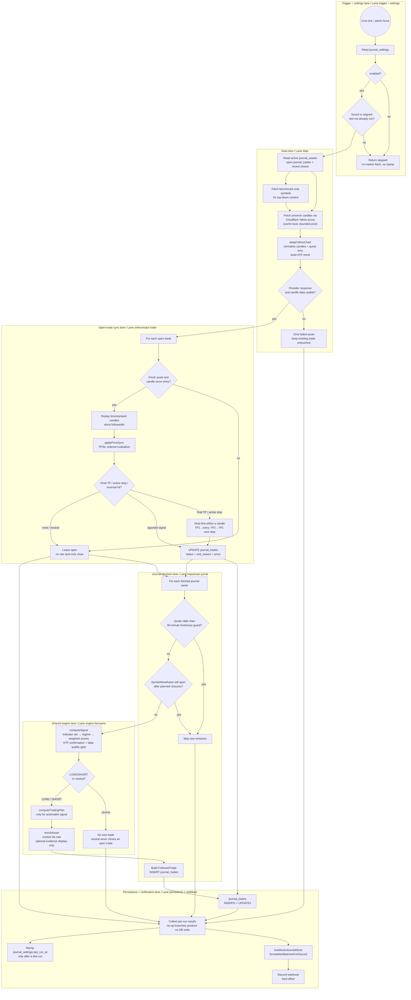
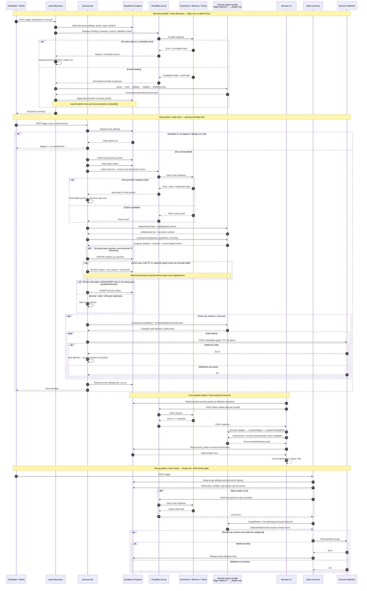

# TSD 08 — Core Signal Flow Diagrams

> 🇮🇩 Diagram kanonis untuk alur sinyal production `main`: dari pemilihan
> universe dan candle sampai trading setup, auto-journal, dashboard, dan
> Discord.
>
> 🇺🇸 Canonical diagrams for the production `main` signal flow: from universe
> selection and candles through the trading setup, auto-journal, dashboard,
> and Discord.

Dokumen ini memetakan implementasi yang benar-benar berjalan. `computeSignal`,
`computeTradingPlan`, `enrichAsset`, dan `runAutoJournal` tetap merupakan modul
yang berbeda; diagram tidak menggabungkannya menjadi satu langkah fiktif.

This document maps the code that actually runs. `computeSignal`,
`computeTradingPlan`, `enrichAsset`, and `runAutoJournal` remain separate
modules; the diagrams do not collapse them into one fictional step.

## 1. End-to-end flowchart / Flowchart end-to-end

🇮🇩 `journal_assets` mengatur universe crypto/US/IDX untuk user premium dan
cron; komoditas/forex tetap berasal dari konstanta. Jalur browser dan Edge
melewati adapter serta engine pure yang sama. Jalur Edge memakai bundle
`_engine.mjs`, bukan implementasi sinyal kedua.

🇺🇸 `journal_assets` supplies the crypto/US/IDX universe for premium users and
the cron; commodities/forex remain constant-driven. Browser and Edge paths use
the same adapter and pure engine. Edge runs the `_engine.mjs` bundle, not a
second signal implementation.

## 2. Signal and journal activity / Activity sinyal dan jurnal

Mermaid tidak menyediakan UML activity diagram native. Swimlane di bawah
menggunakan `flowchart` dan `subgraph` supaya setiap tanggung jawab runtime
tetap terlihat tanpa menambah generator diagram.

Mermaid has no native UML activity diagram. The swimlanes below use `flowchart`
and `subgraph` so each runtime responsibility remains visible without adding a
diagram generator.

### Decision notes / Catatan keputusan

- 🇮🇩 Data-quality, stale quote, missing candle, dan trade yang tetap open
  menahan emission. Trade yang ditutup boleh diganti sinyal aktif dalam scan sama.
- 🇺🇸 Data quality, stale quotes, missing candles, and still-open duplicates
  suppress emission. A closed trade may be replaced by the current signal in
  the same scan.
- 🇮🇩 Trade terbuka disinkronkan dari candle bertimestamp sejak entry. Harga
  spot mentah tidak boleh sendirian menciptakan TP/SL phantom.
- 🇺🇸 Open trades are synchronized from timestamped candles since entry. A raw
  spot quote cannot create a phantom TP/SL close by itself.
- 🇮🇩 `computeTradingPlan` berjalan di adapter sebelum post-signal enrichment;
  enrichment menyesuaikan conviction/outlook, bukan membuat ulang plan di Edge.
- 🇺🇸 `computeTradingPlan` runs in the adapter before post-signal enrichment;
  enrichment adjusts conviction/outlook and does not rebuild the plan in Edge.

## 3. Production sequence / Sequence production

## Implementation reality / Realitas implementasi

| Concern / Concern | Actual behavior / Perilaku aktual |
|---|---|
| Signal source / Sumber sinyal | Browser and Edge use the same pure modules bundled from `src/`; Edge imports the façade at `src/core/edge-engine.ts` and runs `_engine.mjs`. |
| Trading plan order / Urutan trading plan | `yahoo-adapter.ts` calls `computeSignal`, then `computeTradingPlan` for non-neutral output. `enrichAsset` runs afterward. |
| Edge vs browser / Edge vs browser | Edge does not have browser fundamentals. Browser detail may add fundamentals, smart money, accumulation, relative strength, backtest, and calibration overlays. |
| Universe / Universe | Active `journal_assets` rows drive premium browser and server crypto/US/IDX scans; commodities and forex are constant-driven. Discovery only mutates `source='auto'` rows. |
| Journal writes / Penulisan jurnal | `auto-journal` uses the Supabase service-role client for inserts/updates; browser journal reads are entitlement/RLS-gated. |
| Notifications / Notifikasi | Immediate alerts come from `auto-journal`; daily/weekly/monthly recap comes from `daily-summary`. Both are best-effort Discord side effects. |

## Related docs / Dokumen terkait

- [`00-architecture.md`](00-architecture.md) — runtime placement and pure/IO split.
- [`02-data-flow.md`](02-data-flow.md) — browser market-data path and state.
- [`05-edge-functions.md`](05-edge-functions.md) — cron gates, database reads/writes, and Discord.
- [`06-engine-internals.md`](06-engine-internals.md) — engine exports and formulas.
- [`../fsd/02-trading-engine.md`](../fsd/02-trading-engine.md) — feature-level signal behavior.
- [`../fsd/03-auto-journal.md`](../fsd/03-auto-journal.md) — auto-journal cycle and lifecycle.
